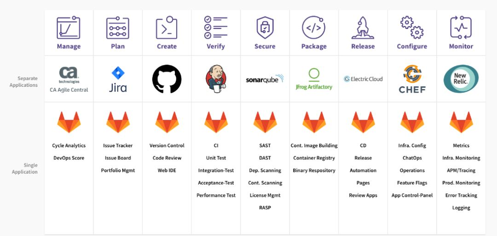
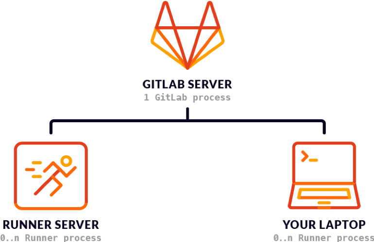

# GitlabCI

## GitLab CI/CD简介

### GitLab 内置持续集成功能

### 持续集成 （CI）

- 集成团队中每个开发人员提交的代码到代码存储库中。
- 开发人员在Merge或者Pull请求中合并拉取新代码。
- 在提交或者合并更改到代码存储库之前，会触发了构建，测试和新代码验证的管道。
- CI可帮助您在开发周期的早期发现并减少错误

### 连续交付 （CD）

- 可通过结构化的部署管道确保将经过CI验证的代码交付给您的应用程序。
- CD可以将经过验证的代码更快地移至您的应用程序。

CI/CD 一起 可以加快团队为客户和利益相关者交付成果的速度。CI和CD必须无缝协作，以使您的团队快速有效地进行构建，并且对于确保完全优化的开发实践至关重要。

[](http://docs.idevops.site/gitlabci/chapter01/02/images/02.png)

------

### GitLab CI/CD优势

- 开源： CI/CD是开源GitLab社区版和专有GitLab企业版的一部分。
- 易于学习： 具有详细的入门文档。
- 无缝集成： GitLab CI / CD是GitLab的一部分，支持从计划到部署,具有出色的用户体验。
- 可扩展： 测试可以在单独的计算机上分布式运行，可以根据需要添加任意数量的计算机。
- 更快的结果： 每个构建可以拆分为多个作业，这些作业可以在多台计算机上并行运行。
- 针对交付进行了优化： 多个阶段，手动部署， 环境 和 变量。

[](http://docs.idevops.site/gitlabci/chapter01/02/images/03.png)

------

### GitLab CI/CD特点

- 多平台： Unix，Windows，macOS和任何其他支持Go的平台上执行构建。
- 多语言： 构建脚本是命令行驱动的，并且可以与Java，PHP，Ruby，C和任何其他语言一起使用。
- 稳定构建： 构建在与GitLab不同的机器上运行。
- 并行构建： GitLab CI / CD在多台机器上拆分构建，以实现快速执行。
- 实时日志记录： 合并请求中的链接将您带到动态更新的当前构建日志。
- 灵活的管道： 您可以在每个阶段定义多个并行作业，并且可以 触发其他构建。
- 版本管道： 一个 .gitlab-ci.yml文件 包含您的测试，整个过程的步骤，使每个人都能贡献更改，并确保每个分支获得所需的管道。
- 自动缩放： 您可以 自动缩放构建机器，以确保立即处理您的构建并将成本降至最低。
- 构建工件： 您可以将二进制文件和其他构建工件上载到 GitLab并浏览和下载它们。
- Docker支持： 可以使用自定义Docker映像， 作为测试的一部分启动 服务， 构建新的Docker映像，甚至可以在Kubernetes上运行。
- 容器注册表： 内置的容器注册表， 用于存储，共享和使用容器映像。
- 受保护的变量： 在部署期间使用受每个环境保护的变量安全地存储和使用机密。
- 环境： 定义多个环境。

[](http://docs.idevops.site/gitlabci/chapter01/02/images/04.jpeg)

------

### GitLab CI/CD架构

### GitLab CI / CD

GitLab的一部分，GitLab是一个Web应用程序，具有将其状态存储在数据库中的API。 除了GitLab的所有功能之外，它还管理项目/构建并提供一个不错的用户界面。

### GitLab Runner

是一个处理构建的应用程序。 它可以单独部署，并通过API与GitLab CI / CD一起使用。

[](http://docs.idevops.site/gitlabci/chapter01/02/images/01.png)

### .gitlab-ci.yml

定义流水线作业运行，位于应用项目根目录下 。

[](http://docs.idevops.site/gitlabci/chapter01/02/images/05.png)

**为了运行测试，至少需要一个 GitLab 实例、一个 GitLab Runner、一个gitlab-ci文件**

------

### GitLab CI/CD工作原理

- 将代码托管到Git存储库。
- 在项目根目录创建ci文件 `.gitlab-ci.yml` ，在文件中指定构建，测试和部署脚本。
- GitLab将检测到它并使用名为GitLab Runner的工具运行脚本。
- 脚本被分组为**作业**，它们共同组成了一个**管道**。

[](http://docs.idevops.site/gitlabci/chapter01/02/images/06.png)

管道状态也会由GitLab显示：

[](http://docs.idevops.site/gitlabci/chapter01/02/images/07.png)

最后，如果出现任何问题，可以轻松地 [回滚](https://docs.gitlab.com/12.9/ee/ci/environments.html#retrying-and-rolling-back)所有更改：

[](http://docs.idevops.site/gitlabci/chapter01/02/images/08.png)

## 安装

### rpm方式

源地址：https://mirrors.tuna.tsinghua.edu.cn/gitlab-ce/yum/el7/

```sh
wget https://mirrors.tuna.tsinghua.edu.cn/gitlab-ce/yum/el7/gitlab-ce-12.9.0-ce.0.el7.x86_64.rpm


rpm -ivh gitlab-ce-12.9.0-ce.0.el7.x86_64.rpm

vim /etc/gitlab.rb   # 编辑站点地址
gitlab-ctl reconfigure  # 配置


#服务控制
gitlab-ctl start 
gitlab-ctl status
gitlab-ctl stop 
```

### Docker方式

1.部署gitlab

```sh
mkdir -p /opt/data/gitlab/config /opt/data/gitlab/logs /opt/data/gitlab/data
docker pull gitlab/gitlab-ce:12.9.0-ce.0

docker run -d  -p 443:443 -p 80:80 -p 222:22 --name gitlab --restart always -v /opt/data/gitlab/config:/etc/gitlab -v /opt/data/gitlab/logs:/var/log/gitlab -v /opt/data/gitlab/data:/var/opt/gitlab gitlab/gitlab-ce:12.9.0-ce.0
```

2.修改gitlab.rb文件中的IP与端口号

vi /opt/data/gitlab/config/gitlab.rb

直接添加以下配置：

~~~sh
# 配置http协议所使用的访问地址,不加端口号默认为80
external_url 'http://192.168.200.128'

# 配置ssh协议所使用的访问地址和端口
gitlab_rails['gitlab_ssh_host'] = '192.168.200.128'
gitlab_rails['gitlab_shell_ssh_port'] = 222 # 此端口是run时22端口映射的端口
~~~

3.重启gitlab

### Kubernetes部署

文件地址： https://github.com/zeyangli/devops-on-k8s/blob/master/devops/gitlab.yaml

```yaml
---
kind: Deployment
apiVersion: apps/v1
metadata:
  labels:
    k8s-app: gitlab
  name: gitlab
  namespace: devops
spec:
  replicas: 1
  revisionHistoryLimit: 10
  selector:
    matchLabels:
      k8s-app: gitlab
  template:
    metadata:
      labels:
        k8s-app: gitlab
      namespace: devops
      name: gitlab
    spec:
      containers:
        - name: gitlab
          image: gitlab/gitlab-ce:12.6.0-ce.0
          imagePullPolicy: Always
          ports:
            - containerPort: 30088
              name: web
              protocol: TCP
            - containerPort: 22
              name: agent
              protocol: TCP
          resources:
            limits:
              cpu: 1000m
              memory: 4Gi
            requests:
              cpu: 500m
              memory: 512Mi
          livenessProbe:
            httpGet:
              path: /users/sign_in
              port: 30088
            initialDelaySeconds: 60
            timeoutSeconds: 5
            failureThreshold: 12
          readinessProbe:
            httpGet:
              path: /users/sign_in
              port: 30088
            initialDelaySeconds: 60
            timeoutSeconds: 5
            failureThreshold: 12
          volumeMounts:
            - name: gitlab-conf
              mountPath: /etc/gitlab
            - name: gitlab-log
              mountPath: /var/log/gitlab
            - name: gitlab-data
              mountPath: /var/opt/gitlab
          env:
            - name: gitlab_HOME
              value: /var/lib/gitlab
      volumes:
        - name: gitlab-conf
          hostPath: 
            path: /data/devops/gitlab/config
            type: Directory
        - name: gitlab-log
          hostPath: 
            path: /data/devops/gitlab/logs
            type: Directory
        - name: gitlab-data
          hostPath: 
            path: /data/devops/gitlab/data
            type: Directory
      serviceAccountName: gitlab
---
apiVersion: v1
kind: ServiceAccount
metadata:
  labels:
    k8s-app: gitlab
  name: gitlab
  namespace: devops
---
kind: Service
apiVersion: v1
metadata:
  labels:
    k8s-app: gitlab
  name: gitlab
  namespace: devops
spec:
  type: NodePort
  ports:
    - name: web
      port: 30088
      targetPort: 30088
      nodePort: 30088
    - name: slave
      port: 22
      targetPort: 22
      nodePort: 30022
  selector:
    k8s-app: gitlab
---
kind: Role
apiVersion: rbac.authorization.k8s.io/v1beta1
metadata:
 name: gitlab
 namespace: devops
rules:
 - apiGroups: [""]
   resources: ["pods"]
   verbs: ["create","delete","get","list","patch","update","watch"]
 - apiGroups: [""]
   resources: ["pods/exec"]
   verbs: ["create","delete","get","list","patch","update","watch"]
 - apiGroups: [""]
   resources: ["pods/log"]
   verbs: ["get","list","watch"]
 - apiGroups: [""]
   resources: ["secrets"]
   verbs: ["get"]
---
apiVersion: rbac.authorization.k8s.io/v1beta1
kind: RoleBinding
metadata:
 name: gitlab
 namespace: devops
roleRef:
 apiGroup: rbac.authorization.k8s.io
 kind: Role
 name: gitlab
subjects:
 - kind: ServiceAccount
   name: gitlab
   namespace: devops
kubectl create -f gitlab.yaml
kubectl delete -f gitlab.yaml
```

注意： 需要修改gitlab.rb配置文件中的站点地址。这里指定的端口是30088（不是必须的）也就是需要将gitlab.rb配置的地址改成30088和nodePort端口为30088。

为什么端口要改成一致的？如果不修改gitlab.rb中的站点地址则默认是80端口，这时候做nodePort的时候例如将80映射到30088，此时对外访问30088可以打开gitlab页面，但是下载代码的时候会发现地址为80端口，导致下载代码失败。所以这里强调一致哦。

```sh
external-url-for-gitlab
external_url 'http://192.168.1.200:30088'
```

`gitlab管理员账号为root`

# GitlabRunner

GitLab Runner是一个开源项目，用于运行您的作业并将结果发送回GitLab。它与[GitLab CI](https://about.gitlab.com/product/continuous-integration/)结合使用，[GitLab CI](https://about.gitlab.com/product/continuous-integration/)是[GitLab](https://about.gitlab.com/product/continuous-integration/)随附的用于协调作业的开源持续集成服务。

## 安装

### Docker安装

1.创建gitlab-runner容器

~~~sh
mkdir -p /opt/data/gitlab-runner/config
docker run -d -v /opt/data/gitlab-runner/config:/etc/gitlab-runner gitlab/gitlab-runner:v12.6.0 
~~~

2.注册

~~~sh
docker exec -it [容器id/name] gitlab-runner register
~~~

根据提示填入信息：


~~~groovy
Runtime platform                                    arch=amd64 os=linux pid=6 revision=ac8e767a version=12.6.0
Running in system-mode.

Please enter the gitlab-ci coordinator URL (e.g. https://gitlab.com/):
http://192.168.1.105
Please enter the gitlab-ci token for this runner:
4tutaeWWL3srNEcmHs1s
Please enter the gitlab-ci description for this runner:
[00e4f023b5ae]: devops-service-runner
Please enter the gitlab-ci tags for this runner (comma separated):
build
Registering runner... succeeded                     runner=4tutaeWW
Please enter the executor: parallels, virtualbox, docker-ssh+machine, kubernetes, docker+machine, custom, docker, docker-ssh, shell, ssh:
shell
Runner registered successfully. Feel free to start it, but if it's running already the config should be automatically reloaded!
~~~

3.重启gitlab-runner

~~~sh
docker restart [容器id/name]
~~~


## GitLabRunner命令

GitLab Runner包含一组命令，可用于注册，管理和运行构建。

### 启动命令

```sh
gitlab-runner --debug <command>   #调试模式排查错误特别有用。
gitlab-runner <command> --help    #获取帮助信息
gitlab-runner run       #普通用户模式  配置文件位置 ~/.gitlab-runner/config.toml
sudo gitlab-runner run  # 超级用户模式  配置文件位置/etc/gitlab-runner/config.toml
```

### 注册命令

```sh
gitlab-runner register  #默认交互模式下使用，非交互模式添加 --non-interactive
gitlab-runner list      #此命令列出了保存在配置文件中的所有运行程序
gitlab-runner verify    #此命令检查注册的runner是否可以连接，但不验证GitLab服务是否正在使用runner。 --delete 删除
gitlab-runner unregister   #该命令使用GitLab取消已注册的runner。


#使用令牌注销
gitlab-runner unregister --url http://gitlab.example.com/ --token t0k3n

#使用名称注销（同名删除第一个）
gitlab-runner unregister --name test-runner

#注销所有
gitlab-runner unregister --all-runners
```

### 服务管理

```sh
gitlab-runner install --user=gitlab-runner --working-directory=/home/gitlab-runner

# --user指定将用于执行构建的用户
#`--working-directory  指定将使用**Shell** executor 运行构建时所有数据将存储在其中的根目录

gitlab-runner uninstall #该命令停止运行并从服务中卸载GitLab Runner。

gitlab-runner start     #该命令启动GitLab Runner服务。

gitlab-runner stop      #该命令停止GitLab Runner服务。

gitlab-runner restart   #该命令将停止，然后启动GitLab Runner服务。

gitlab-runner status #此命令显示GitLab Runner服务的状态。当服务正在运行时，退出代码为零；而当服务未运行时，退出代码为非零。
```

