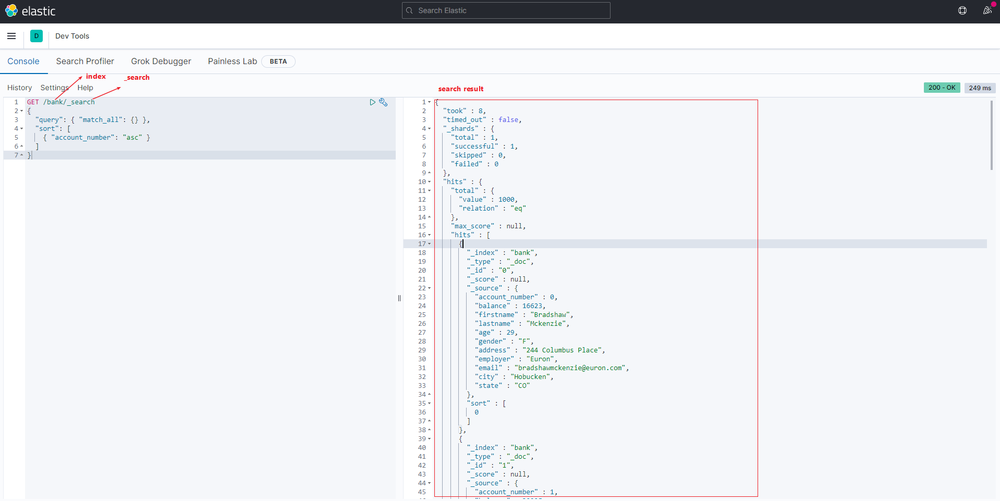
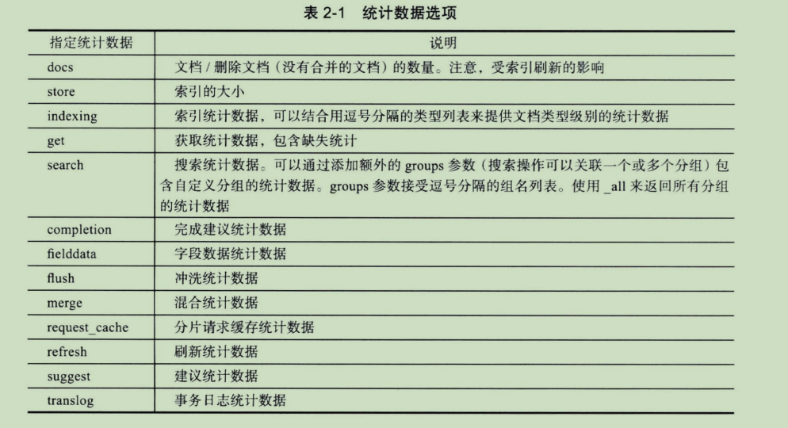
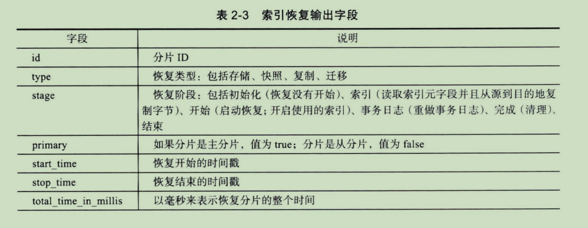
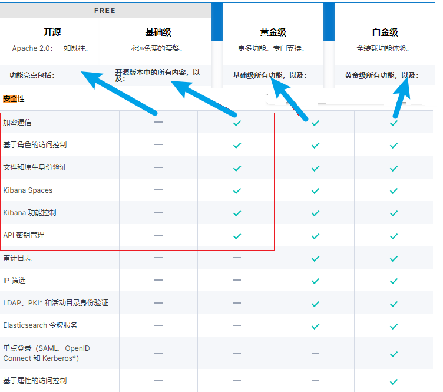

# 常用命令

~~~sh
#查看集群状态
GET /_cluster/health?pretty&human
#查看集群节点情况
GET /_cat/nodes?pretty
#查看集群负载情况
GET /_cat/nodes?v
#集群任务处理情况
GET /_cat/thread_pool?v
#查看索引
GET /_cat/indices?v
#查看索引模板
GET /_cat/templates
~~~


# 安装

~~~sh
#准备文件和文件夹，并chmod -R 777 xxx
#配置文件内容，参照
https://www.elastic.co/guide/en/elasticsearch/reference/7.5/node.name.html 搜索相关配置
# 考虑为什么挂载使用esconfig ...
docker run --name=elasticsearch -p 9200:9200 -p 9300:9300 \
-e "discovery.type=single-node" \
-e ES_JAVA_OPTS="-Xms300m -Xmx300m" \
-v /app/es/data:/usr/share/elasticsearch/data \
-v /app/es/plugins:/usr/shrae/elasticsearch/plugins \
-v esconfig:/usr/share/elasticsearch/config \
-d elasticsearch:7.12.0

####################我一般使用以下###################

docker pull elasticsearch:7.4.2
docker pull kibana:7.4.2

mkdir -p /opt/docker_app/elasticsearch/{config,data,plugins} # 用来存放配置文件、数据、插件
echo "http.host: 0.0.0.0" >/opt/docker_app/elasticsearch/config/elasticsearch.yml # 允许任何机器访问
chmod -R 777 /opt/docker_app/elasticsearch/ ## 设置elasticsearch文件可读写权限

# 启动es
docker run --name elasticsearch -p 9200:9200 -p 9300:9300 \
-e  "discovery.type=single-node" \
-e ES_JAVA_OPTS="-Xms64m -Xmx512m" \
-v /opt/docker_app/elasticsearch/config/elasticsearch.yml:/usr/share/elasticsearch/config/elasticsearch.yml \
-v /opt/docker_app/elasticsearch/data:/usr/share/elasticsearch/data \
-v  /opt/docker_app/elasticsearch/plugins:/usr/share/elasticsearch/plugins \
-d elasticsearch:7.4.2

#以后再外面装好插件重启就可

#特别注意：
-e ES_JAVA_OPTS="-Xms64m -Xmx128m" \ 测试环境下，设置 ES 的初始内存和最大内存，否则导致过大启动不了ES

# 开机启动
docker update elasticsearch --restart=always

# 启动kibana
docker run --name kibana -e ELASTICSEARCH_HOSTS=http://192.168.200.128:9200 -p 5601:5601 -d kibana:7.4.2

~~~


# ES实现原理


>Lucene将上面三列分别作为词典文件、频率文件、位置文件保存。其中词典文件不仅保存了每个关键词，还保留了指向频率文件和位置文件的指针，通过指针即可找到对应文件信息。
>
>Lucene使用了field概念，用于表达信息所在位置（如标题中、文章中、URL中），在建索引时，该field信息也记录在词典文件中，每个关键词都有一个field信息，因为每个关键字一定属于一个或多个field。

# ES一些术语和概念

1. 索引词（term）

   > 精确值，foo、Foo、FOO被认为是不同的term

2. 文本（text）

   >文本是一段普通的非结构化文字。通常，**文本会被分析成一个个的索引词**，存储在索引库中。为了让文本能够进行搜索，文本字段需要事先进行分析，当对文本中的关键词进行查询的时候，搜索引擎应该根据搜索条件搜索出原文本。

3. 分析（analysis）

   > 分析是将文本转换成索引词的过程，分析过程依赖分词器。

4. 集群

5. 节点

6. 路由

   > 当存储doc时，它会根据hash(doc的ID)值存储在唯一的主分片中。如果文档有一个指定的父文档，则从父文档ID中生成，该值可以存储文档的时候进行修改。

7. 分片（shard）

   > 分片是单个Lucene实例，这是ES管理比较底层的功能。索引是指向主分片和副本分片的逻辑空间。对于使用，只需要指定分片的数量。在开发使用过程中，我们对应的对象都是index，ES会自动管理集群中的所有分片，发生故障时，ES会把分片移动到不同的节点或新节点。
   >
   > 一个index可以存很大的数据，这些空间可以超过一个节点的物理空间，若数据都存储在单节点对搜索性能也有影响。因此，ES将index分解成多个分片。当你创建index，你可以简单定义你想要的分片数量，每个分片本身是一个全功能的、独立的单元，可以托管在集群中的任何节点。

8. 主分片

   > 每个doc都存储在一个分片中，当你存储一个doc时，系统会首先存储在主分片中，然后复制到不同的副本分片中。默认情况下一个index有5个主分片，你可以事先定义分片数量，但之后无法修改。

9. 副本分片

10. 复制（replica）

    > 复制是一个非常有用的功能，不然会有单点问题。当网络中的某个节点出现问题，复制可以故障转移，保证高可用。因此ES允许你创建一个或多个拷贝，你的索引分片就形成了所谓的副本或副本分片。
    >
    > 复制是重要的，原因：
    >
    > - 保证了高可用，当节点失败不受影响，需要注意的是，一个复制的分片不会存储在同一个节点中。
    > - 它允许你扩展搜索量，提供并发量，因为搜索可以在所有副本上并行执行。
    >
    > 每个索引可以拆分成多个分片，索引可以复制0个或多个分片。一旦复制，每个索引就有了主分片和副本分片。分片数量和副本的数量可以在创建索引时定义。但之后只能改变副本的数量，不能改变分片的数量。
    >
    > **注意**：每个ES分片是一个Lucene的索引，最大是Integer.MAX_VALUE-128。可以使用 _cat/shards 监控分片大小

11. 索引（index）

    > 具有相同结构的doc集合，类似MySQL的**表**。

12. 类型（已废除）

    > 类型是index的逻辑分区，一种类型被定义具有一组公共字段的doc。例如，你想将博客系统所有信息存入一个index，则底下的user、blog等就是一种类型。

13. 文档（doc）

    > doc是以json格式存储在ES中的字符串，类似MySQL中的**行**。
    >
    > 每个doc都有一个类型和ID，原始的JSON文档被存储在一个叫_source的字段中，当搜索文档时默认返回就是这个字段。

14. 映射（mapping）

    > 类似MySQL的**表结构**，可以事先定义，也可以被ES智能识别。

15. 字段（field）

    > 类型MySQL的**字段**。

16. 来源字段（source field）

    > 默认情况，你的源文档存储在_source这个字段中，当你查询时也会返回这个字段。这允许你可以从搜索结构中访问原始对象，这个对象返回一个精确的json，这个对象不显示索引分析后的其他任何数据。

17. 主键（ID）

    > ID是一个文件的唯一标识，如果在存库时没有提供ID，系统会自动生存ID，文档的index/type/id必须是唯一的。

**返回值字段说明**



- `took` – Elasticsearch运行查询所花费的时间（以毫秒为单位）
- `timed_out` –搜索请求是否超时
- `_shards` - 搜索了多少个碎片，以及成功，失败或跳过了多少个碎片的细目分类。
- `max_score` – 找到的最相关文档的分数
- `hits.total.value` - 找到了多少个匹配的文档
- `hits.sort` - 文档的排序位置（不按相关性得分排序时）
- `hits._score` - 文档的相关性得分（使用match_all时不适用）


# ES字段类型


# 索引

> **注意：新版ES已经废除了type**，所以以前的/index/type/id推荐变为 /index/_doc/id
>
> 

|      method      |                   url地址                    |          描述          |
| :--------------: | :------------------------------------------: | :--------------------: |
| PUT（创建,修改） |     localhost:9200/索引名称/_doc/文档id      | 创建文档（指定文档id） |
|   POST（创建）   |         localhost:9200/索引名称/_doc         | 创建文档（随机文档id） |
|   POST（修改）   | localhost:9200/索引名称/__doc/文档id/_update |        修改文档        |
|  DELETE（删除）  |     localhost:9200/索引名称/_doc/文档id      |        删除文档        |
|   GET（查询）    |     localhost:9200/索引名称/_doc/文档id      |   查询文档通过文档ID   |
|   POST（查询）   | localhost:9200/索引名称/__doc/文档id/_search |      查询所有数据      |

## 创建空索引

> 说明：**可以直接创建索引**，不需要创建空索引后再修改数据
>
> 可以在index里加一些参数：
>
> - index.data_path：字符型索引数据使用的路径。ES默认附加节点序号到路径中，确保系统机器上的多重实例不会共享数据目录。
> - index.shadow_replicas：索引是否使用副本。默认false。
> - index.shared_filesystem：索引是否使用共享文件系统，默认为true。
> - index.shared_filesystem.recover_on_any_node：索引的主分片是否可以恢复到集群中任何节点，默认false。

```json
PUT /myindex
{
    "settings": {
        "index": {
            "number_of_shards": "2", #分片数
            "number_of_replicas": "0" #副本数
        }
    }
}
#不指定分片数和副本数，系统默认1个分片，1个副本
```

## 修改索引

~~~json
#可以修改索引副本数，分词器等
PUT /wujie/_settings
{
  "number_of_replicas": 2
}
#注意：【无法修改分片数量，否则报错】
~~~

## 打开/关闭索引

> 关闭索引后，只能查看索引的元数据，不能读写数据

~~~json
POST /wujie/_close
POST /wujie/_open
~~~

查看所有索引

~~~sh
Get /_cat/indices?v
~~~

## 创建映射（索引）

~~~json
#为index创建mappings
PUT /zfc
{
  "mappings": {
    "properties": {
      "id":{
        "type": "integer"
      },
      "name":{
        "type": "text"
      },
      "brithday":{
        "type": "date"
      }
    }
  }
}


#为doc创建mappings
PUT /zfc/_doc/1
{
  "mappings": {
    "properties": {
      "id":{
        "type": "integer"
      },
      "name":{
        "type": "text"
      },
      "brithday":{
        "type": "date"
      }
    }
  }
}
~~~

## 修改映射（重建索引）

>**index的mappings无法修改**，可以通过**_reindex** 重建索引,方式修改

~~~json
#doc的mappings可以修改（感觉没啥用）
POST /zfc/_doc/1
{
  "mappings": {
    "properties": {
      "id":{
        "type": "integer"
      },
      "name":{
        "type": "text"
      },
      "brithday":{
        "type": "date"
      },
      "key":{
        "type": "keyword"
      }
    }
  }
}
~~~

通过reindex修改index的mappings

~~~json
#1. 创建一个新的index，设置新的mappings
PUT /zfc1
{
  "mappings": {
    "properties": {
      "id":{
        "type": "long"  #修改处
      },
      "name":{
        "type": "text"
      },
      "brithday":{
        "type": "date"
      },
      "key":{
        "type": "keyword"
      }
    }
  }
}
#2. _reindex进行迁移
POST _reindex
{
  "source": {
    "index": "zfc"
  },
  "dest": {
    "index": "zfc1"
  }
}
#3. 删除旧的index
DELETE zfc
#4. 设置别名
POST _aliases
{
  "actions": [
    {
      "add": {
        "index": "zfc1",
        "alias": "zfc"
      }
    }
  ]
}
~~~

> dest.version_type:
>
> - interval：导致es盲目转储文件到目标索引，任何具有相同类型和ID的文档将会被重写。
> - external：会导致es保护源索引，如果在目标索引中有一个比源索引旧的版本，则会更新文档。对于源文件中丢失的文档也会在目标中被创建。
> - create：会导致目标索引中仅创建丢失的文件，所有现有的文件将导致版本冲突。
>
> 正常情况下发生冲突时，_reindex过程将会被终止，可以在请求中设置 conflicts:proceed，可以只进行计算。

## 索引别名

~~~json
#创建别名
POST _aliases
{
  "actions": [
    {
      "add": {
        "index": "zfc1",
        "alias": "zfc"
      },
      "add": {                   #一个别名是可以关联n个index的，根据别名查的时候会列出所有index
        "index": "wujie",
        "alias": "zfc"
      },
      "add": {                   #也可以通过通配符
        "index": "z*",
        "alias": "zfc"
      }
    }
  ]
}
#修改别名（没有修改），可以先remove，后add
POST _aliases
{
  "actions": [
    {
      "remove": {
        "index": "zfc1",
        "alias": "zfc"
      },
      "add": {                 
        "index": "zfc1",
        "alias": "wujie"
      }
    }
  ]
}
#删除别名
DELETE /zfc1/_alias/zfc

或

POST _aliases
{
  "actions": [
    {
      "remove": {
        "index": "zfc1",
        "alias": "zfc"
      }
    }
  ]
}

#查看index下所有的别名
GET zfc1/_alias


#带filter和routing的别名
#作用：在使用别名进行查找时，只有满足filter中的要求，才能查到数据
POST _aliases
{
  "actions": [
    {
      "add": {
        "index": "wujie",
        "alias": "zfc2",
        "filter": {
          "term": {
            "age": "21"
          }
        },
        "routing": "1",
        "search_routing": "1,2",
        "index_routing": "1"    #index_routing只能一个值
      }
    }
  ]
}
~~~

## 索引分析

> - 字符过滤器：字符串经过字符过滤器（character filter）处理，它们的工作是在标记化之前处理字符串。字符过滤器能够去除HTML标记，或者转换"&"为“and”。
> - 分词器：分词器（tokenizer）被标记化成独立的词。一个简单的分词器可以根据空格或逗号将单词分开。
> - 标记过滤器：每个词都通过标记过滤处理，它可以修改词（例如Quick转小写），去掉词（例如a、and、the等），或者增加词（例如同义词jump和leap）。

~~~json
GET /_analyze
{
  "analyzer": "standard", 
  "text": ["zfc is a db"]
}
~~~

TODO P65，几个例子

## 索引模板

### 创建索引模板

~~~json
PUT /_template/mytemplate
{
  "index_patterns":"my-*",
  "settings": {
    "number_of_shards": 1
  },
  "mappings": {
    "_source": {
      "enabled": false
    }
  }
  
}
~~~

### 删除索引模板

~~~json
DELETE /_template/mytemplate
~~~

### 查看索引模板

~~~json
GET /_template/mytemplate
~~~

> 当匹配到多个模板时，会合并模板，重复的地方根据order的优先级（小的先）

## 索引监控

### 索引统计

~~~json
//查看索引统计数据
GET /zfc/_stats
~~~



> 注意：当分片在集群中移动的时候，它们的统计数据会被清除，视为他们在其他节点中被创建。另一方面，即使分片“离开”了一个节点，那个节点依旧会保存分片之前的统计数据。

### 索引分片

~~~json
//查看索引分片数据
GET /enis-1/_segments

//返回值
{
  "_shards" : {
    "total" : 2,
    "successful" : 1,
    "failed" : 0
  },
  "indices" : {
    "enis-1" : {
      "shards" : {
        "0" : [
          {
            "routing" : {
              "state" : "STARTED",
              "primary" : true,
              "node" : "D4sGVhVrQDC5FKcfU_L7Cg"
            },
            "num_committed_segments" : 0,
            "num_search_segments" : 0,
            "segments" : { }
          }
        ]
      }
    }
  }
}

~~~

### 索引恢复

~~~json
//查看索引恢复数据
GET /enis-1/_recovery

//返回
{
  "enis-1" : {
    "shards" : [
      {
        "id" : 0,
        "type" : "EMPTY_STORE",
        "stage" : "DONE",
        "primary" : true,
        "start_time_in_millis" : 1697510829256,
        "stop_time_in_millis" : 1697510829279,
        "total_time_in_millis" : 23,
        "source" : { },
        "target" : {
          "id" : "D4sGVhVrQDC5FKcfU_L7Cg",
          "host" : "127.0.0.1",
          "transport_address" : "127.0.0.1:9300",
          "ip" : "127.0.0.1",
          "name" : "6f1f914508dd"
        },
        "index" : {
          "size" : {
            "total_in_bytes" : 0,
            "reused_in_bytes" : 0,
            "recovered_in_bytes" : 0,
            "percent" : "0.0%"
          },
          "files" : {
            "total" : 0,
            "reused" : 0,
            "recovered" : 0,
            "percent" : "0.0%"
          },
          "total_time_in_millis" : 11,
          "source_throttle_time_in_millis" : 0,
          "target_throttle_time_in_millis" : 0
        },
        "translog" : {
          "recovered" : 0,
          "total" : 0,
          "percent" : "100.0%",
          "total_on_start" : 0,
          "total_time_in_millis" : 8
        },
        "verify_index" : {
          "check_index_time_in_millis" : 0,
          "total_time_in_millis" : 0
        }
      }
    ]
  }
}

~~~




### 索引分片存储

~~~json
//查看索引分片存储信息
GET /enis-1/_shard_stores


//返回
{
  "indices" : {
    "enis-1" : {
      "shards" : {
        "0" : {
          "stores" : [
            {
              "D4sGVhVrQDC5FKcfU_L7Cg" : {
                "name" : "6f1f914508dd",
                "ephemeral_id" : "r3Pp8tZOSqO0_Jad-WNdTw",
                "transport_address" : "127.0.0.1:9300",
                "attributes" : {
                  "ml.machine_memory" : "8181829632",
                  "xpack.installed" : "true",
                  "ml.max_open_jobs" : "20"
                }
              },
              "allocation_id" : "VbGJ_rlPTPmxssOm2L2Fdg",
              "allocation" : "primary"
            }
          ]
        }
      }
    }
  }
}

~~~

## 索引状态

### 清除缓存

### 索引刷新

### 冲洗

### 合并索引

TODO P77页


# 文档

## 新增数据

~~~json
PUT /wujie/_doc/1
{
  "id":2,
  "name":"zhangsan"
}

或

POST /wujie/_doc/1
{
  "id":2,
  "name":"zhangsan"
}
~~~

### op_type参数

在ES中，`op_type`是一个用于指定操作类型的参数，它决定了在索引文档时的行为。

以下是一些常见的`op_type`选项：

1. `index`（默认值）：以`index`操作类型将文档添加到索引中。如果指定的文档ID已经存在，则会覆盖原有文档。
2. `create`：以`create`操作类型创建新文档。如果指定的文档ID已经存在，则会返回错误，不进行任何修改。
3. `update`：以`update`操作类型更新现有文档。如果指定的文档ID不存在，则会返回错误。
4. `delete`：以`delete`操作类型从索引中删除指定的文档。

可以在执行索引操作的请求中设置`op_type`参数。例如：

```json
POST my_index/_doc/1
{
  "field": "value",
  "op_type": "create"
}
```

上述示例中，使用`create`操作类型创建一个新的文档。如果文档ID为1的文档已经存在，则会返回错误。


### 分片的选择

> 默认通过hash(id)控制。但可以通过routing手动控制，还是hash(routing)。


## 查看数据

~~~json
#根据doc的id搜索index下的某个doc
GET /wujie/_doc/1
#搜索index下所有的doc（默认最多10条）
GET /wujie/_search
#查询年龄等于20的用户
GET /wujie/_search?q=age:20
~~~

> 查询参数：
> _primary:在主节点进行查询
>
> _local:尽可能在本地节点上进行查询

## 删除数据

~~~json
DELETE /wujie
~~~

## 修改数据

~~~json
POST /wujie/_update/1
{
  "doc":{
    "id":1,
    "age":21
  }
}

或

PUT /wujie/_doc/1
{
  "id":1,
  "name":"lisi"
}
~~~

## script

TODO P82

## 多文档

### _mget

~~~json
//多index查询多doc
GET /_mget
{
  "docs": [
    {
      "_index": "test-agg-cars",
      "_id":"1"
    },
    {
      "_index":"test-agg-logs",
      "_id":"1"
    }
  ]
}
~~~


### _bulk

~~~json
//批量插入
POST /test-agg-cars/_bulk
{ "index": {}}
{ "price" : 10000, "color" : "red", "make" : "honda", "sold" : "2014-10-28" }
{ "index": {}}
{ "price" : 20000, "color" : "red", "make" : "honda", "sold" : "2014-11-05" }
{ "index": {}}
{ "price" : 30000, "color" : "green", "make" : "ford", "sold" : "2014-05-18" }
{ "index": {}}
{ "price" : 15000, "color" : "blue", "make" : "toyota", "sold" : "2014-07-02" }
{ "index": {}}
{ "price" : 12000, "color" : "green", "make" : "toyota", "sold" : "2014-08-19" }
{ "index": {}}
{ "price" : 20000, "color" : "red", "make" : "honda", "sold" : "2014-11-05" }
{ "index": {}}
{ "price" : 80000, "color" : "red", "make" : "bmw", "sold" : "2014-01-01" }
{ "index": {}}
{ "price" : 25000, "color" : "blue", "make" : "ford", "sold" : "2014-02-12" }
~~~


# DSL

## filter

~~~json
//age>30&last_name=smith的所有员工
GET /megacorp/employee/_search
{
    "query": {
        "filtered": {
            "filter": {
                "range": {
                    "age": {
                        "gt": 30
                    }
                }
            },
            "query": {
                "match": {
                    "last_name": "smith"
                }
            }
        }
    }
}
~~~

## match

> 相关性查询，ES会自动分词

~~~json
GET /megacorp/employee/_search
{
    "query": {
        "match": {
            "about": "rock climbing"
        }
    }
}


//查询结果如下：有相关的都被查到，但score不同
{
...
"hits": {
        "total": 2,
        "max_score": 0.16273327,
        "hits": [
            {
...
"_score": 0.16273327, <1>
"_source": {
                    "first_name": "John",
                    "last_name": "Smith",
                    "age": 25,
                    "about": "I love to go rock climbing",
                    "interests": [
                        "sports",
                        "music"
                    ]
                }
            },
            {
...
"_score": 0.016878016, <2>
"_source": {
                    "first_name": "Jane",
                    "last_name": "Smith",
                    "age": 32,
                    "about": "I like to collect rock albums",
                    "interests": [
                        "music"
                    ]
                }
            }
        ]
    }
}
~~~

## match_phrase

> 与match相对，全词搜索（短语搜索）

~~~json
GET /megacorp/employee/_search
{
    "query": {
        "match_phrase": {
            "about": "rock climbing"
        }
    }
}
~~~

## highlight

~~~json
GET /megacorp/employee/_search
{
    "query": {
        "match_phrase": {
            "about": "rock climbing"
        }
    },
    "highlight": {
        "fields": {
            "about": {}
        }
    }
}


//查询结果如下：<em></em>包裹
{
...
"hits": {
        "total": 1,
        "max_score": 0.23013961,
        "hits": [
            {
...
"_score": 0.23013961,
                "_source": {
                    "first_name": "John",
                    "last_name": "Smith",
                    "age": 25,
                    "about": "I love to go rock climbing",
                    "interests": [
                        "sports",
                        "music"
                    ]
                },
                "highlight": {
                    "about": [
                        "I love to go <em>rock</em> <em>climbing</em>" <1>
                    ]
                }
            }
        ]
    }
}
~~~

## aggs

~~~json
GET /megacorp/employee/_search
{
    "aggs": {
        "all_interests": {
            "terms": {
                "field": "interests"
            }
        }
    }
}


//返回结果：
{
...
"hits": { ...
    },
    "aggregations": {
        "all_interests": {
            "buckets": [
                {
                    "key": "music",
                    "doc_count": 2
                },
                {
                    "key": "forestry",
                    "doc_count": 1
                },
                {
                    "key": "sports",
                    "doc_count": 1
                }
            ]
        }
    }
}
~~~

~~~json
//统计每种兴趣的员工平均年龄
GET /megacorp/employee/_search
{
    "aggs": {
        "all_interests": {
            "terms": {
                "field": "interests"
            },
            "aggs": {
                "avg_age": {
                    "avg": {
                        "field": "age"
                    }
                }
            }
        }
    }
}


//返回结果
...
"all_interests": {
    "buckets": [
        {
            "key": "music",
            "doc_count": 2,
            "avg_age": {
                "value": 28.5
            }
        },
        {
            "key": "forestry",
            "doc_count": 1,
            "avg_age": {
                "value": 35
            }
        },
        {
            "key": "sports",
            "doc_count": 1,
            "avg_age": {
                "value": 25
            }
        }
    ]
}
~~~

## scroll

> `scroll` 是 Elasticsearch 提供的一种机制，用于在大型搜索结果中进行分页处理。它允许你在多个请求之间保持“滚动”状态，以获取连续的结果集。

下面是一个使用 `scroll` API 的示例：

1.开始一个滚动上下文（Scroll Context）：

```json
POST /索引名/_search?scroll=1m
{
  "size": 100,
  "query": {
    "match_all": {}
  }
}
```

- `索引名`: 替换为实际的索引名称。
- `size`: 每次滚动获取的文档数量。
- `scroll`: 指定滚动时间窗口，表示滚动上下文保持有效的时间，默认为1m（1分钟）。

该请求将返回第一批结果以及一个 `scroll_id`，它是用于检索下一批结果的标识符。

2.使用滚动上下文检索下一批结果：

```json
POST /_search/scroll
{
  "scroll": "1m",
  "scroll_id": "scroll_id"
}
```

- `scroll`: 指定滚动时间窗口，保持与初始滚动请求相同的时间窗口。
- `scroll_id`: 初始滚动请求返回的 `scroll_id`。

该请求将返回下一批结果以及一个新的 `scroll_id`，可以继续检索更多的结果。

3.重复第2步，直到所有结果都被检索完毕。

需要注意的是，每次滚动请求都会生成一个新的 `scroll_id`，所以在进行下一次滚动请求时需要使用最新的 `scroll_id`。

当你完成了所有的滚动操作后，应该显式地清除滚动上下文，以释放资源:

```json
DELETE /_search/scroll
{
  "scroll_id": ["scroll_id1", "scroll_id2"]
}
```

- `scroll_id`: 指定要清除的滚动上下文的 `scroll_id` 列表。

这样可以确保滚动上下文被正确关闭并释放资源。

使用 `scroll` 可以高效地处理大量数据，避免一次性获取所有结果而导致资源消耗过大。同时，它也适用于对实时搜索结果进行持续处理的场景。记得根据实际需求设置合适的 `size` 和 `scroll` 参数值。

# 分布式集群

## 集群健康

| 颜色   | 说明                                       |
| ------ | ------------------------------------------ |
| green  | 所有主要分片和复制分片都可用               |
| yellow | 所有主要分片可用，但不是所有复制分片都可用 |
| red    | 不是所有的主要分片都可用                   |

查看集群健康

~~~json
GET /_cluster/health

//返回结果：
{
"cluster_name": "elasticsearch",
"status": "green", <1>
"timed_out": false,
"number_of_nodes": 1,
"number_of_data_nodes": 1,
"active_primary_shards": 0,
"active_shards": 0,
"relocating_shards": 0,
"initializing_shards": 0,
"unassigned_shards": 0
}
~~~


# 路由TODO

>

# ES安全之X-Pack

## 1、什么是Xpack

> X-Pack是ES扩展功能，提供安全性，警报，监视，报告，机器学习和许多其他功能。 ES7.0+之后，默认情况下，当安装ElasticSearch时，会安装X-Pack，无需单独再安装。

基础版本安全功能列表如下：



## 2、相关安全配置介绍

这里挑一些比较重要常见的配置项介绍，完整的配置介绍可以查看官方文档

### 2.1、xpack.security.enabled

默认为true，启用节点上ES的XPACK安全功能，相当于总开关

### 2.2、xpack.security.http.ssl

这个是用来开启https的，以及对应的设置，整体配置项如下：

~~~yaml
xpack.security.http.ssl:
  enabled: false 【开启还是关闭】
  verification_mode: certificate【如下】
   【full：它验证所提供的证书是否由受信任的权威机构(CA)签名，并验证服务器的主机名(或IP地址)是否与证书中识别的名称匹配。】
   【certificate：它验证所提供的证书是否由受信任的机构(CA)签名，但不执行任何主机名验证。】
   【none：它不执行服务器证书的验证。】
  truststore.path: certs/elastic-certificates.p12 【信任存储库文件的存放位置】
  keystore.path: certs/elastic-certificates.p12【密钥存储库文件的存放位置】
~~~

### 2.3、xpack.security.transport.ssl

这个是传输层的认证设置，整体配置项如下：

~~~yaml
xpack.security.transport.ssl:
  enabled: true【开启还是关闭】
  verification_mode: certificate【如下】
   【full：它验证所提供的证书是否由受信任的权威机构(CA)签名，并验证服务器的主机名(或IP地址)是否与证书中识别的名称匹配。】
   【certificate：它验证所提供的证书是否由受信任的机构(CA)签名，但不执行任何主机名验证。】
   【none：它不执行服务器证书的验证。】
  keystore.path: certs/elastic-certificates.p12【信任存储库文件的存放位置】
  truststore.path: certs/elastic-certificates.p12【密钥存储库文件的存放位置】
~~~

## 3、ES集群认证配置

命令操作都是在ES安装根目录下执行的

### 3.1、创建证书

#### a、创建一个证书颁发机构

提示命名文件：直接回车，默认文件名elastic-stack-ca.p12文件
提示输入密码：可以直接回车，也可以输入密码进行设置

~~~sh
./bin/elasticsearch-certutil ca
~~~

#### b、为节点生成证书和私钥

提示命名文件，直接回车，默认文件名elastic-certificates.p12文件
提示输入密码：可以直接回车，也可以输入密码进行设置

~~~sh
./bin/elasticsearch-certutil cert --ca elastic-stack-ca.p12
~~~

#### c、config目录下创建下certs目录

~~~sh
makdir config/certs 
~~~

#### d、将文件可拷贝到certs目录下

~~~sh
mv elastic-certificates.p12 config/certs/
~~~

### 3.2、给keystore和truststore设置密码(可选)

注解：
keystore可以看成一个放key的库，key就是公钥，私钥，数字签名等组成的一个信息。
truststore是放信任的证书的一个store
truststore和keystore的性质是一样的，都是存放key的一个仓库，区别在于，truststore里存放的是只包含公钥的数字证书，代表了可以信任的证书，而keystore是包含私钥的。

如果在创建证书的过程中加了密码，需要输入这个密码（每个节点都需要）。

~~~sh
./bin/elasticsearch-keystore add xpack.security.transport.ssl.keystore.secure_password

./bin/elasticsearch-keystore add xpack.security.transport.ssl.truststore.secure_password

./bin/elasticsearch-keystore add xpack.security.http.ssl.keystore.secure_password

./bin/elasticsearch-keystore add xpack.security.http.ssl.truststore.secure_password
~~~

这样就会在config目录下keystore文件了

### 3.3、修改配置文件并重启

配置文件中加入以下配置，然后重启

~~~sh
xpack.security.enabled: true

xpack.security.http.ssl:
  enabled: false
  verification_mode: certificate
  truststore.path: certs/elastic-certificates.p12
  keystore.path: certs/elastic-certificates.p12

xpack.security.transport.ssl:
  enabled: true
  verification_mode: certificate
  keystore.path: certs/elastic-certificates.p12
  truststore.path: certs/elastic-certificates.p12
~~~

`注意：需要设置elastic-certificates.p12文件权限，否则报错。`

chmod 777 -R certs/


### 3.4、创建用户密码

把elastic-certificates.p12文件复制到其他节点certs目录下，就可以设置账号密码了。在其中一个节点设置密码即可，设置完之后，数据会自动同步到其他节点。

#### a、手动输入密码

~~~sh
./bin/elasticsearch-setup-passwords interactive
~~~

#### b、重置用户密码（随机密码）

~~~sh
./bin/elasticsearch-reset-password -u elastic
~~~

#### c、重置用户密码（指定密码）

~~~sh
./bin/elasticsearch-reset-password -u elastic -i <password>
~~~

## 4、ES单机认证配置

### 1.修改配置

需要在配置文件中开启x-pack验证, 修改config目录下面的elasticsearch.yml文件，在里面添加如下内容,并重启es.

~~~sh
xpack.security.enabled: true
xpack.license.self_generated.type: basic
xpack.security.transport.ssl.enabled: true
~~~

### 2.设置密码

进入es的安装根目录bin下，执行设置用户名和密码的命令,这里需要为4个用户分别设置密码，elastic, [kibana](https://so.csdn.net/so/search?q=kibana&spm=1001.2101.3001.7020), logstash_system,beats_system

~~~sh
./elasticsearch-setup-passwords interactive
~~~

## 5、认证验证场景

### 5.1、浏览器访问验证

这里说明一下：
xpack.security.http.ssl的enable为true 就会是https，为false就是http，我这里是关掉了

### 5.2、curl 认证

当你执行curl去访问es api的时候也会提示需要进行认证


但是带上账号密码就可以了

### 5.3、kibana 认证

kibana中配置ES中配置的kibana账号密码即可连接ES认证

~~~sh
elasticsearch.username: "elastic"
elasticsearch.password: "XXX"
elasticsearch.hosts: ["http://1.1.1.1:9200","http://2.2.2.2:9200","http://3.3.3.3:9200"]
server.port: 5601
~~~

## 中孚elasticsearch.yml

~~~yaml
cluster.name: zf-es
node.name: node-1
network.host: 0.0.0.0
http.port: 9200
transport.tcp.host: 8544
discovery.seed_hosts: ["node128:9301"]
cluster.initial_master_nodes: ["node128"]

path.data: /opt/zfbdp/data/elasticsearch
path.logs: /opt/zfbdp/logs/elasticsearch

xpack.security.enabled: true
xpack.security.http.ssl:
  enabled: false
  verification_mode: certificate
  truststore.path: certs/elastic-certificates.p12
  keystore.path: certs/elastic-certificates.p12
xpack.security.transport.ssl:
  enabled: true
  verification_mode: certificate
  keystore.path: certs/elastic-certificates.p12
  truststore.path: certs/elastic-certificates.p12

action.destructive_requires_name: true
bootstrap.system_call_filter: false
http.cors.allow-origin: "*"
http.cors.enabled: true
~~~

