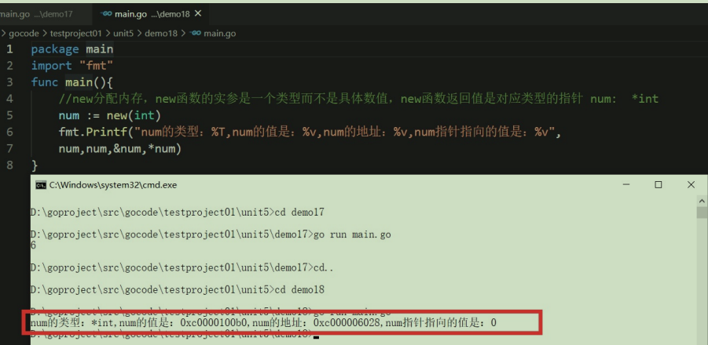
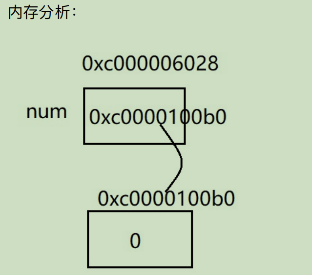
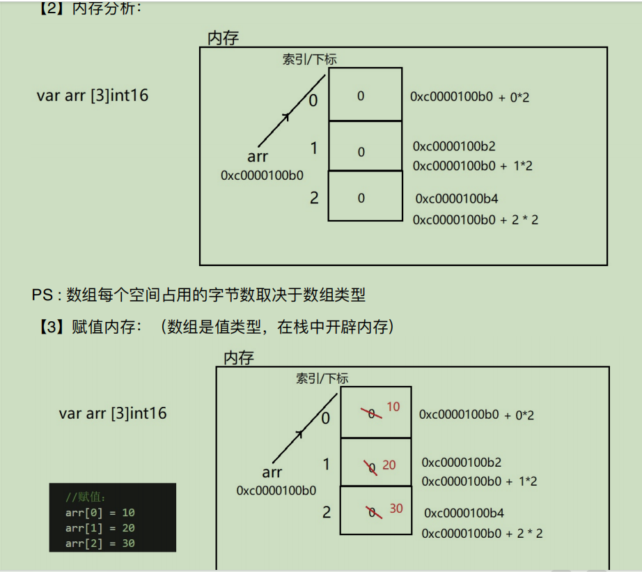
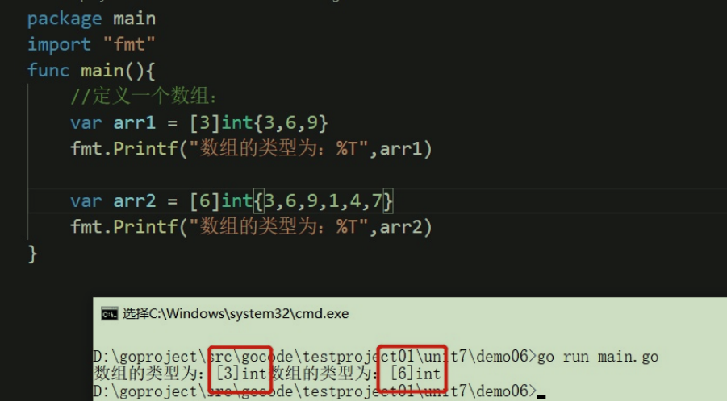
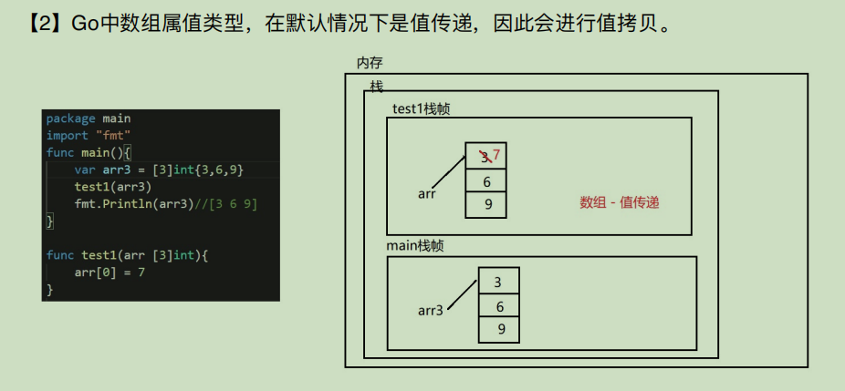
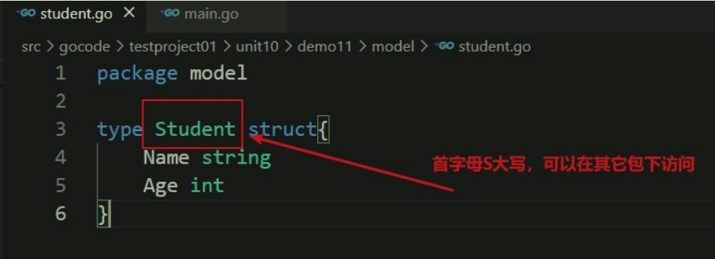
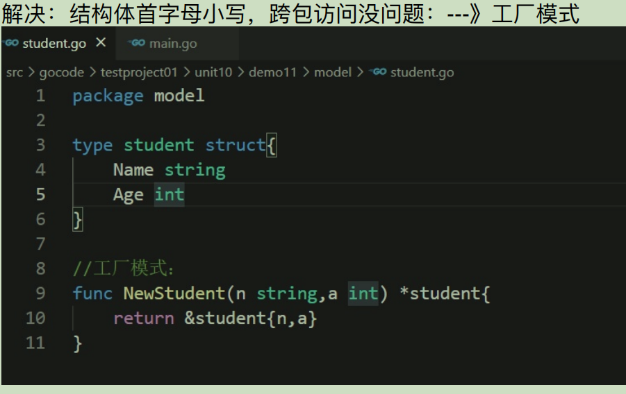
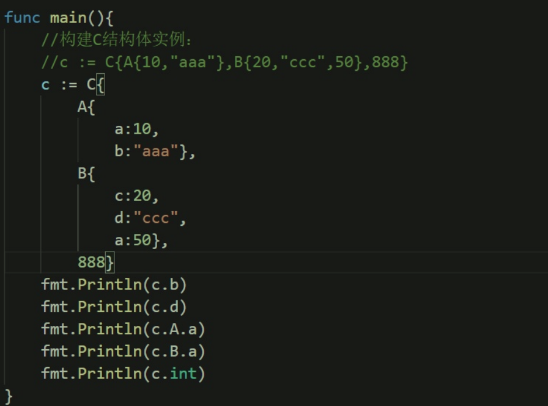
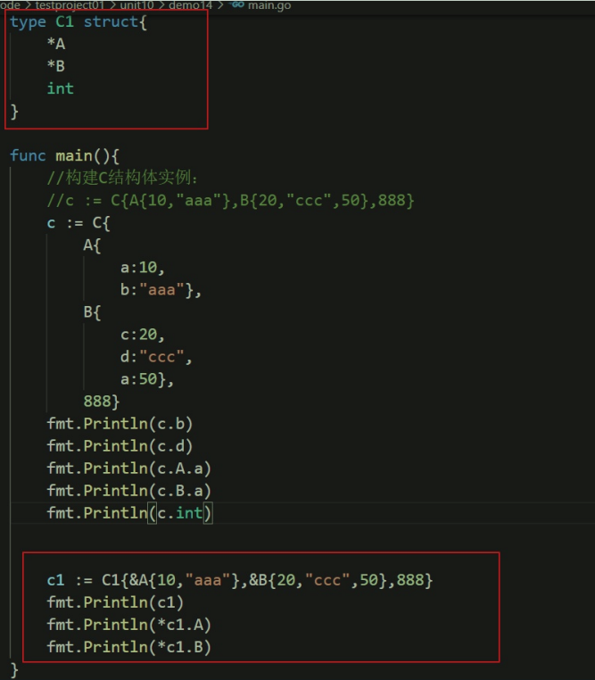
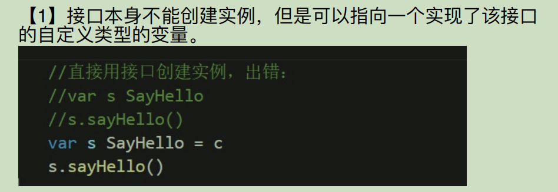

# Golang安装

## 采坑

当你开启了GO111MODULE，仍然使用GOPATH模式的方法，在引入自定义模块时会报错。go mod具体使用将在下一篇介绍

GO111MODULE 有三个值：off, on和auto（默认值）。

- GO111MODULE=off，go命令行将不会支持module功能，寻找依赖包的方式将会沿用旧版本那种通过vendor目录或者GOPATH模式来查找。

- GO111MODULE=on，go命令行会使用modules，而一点也不会去GOPATH目录下查找。

- GO111MODULE=auto，默认值，go命令行将会根据当前目录来决定是否启用module功能。这种情况下可以分为两种情形：

  - ```
    当前目录在GOPATH/src之外且该目录包含go.mod文件
    ```

  - ```
    当前文件在包含go.mod文件的目录下面。
    ```

*当modules 功能启用时，依赖包的存放位置变更为$GOPATH/pkg，允许同一个package多个版本并存，且多个项目可以共享缓存的 module。*

（1）使用了了相对路径：*import “./models”*

报错：build command-line-arguments: cannot find module for path */D*/dev这里后面一堆本地路径
这是因为在go module下 你源码中 impot …/ 这样的引入形式不支持了， 应该改成 impot 模块名/ 。 这样就ok了

（2）使用结合了GOPATH的形式：import “Go-Player/src/ademo/models”

于是我们把上面的import改成了结合GOPATH的如上形式

报错：package Go-Player/src/ademo/models is not in GOROOT D:/development/go/src/GPlayer/src/ademo/models
（3）彻底解决方法：用go env -u 恢复初始设置

不再使用go mod：

- go env -w GO111MODULE=off 或者 go env -w GO111MODULE=auto
- go env -u GO111MODULE

区别在于，如果GO111MODULE=on或者auto，在go get下载包时候，会下载到GOPATH/pkg/mod，引入时也是同样的从这个目录开始。如果这行了上述命令，那么在go get下载包时候，会下载到GOPATH/src 目录下

# Golang基本语法

## helloworld

~~~go
package main

import "fmt"

func main() {
	fmt.Println("go helloworld!")
}
~~~

> 注意：main函数想执行，必须**package main**

## 变量


> **注意:go语言中局部变量和包必须申明即使用，否则会报错**
>
> **如果变量名、函数名、常量名⾸字⺟⼤写，则可以被其他的包访问**

### 变量申明

~~~go
package main

import "fmt"

var nn = 1

//使用这种方式一次性申明多个
var (
	age  = 12
	name = "111"
)

func main() {
	//指定类型的变量
	var num int = 3
	fmt.Println(num)
	//自动推断类型的变量
	var num1 = 3.1
	fmt.Printf("num1的类型:%T,值:%f \n", num1, num1) //num1的类型:float64,值:3.100000
	//快捷写法s
	num2 := 3.2
	fmt.Printf("num2的类型:%T,值:%f \n", num2, num2)      //num2的类型:float64,值:3.200000
	fmt.Printf("nn:%d,age:%d,name:%s", nn, age, name) //nn:1,age:12,name:111
}

~~~

### 默认值

> go中局部变量和全局变量都有默认值

~~~go
package main

import "fmt"

var nn int

func main() {
	//指定类型的变量
	var num int
	fmt.Printf("num:%d,nn:%d", num, nn) //num:0,nn:0
}
~~~

### 字符类型

> 在go中没有单独类型表示char
>
> 如果存储单个字符，使用byte
>
> 字符使用UTF-8编码
>
> 字符本质就是ASCII表中对应的数值

### 类型转换

~~~go
package main

import (
	"fmt"
	"strconv"
)

func main() {
	num := 2
	price := 2.1122
	//int => float64
	numFloat := float64(num)
	fmt.Printf("numFloat的类型:%T,值:%f \n", numFloat, numFloat)
	//基本数据类型 => string
	//方法1 借助fmt
	str1 := fmt.Sprint(num)
	var str2 string = fmt.Sprintf("%d", num)
	str4 := fmt.Sprintf("%.3f", price)
	fmt.Printf("str1的类型:%T,值:%s \n", str1, str1)
	fmt.Printf("str2的类型:%T,值:%s \n", str2, str2)
	fmt.Printf("str4的类型:%T,值:%s \n", str4, str4)

	//方法2 借助strconv,参数2代表进制
	str3 := strconv.FormatInt(int64(num), 10)
	str5 := strconv.FormatFloat(price, 'f', 2, 64)

	fmt.Printf("str3的类型:%T,值:%s \n", str3, str3)
	fmt.Printf("str5的类型:%T,值:%s \n", str5, str5)

	//string => 基本类型
	strNum, _ := strconv.ParseInt(str1, 10, 64)
	fmt.Printf("strNum的类型:%T,值:%d \n", strNum, strNum)
}

~~~

## 指针（与c一致）

~~~go
package main

import "fmt"

func main() {
	num := 2
	var numPointer *int = &num
	//简写var numPointer = &num
	fmt.Printf("num的地址:%p,num值:%d", numPointer, *numPointer)
}
~~~

## 获取用户输入

~~~go
package main

import "fmt"

func main() {
	//实现功能：获取用户输入的name和age
	//方式一：scanln
	var name string
	var age int
	fmt.Println("请输入name:")
	fmt.Scanln(&name)
	fmt.Println("请输入age:")
	fmt.Scanln(&age)zfc
	fmt.Printf("name:%s,age:%d", name, age)
	//方式二: scanf
	fmt.Println("请输入name,age")
	fmt.Scanf("%s %d", &name, &age)
	fmt.Printf("name:%s,age:%d", name, age)
}
~~~

## 流程控制

### if/else

~~~go
package main

import "fmt"

func main() {
	if n := 2;n > 2 {
		fmt.Println("n>2")
	} else {
		fmt.Println("n<=2")
	}
}
~~~

### swich case

> 与java相比区别：
>
> 1.case可以接收多个值
>
> 2.不需要写break，默认带
>
> 3.switch后是⼀个表达式(即:常量值、变量、⼀个有返回值的函数等都可以)

~~~go
package main

import "fmt"

func main() {
	age := 18
	switch age {
	case 10:
		fmt.Println("age=10")
	case 17, 18:
		fmt.Println("age=17|18")
        fallthrough  //穿透一层，下面case也会执行
	case 19:
		fmt.Println("age=19")
	default:
		fmt.Println("啥也没匹配上")
	}
}
~~~

### for

~~~go
package main

import "fmt"

func main() {
	for i := 0; i < 18; i++ {
	 	fmt.Println(i)
	}
	var str = "go你"
	//遍历str
	//方式一：传统，不支持中文
	for i := 0; i < len(str); i++ {
		fmt.Printf("%c \n", str[i])
	}
	//方式二：
	for i, value := range str {
		fmt.Printf("index:%d,val:%c \n", i, value)
	}
}

g 
o 
ä
½
 
index:0,val:g
index:1,val:o
index:2,val:你
~~~

### label

~~~go
package main

import "fmt"

func main() {
label:
	for i := 0; i < 18; i++ {
		fmt.Println(i)
		if i == 15 {
			break label
		}
	}
	fmt.Println("结束1")
}

0
1
2
3
4
5
6
7
8
9
10
11
12
13
14
15
结束1
~~~

~~~go
package main

import "fmt"

func main() {
	for i := 0; i < 18; i++ {
		fmt.Println(i)
		if i == 15 {
			goto label2
		}
	}
	fmt.Println("结束1")
label2:
	fmt.Println("结束2")
}

0
1
2
3
4
5
6
7
8
9
10
11
12
13
14
15
结束2
~~~

## 函数

> init函数是go中特殊的函数

~~~go
package main

import "fmt"

//返回单个值
func add(num1 int, num2 int) int {
	return num1 + num2
}

//返回多个值
func plusOrMinus(num1 int, num2 int) (int, int) {
	return (num1 + num2), (num1 - num2)
}

func main() {
	fmt.Printf("sum:%d \n", add(1, 2))
	plus, minus := plusOrMinus(1, 2)
	//如果返回值不想接收，用_   即plus, _ := plusOrMinus(1, 2)
	fmt.Printf("sum:%d,minus:%d", plus, minus)
}
~~~

### 不定参数

~~~go
//不定参数
func printArgs(args ...int) {
	for i := 0; i < len(args); i++ {
		fmt.Printf("%d ", args[i])
	}
}
~~~

### 生命周期

> 在一个类中：全局变量>init>main
>
> 若引用了其他类的变量方法，会先加载其他类的 全局变量>init>main

~~~go
package main

import "fmt"

var n = testGrobalVar()

func init() {
	fmt.Println("init函数...")
}

func testGrobalVar() int {
	fmt.Println("全局变量初始化...")
	return 1
}

func main() 
	fmt.Println("main执行...")
}


自己的全局变量初始化...
自己的init函数...
自己的main执行...
~~~

一个类调用另一个类的全局变量时

~~~go
package main

import (
	"fmt"
	"helloworld/hello/cc"
)

var n = testGrobalVar()

func init() {
	fmt.Println("自己的init函数...")
}

func testGrobalVar() int {
	fmt.Println("自己的全局变量初始化...")
	return 1
}

func main() {
	fmt.Println("自己的main执行...")
	fmt.Println("Name:%s", cc.Name)
}

goUtil的全局变量初始化...
goUtil的init函数...
自己的全局变量初始化...
自己的init函数...
自己的main执行...
Name:%s zfc
~~~

~~~go
package cc

import "fmt"

var Name = testGrobalVar()

func init() {
	fmt.Println("goUtil的init函数...")
}

func testGrobalVar() string {
	fmt.Println("goUtil的全局变量初始化...")
	return "zfc"
}
~~~

### 匿名函数

~~~go
//定义的同时调用(10)
res := func(num int) int {
		return num
	}(10)
fmt.Println("res:%d", res)
~~~

## 闭包

> 闭包就是⼀个函数和与其相关的引⽤环境组合的⼀个整体
>
> 举例：求sum，第一个函数调用用到上一个调用结果的sum

~~~go
package main

import "fmt"

func getSum() func(int) int {
	sum := 0
	return func(num int) int {
		sum += num
		return sum
	}
}

func main() {
	f := getSum()
	fmt.Println(f(1))
	fmt.Println(f(2))
	fmt.Println(f(3))
}
//匿名函数中引⽤的那个变量会⼀直保存在内存中，可以⼀直使⽤
1
3
6
~~~

## defer

> 作用：在函数执⾏完毕后，及时的释放资源，最后才会执行
>
> **原理：将代码语句放入特定的栈中，同时拷贝变量入栈**
>
> 注意：
>
> **1.多个defer语句是先进先出的顺序**
>
> **2.引用的变量值还是原时间点**

~~~go
func main() {
	num := 1
	defer fmt.Println("defer中的num:", num)
	num++
	fmt.Println("num:", num)
}
//结果
num: 2         
defer中的老二  
defer中的num: 1
~~~

## str常用方法

strings、strconv自行探索

## 内置函数

### len

~~~go
func len(v Type) int
~~~

内置函数len返回v的长度，取决于具体类型：

> 数组：v中元素数量
>
> 数组指针：*v中元素数量（v为nil时panic）
>
> 切片、映射：v中元素的数量，若v为nil，len(v)=0
>
> **字符串：v中字节长度，若想计算字符串长度要用utf8中的函数**
>
> 通道：通道缓存中队列（未读取）元素的数量；若v为nil，len(v)=0

~~~go
func new(Type) *Type
//内置函数new分配内存。其第一个实参为类型，而非值。返回值为指向该类型的新分配的零值的指针。
~~~

> 分配内存，主要⽤来分配**值类型**（int系列, float系列, bool,string、数组和结构体struct）





### make

~~~go
func make(t Type, size ...IntegerType) Type
~~~

> 作用：分配内存，主要⽤来分配**引⽤类型**（指针、slice切⽚、map、管道chan、interface 等）。其第一个实参为类型，而非值。make返回类型与其参数相同，而非指向它的指针，其具体的结构取决于具体的类型：
>
> 切片：size指定了其长度。该切片的容量等于长度。切片支持第二个整数实参可用来指定不同的容量；它必须不小于其长度，因此make(int[], 0 ,10)会分配一个长度0，容量10的切片。
>
> 映射：初始分配的创建取决于size，但产生的映射长度为0。size可以省略，这种情况下就会分配一个小的起始大下。
>
> 通道：通道的缓存根据指定的缓存容量初始化。若size为0或被省略，该通道即为无缓存的。

## 异常

### defer+recover机制处理错误

> defer作用是将程序块放入栈中，最后处理
>
> recover作用是捕获异常

~~~go
package main

import "fmt"

func main() {
	defer func() {
		err := recover()
		if err != nil {
			fmt.Println("出现错误!!!!!!:", err)
		}
	}()
	num1 := 10
	num2 := 0
	fmt.Println(num1 / num2)
}
~~~

### 自定义异常

```go
func New(text string) error {
   return &errorString{text}
}
```

~~~go
package main

import (
	"errors"
	"fmt"
)

func main() {
	defer func() {
		err := recover()
		if err != nil {
			fmt.Println("recover捕获到异常!!!!!!:", err)
		}
	}()
	num1 := 10
	num2 := 0
	res, err := divide(num1, num2)
	if err != nil {
		fmt.Println("程序出现错误!!!!!!!!!:", err)
	} else {
		fmt.Println("运行结果:", res)
	}
}

func divide(num1 int, num2 int) (int, error) {
	if num2 == 0 {
		err := errors.New("被除数不是为0")
		panic(err)   //！！！！！！此处会终止程序运行！！！！！！
		return -1, err
	}
	return num1 / num2, nil
}
~~~

> panic(err)会终止程序运行
>
> 因此上述代码中会被recover捕获，而不会执行divide函数下面的代码

## 数组

### 定义

~~~go
package main

import "fmt"

func main() {
	var arr [3]int
	arr[0] = 1
	arr[1] = 1
	arr[2] = 1
	fmt.Printf("arr长度:%d,类型:%T,地址%p,值:%v \n", len(arr), arr, &arr, arr)
	fmt.Printf("arr[0]地址:%p \n", &arr[0])
	fmt.Printf("arr[1]地址:%p \n", &arr[1])
	fmt.Printf("arr[2]地址:%p", &arr[2])
}
//arr长度:3,类型:[3]int,地址0xc0000100d8,值:[1 1 1]
//arr[0]地址:0xc0000100d8
//arr[1]地址:0xc0000100e0
//arr[2]地址:0xc0000100e8

~~~



### 几种初始化方式

~~~go
//初始化几种方式
	//方式1
	var arr1 = [3]int{1, 2, 3}
	fmt.Println(arr1)
	//方式2
	var arr2 = [...]int{1, 2, 3}
	fmt.Println(arr2)
	//方式3
	var arr3 = [...]int{0: 1, 2: 2, 1: 3}
	fmt.Println(arr3)  //[1 3 2] 
~~~

### 注意点

> 注意：长度也是类的一部分
>
> 




## 切片

### 定义

> 跟数组类似，但不固定长度，可自动扩容（类似java里的ArrayList，但没有remove等方法，需要自己实现）
>
> 遍历方式跟数组一致：1.for            2.range

~~~go
package main

import "fmt"

func main() {
	//切片定义：
	arr := [3]int{1, 2, 3}
	//方式一：切割数组
	slice := arr[:]
	slice = append(slice, 3)
	fmt.Printf("slice类型:%T,值%v,slice[0]:%v,长度:%d,容量:%d \n", slice, slice, slice[0], len(slice), cap(slice)) //slice类型:[]int,值[1 2 3 3],slice[0]:1,长度:4,容量:6

	//方式二：直接赋值
	slice1 := []int{1, 2, 3}
	fmt.Println(slice1) //[1 2 3]

	//方式三：make
	slice2 := make([]int, 0, 3)
	fmt.Println(slice2) //[]
}
~~~

### 注意点

1.切片不能越界


2.简写


3.切片可以继续切片


4.切片会动态扩容


5.切片的拷贝

~~~go
package main

import "fmt"

func main() {
	slice := []int{12, 3, 4}
	slice1 := make([]int, 6)
	//slice拷贝到slice1
	copy(slice1, slice)
	fmt.Println(slice1) //[12 3 4 0 0 0]
}
~~~

## map

### 定义

> 定义：var m map[keyType]valueType，例如 var m map[string]int
>
> **注意：map使用前一定要使用make进行初始化分配内存**
>
> key、value的类型可以是bool、数字、string、指针、channel，还可以的只包含前面几个类型的接口、结构体、数组
>
> key通常为int、string，value通常为数字（整数、浮点数）、string、map、结构体
>
> key不可是slice、map、func

### 创建方式

~~~go
package main

import "fmt"

func main() {
	//创建map
	//方式一：声明+make
	var studentMap map[string]int
	//必须通过make初始化内存，所以上行即使定义了，也不能直接使用（鸡肋的创建map方式）
	studentMap = make(map[string]int)
	studentMap["小王"] = 11
	studentMap["小李"] = 12
	fmt.Println(studentMap)
	//方式二：直接make创建
	studentMap1 := make(map[string]int)
	fmt.Println(studentMap1)
	//方式三：创建并初始化
	studentMap2 := map[string]int{"小张": 1, "小憩": 2}
	fmt.Println(studentMap2)
}
~~~

### 常见使用

~~~go
package main

import "fmt"

func main() {
	studentMap := map[string]int{"a": 1, "b": 12}
	//查找某个key的val
	a := studentMap["a"]
	cc, flag := studentMap["cc"] //也可以返回第二个参数，代表是否存在k
	fmt.Printf("a的值:%v，cc的值:%v，flag的值:%v \n", a, cc, flag)
	//新增kv，或更新v
	studentMap["a"] = 11
	studentMap["aa"] = 22
	fmt.Println(studentMap)
	//删除k
	delete(studentMap, "b")
	//遍历
	for k, v := range studentMap {
		fmt.Printf("k:%v,v:%v \n", k, v)
	}
}


a的值:1，cc的值:0，flag的值:false
map[a:11 aa:22 b:12]
k:a,v:11
k:aa,v:22
~~~

## 对象/结构体（struct）

> go也支持面向对象（OOP），go的面向对象非常简洁，去掉了传统OOP的方法重载、构造函数、隐藏的this指针等。go仍有继承、封装、多态的特性，只是实现方式不同，比如继承，go并没有extends，而是通过匿名字段来实现。

### 创建方式

~~~go
package main

import (
	"fmt"
)

func main() {
	//创建struct方式
	//方式一：定义+赋值
	var t1 teacher
	t1.Name = "李老师"
	t1.Age = 55
	fmt.Println(t1)
	//方式二：直接赋值，指定kv，类似map
	t2 := teacher{Name: "张老师", Age: 23}
	fmt.Println(t2)
	//方式三：直接赋值，不指定kv，顺序
	t3 := teacher{"王老师", 33}
	fmt.Println(t3)
	//方式四：new，返回的是指针
	t4 := new(teacher)
	(*t4).Name = "a老师"
	t4.Age = 45      //go的优化，所以这里可以直接像上面一样赋值
	fmt.Println(*t4) //指针，所有要用*获取值
	//方式五：指针创建，返回的是指针
	t5 := &teacher{"b老师", 32}
	fmt.Println(*t5) //指针，所有要用*获取值
}

type teacher struct {
	Name string
	Age  int
}


{李老师 55}
{张老师 23}
{王老师 33}
{a老师 45} 
{b老师 32} 
~~~

### struct别名

> 结构体进⾏type重新定义(相当于取别名)，Golang认为是新的数据类型，但是相互间可以强转

~~~go
package main

import "fmt"

type Teacher struct {
	Name string
}

type Tea Teacher

func main() {
	t1 := Teacher{"t1"}
	fmt.Println(t1)
	t2 := Tea{"t2"}
	fmt.Println(t2)
	var t3 = Teacher(t2)
	fmt.Println(t3)
}

~~~

### 类方法

~~~go
package main

import "fmt"

type Person struct {
	Name string
}

func commonFunc() {
	fmt.Println("普通方法")
}

func (p Person) structFunc() {
	fmt.Println("类方法:", p)
}

func main() {
	p := Person{"小伟"}
	p.structFunc() //类方法: {小伟}
	commonFunc() //普通方法

}
~~~

> 注意：**类方法中是值传递**


如希望是地址传递，可借助指针

~~~go
package main

import "fmt"

type Person struct {
	Name string
}

func commonFunc() {
	fmt.Println("普通方法")
}

func (p Person) structFunc() {
	p.Name = "小李"
	fmt.Println("类方法:", p)
}

func (p *Person) structFunc2() {
	p.Name = "小王"
	fmt.Println("类方法2:", p)
}

func main() {
	commonFunc()
	p := Person{"小伟"}
	p.structFunc()
	p.structFunc2() 
	fmt.Println(p) //小王
}
普通方法
类方法: {小李}
类方法2: &{小王}
{小王}

~~~

### String方法(java中的toString)

~~~go
package main

import "fmt"

type Child struct {
	Name string
}

func (c Child) String() string {
	return "name:" + c.Name
}

func main() {
	c := Child{"小伟"}
	fmt.Println(c) //name:小伟
}
~~~

### 跨包创建结构体实例







### 继承

> go中继承通过**匿名类属性**实现
>
> 子类拥有父类的属性和方法（同java）

~~~go
package main

import "fmt"

type Animal struct {
	Name string
	age  int
}
type Cat struct {
	Animal
}

func main() {
	a := Animal{"小猫", 12}
	cat := Cat{a}
	fmt.Println(cat.Name) //小猫
}

~~~

若父类中的属性在子类中也有，**就近原则**。

~~~go
package main

import "fmt"

type Animal struct {
	Name string
	age  int
}
type Cat struct {
	Animal
	Name string
}

func main() {
	a := Animal{"小猫", 12}
	cat := Cat{a, "大猫"}
	fmt.Println(cat.Name) //大猫
}
~~~

多继承



嵌入匿名结构体的指针也可以



### 接口

> 说明：
>
> （1）接⼝中可以定义⼀组⽅法，但不需要实现，不需要⽅法体。并且接⼝中不能包含任何变量。到某个⾃定义类型要使⽤的时候（实现接⼝的时候）,再根据具体情况把这些⽅法具体实现出来。
>
> （2）实现接⼝要实现所有的⽅法才是实现。
>
> （3）Golang中的接⼝不需要显式的实现接⼝。Golang中没有implement关键字。（Golang中实现接⼝是基于⽅法的，不是基于接⼝的）例如：A接⼝ a,b⽅法，B接⼝ a,b⽅法，C结构体 实现了 a,b⽅法 ，那么C实现了A接⼝，也可以说实现了B接⼝ （只要实现全部⽅法即可，和实际接⼝耦合性很低，⽐Java松散得多）
>
> （4）接⼝⽬的是为了定义规范，具体由别⼈来实现即可。

~~~go
package main

import "fmt"

type Hi interface {
	sayHi()
}
type Chinese struct {
}

func (c Chinese) sayHi() {
	fmt.Println("你好")
}

type English struct {
}

func (e English) sayHi() {
	fmt.Println("hi")
}

func greet(hi Hi) {
	hi.sayHi()
}

func main() {
	c := Chinese{}
	e := English{}
	greet(c)
	greet(e)
}

~~~





## 断言

> Go语⾔⾥⾯有⼀个语法，可以直接判断是否是该类型的变量：
>
> value, ok := element.(T)，这⾥value就是变量的值，ok是⼀个bool类型，element是interface变量，T是断⾔的类型。

~~~go
package main

import "fmt"

type A struct {
}
type B struct {
}
type hi interface {
	sayHi()
}

func (a A) sayHi() {
	fmt.Println("你好")
}
func (a A) sayGood() {
	fmt.Println("很好")
}
func (b B) sayHi() {
	fmt.Println("hi")
}
func greet(hi hi) {
	hi.sayHi()
	a, flag := hi.(A)
	if flag {
		a.sayGood()
	} else {
		fmt.Println("没有sayGood方法")
	}
}
func main() {
	a := A{}
	greet(a)
	b := B{}
	greet(b)
}
你好
很好           
hi             
没有sayGood方法

~~~

### switch case by type写法

```
package main

import "fmt"

type A struct {
}
type B struct {
}
type hi interface {
   sayHi()
}

func (a A) sayHi() {
   fmt.Println("你好")
}
func (a A) sayGood() {
   fmt.Println("很好")
}
func (b B) sayHi() {
   fmt.Println("hi")
}
func greet(hi hi) {
   hi.sayHi()
   a, flag := hi.(A)
   if flag {
      a.sayGood()
   } else {
      fmt.Println("没有sayGood方法")
   }
}
func greet2(hi hi) {
   hi.sayHi()
   switch hi.(type) {
   case A:
      a := hi.(A)
      a.sayGood()
   }
}
func main() {
   a := A{}
   b := B{}
   //greet(a)
   //greet(b)
   //用switch case by type写法
   greet2(a)
   greet2(b)
}
你好
很好
hi  
```

## 文件操作

### 读操作

~~~go
package main

import (
	"bufio"
	"fmt"
	"io"
	"os"
)

func main() {
	//读取文件内容
	//方式一：直接读
	fileContent, _ := os.ReadFile("D:\\1.txt")
	fmt.Println(string(fileContent))
	//方式二：buffer
	file, fileErr := os.Open("D:\\1.txt")
	defer file.Close()
	if fileErr != nil {
		fmt.Println("读取file出错")
		return
	}
	//创建流
	reader := bufio.NewReader(file)
	for {
		readString, err := reader.ReadString(128)
		if err == io.EOF {
			break
		}
		fmt.Print(readString)
	}
}
~~~

写操作

~~~go
package main

import (
	"bufio"
	"fmt"
	"os"
)

func main() {
	//写文件
	//方式一：直接读
	//fileContent, _ := os.WriteFile("D:\\2.txt",,)
	//fmt.Println(string(fileContent))
	//方式二：buffer
	file, fileErr := os.OpenFile("D:\\3.txt", 1, 666)
	defer file.Close()
	if fileErr != nil {
		fmt.Println("读取file出错")
		return
	}
	//创建流
	writer := bufio.NewWriter(file)
	writer.WriteString("go写入file")
	//flush了真正写入
	writer.Flush()
	fileMode := os.FileMode(0666).String()
	fmt.Println(fileMode)
}

~~~

## 协程&sync

> 轻量级线程
>
> 特点：
>
> **主死从随**：主线程死了，即使协程未完成也死

~~~go
package main

import (
	"fmt"
	"time"
)

func test() {
	for i := 1; i <= 10; i++ {
		fmt.Println("test...", i)
	}
}
func main() {
	//开启协程
	go test()
	for i := 1; i <= 10; i++ {
		fmt.Println("main...", i)
		time.Sleep(time.Second)
	}
}

~~~

### waitGroup

> WaitGroup⽤于等待⼀组线程的结束。⽗线程调⽤Add⽅法来设定应等待的线程的数量。每个被等待的线程在结束时应调⽤Done⽅法。同时，主线程⾥可以调⽤Wait⽅法阻塞⾄所有线程结束。
>
> **解决主线程在⼦协程结束后⾃动结束**

~~~go
package main

import (
	"fmt"
	"sync"
)

// 无需赋值
var wg sync.WaitGroup

func main() {
	for i := 0; i < 5; i++ {
		wg.Add(1) //+1
		go func(i int) {
			fmt.Println(i)
			wg.Done() //-1
		}(i)
	}
	//main线程会阻塞，知道waitGroup减到0
	wg.Wait()
}
~~~

### 互斥锁

~~~go
package main

import (
	"fmt"
	"sync"
)

var waitGroup sync.WaitGroup
var lock sync.Mutex
var num = 0

func add() {
	defer waitGroup.Done()
	for i := 0; i < 10000; i++ {
		lock.Lock()
		num++
		lock.Unlock()
	}
}

func sub() {
	defer waitGroup.Done()
	for i := 0; i < 10000; i++ {
		lock.Lock()
		num--
		lock.Unlock()
	}
}

func main() {
	waitGroup.Add(2)
	go add()
	go sub()
	waitGroup.Wait()
	fmt.Println(num)
}

~~~

### 读写锁

~~~go
package main

import (
	"fmt"
	"sync"
	"time"
)

var rwLock sync.RWMutex
var waitgroup sync.WaitGroup

func read() {
	defer waitgroup.Done()
	rwLock.RLock()
	fmt.Println("读数据-开始")
	time.Sleep(time.Second)
	fmt.Println("读数据-结束")
	rwLock.RUnlock()
}

func write() {
	defer waitgroup.Done()
	rwLock.Lock()
	fmt.Println("写数据-开始")
	time.Sleep(time.Second)
	fmt.Println("写数据-结束")
	rwLock.Unlock()
}

func main() {
	waitgroup.Add(6)
	//场景：读多写少
	for i := 0; i < 5; i++ {
		go read()
	}
	go write()
	waitgroup.Wait()
}

~~~


### once

> 只执行一次函数

```go
package main

import (
	"fmt"
	"sync"
)

var once = sync.Once{}

func main() {
	onceFunc()
	onceFunc()
}

func onceFunc() {
	once.Do(func() {
		fmt.Println("执行once func")
	})
}
```

注意坑：由于go是值传递，所以传入的once会重复执行，不起效

```go
package main

import (
   "fmt"
   "sync"
)

func main() {
   var once = sync.Once{}
    //！！！！！！！！！！会执行两次，不起效！！！！！！！！！！！！
   onceFunc(once)
   onceFunc(once)
}

func onceFunc(once sync.Once) {
   once.Do(func() {
      fmt.Println("执行once func")
   })
}
```

**传指针才正确**

```
package main

import (
   "fmt"
   "sync"
)

var once = sync.Once{}

func main() {
   onceFunc(&once)
   onceFunc(&once)
}

func onceFunc(once *sync.Once) {
   once.Do(func() {
      fmt.Println("执行once func")
   })
}
```

## 管道

### 定义

> 管道（channel）特质介绍：                    var 变量名 chan 数据类型
>
> （1）管道本质就是**队列**
>
> （2）数据是先进先出
>
> （3）自身线程安全，多协程访问时，不需要加锁，channel本身就是线程安全的
>
> （4）管道有类型的，⼀个string的管道只能存放string类型数据
>
> （5）管道是引⽤类型，必须初始化才能写⼊数据，即make后才能使⽤

~~~go
package main

import "fmt"

func main() {
	//申明一个chan,int类型，容量3
	var initChan chan int
	initChan = make(chan int, 3)
	initChan <- 3
	initChan <- 2
	initChan <- 1
	//读
	chanLen := len(initChan)
	for i := 0; i < chanLen; i++ {
		fmt.Println(<-initChan)
	}
	//再写
	initChan <- 4
	fmt.Printf("chan的实际长度:%v,容量:%v", len(initChan), cap(initChan))
    close(initChan)
}

~~~

### 管道关闭

> close(intChan)
>
> **关闭后无法写，但可以读**

### 管道遍历

~~~go
package main

import "fmt"

func main() {
	//申明一个chan,int类型，容量3
	var initChan chan int
	initChan = make(chan int, 3)
	initChan <- 3
	initChan <- 2
	initChan <- 1
	//读
	//方式一
	chanLen := len(initChan)
	for i := 0; i < chanLen; i++ {
		fmt.Println(<-initChan)
	}
	//再写
	initChan <- 4
	//方式二：
	for i := range initChan {
		fmt.Println(i)
	}
	close(initChan)
}
~~~

### 只写/只读

~~~go
package main

import "fmt"

func main() {
	//只写chan
	var readChan chan<- int = make(chan int, 3)
	//只读chan
	var writeChan <-chan int = make(chan int, 3)
	readChan <- 3
	//fmt.Println(<-readChan)   //报错
	//writeChan <- 3            //报错
	fmt.Println(<-writeChan)
}
~~~

### select

> select功能：解决多个管道的选择问题，也可以叫做多路复⽤，可以从多个管道中随机公平地选择⼀个来执⾏
>
> PS：case后⾯必须进⾏的是io操作，不能是等值，随机去选择⼀个io操作
>
> PS：default防⽌select被阻塞住，加⼊default

~~~go
package main

import (
	"fmt"
	"time"
)

func main() {
	intChan := make(chan int, 1)
	go func() {
		time.Sleep(time.Second * 3)
		intChan <- 3
	}()
	strChan := make(chan string, 1)
	go func() {
		time.Sleep(time.Second * 1)
		strChan <- "a"
	}()
	time.Sleep(time.Second * 3)
	select {
	case v := <-intChan:
		fmt.Println(v)
	case v := <-strChan:
		fmt.Println(v)
	default:
		fmt.Println("防⽌select被阻塞")
	}
}
~~~

## socket

### server

~~~go
package main

import (
	"fmt"
	"net"
)

func process(conn net.Conn) {
	defer conn.Close()
	for {
		buffer := make([]byte, 1024)
		n, err := conn.Read(buffer)
		if err != nil {
			fmt.Println("读取client消息失败:", err)
			return
		}
		fmt.Println("读取client消息：", string(buffer[:n]))
	}
}

func main() {
	fmt.Println("server start...")
	listen, err := net.Listen("tcp", "127.0.0.1:18181")
	defer listen.Close()
	if err != nil {
		fmt.Println("监听失败:", err)
		return
	}
	for {
		conn, e := listen.Accept()
		if err != nil {
			fmt.Println("获取client连接失败:", e)
			return
		}
		fmt.Println("获取到的连接:", conn)
		//开启协程获取client发送的消息
		go process(conn)
	}
}
~~~

### client

~~~go
package main

import (
	"bufio"
	"fmt"
	"net"
	"os"
)

func main() {
	fmt.Println("client start...")
	conn, err := net.Dial("tcp", "127.0.0.1:18181")
	defer conn.Close()
	if err != nil {
		fmt.Println("client 连接失败：", err)
		return
	}
	reader := bufio.NewReader(os.Stdin)
	readString, err := reader.ReadString('\n')
	if err != nil {
		fmt.Println("读取控制台失败:", err)
		return
	}
	//写入conn
	conn.Write([]byte(readString))
	fmt.Println("client发送成功,conn:", conn)
}
~~~

## 反射

> 【1】反射相关的函数
>
> 1) reflect.TypeOf(变量名)，获取变量的类型，返回reflect.Type类型
>
> 2) reflect.ValueOf(变量名)，获取变量的值，返回reflect.Value类型(reflect.Value是⼀个结构体类型),通过reflect.Value，可以获取到关于该变量的很多信息。**注意：reflect.ValueOf返回的类型本质还是反射类型，无法直接当实际类型操作。**
>
> 【2】代码
>
> 

### 基本类型

#### 获取type和value

~~~go
package main

import (
	"fmt"
	"reflect"
)

// 利⽤⼀个函数，函数的参数定义为空接⼝
func testReflect(i interface{}) {
	//1.调⽤TypeOf函数，返回reflect.Type类型数据
	iType := reflect.TypeOf(i)
	fmt.Printf("反射获取iType:%v,实际类型:%T \n", iType, iType)
	//2.调⽤ValueOf函数，返回reflect.Value类型数据
	iValue := reflect.ValueOf(i)
	fmt.Printf("反射获取iValue:%v,实际类型:%T \n", iValue, iValue)
	//3.value转成具体的类型进行运算
	//方式一
	num1 := 20 + iValue.Int()
	fmt.Println("num1:", num1)
	//方式二：断言
	iInterface := iValue.Interface()
	relVal := iInterface.(int32)
	num2 := 20 + relVal
	fmt.Println("num2:", num2)
}

func main() {
	var num int32 = 2
	testReflect(num)
}
~~~

#### 修改变量值

> 传入地址，搭配Elem()
>
> Emem函数说明：func (v Value) Elem() Value，Elem返回v持有的接口保管的值的Value封装，或者v持有指针指向值的Value封装。如果v的Kind不是interface或指针会异常；如果v持有的值是nil，会返回Value零值。
>
> 

```go
package main

import (
   "fmt"
   "reflect"
)

func main() {
   num := 2
   //注意！！！！此处需要传地址！！！！！！！！
   numValue := reflect.ValueOf(&num)
   //setInt需要保证调用者是地址，否则painc
   //Elem作用：返回Value封装
   numValue.Elem().SetInt(22)
   fmt.Println(num)
}
```


### 结构体

#### 获取type和value

~~~go
package main

import (
	"fmt"
	"reflect"
)

type Stu struct {
	name string
}

func testStructReflect(i interface{}) {
	//1.调⽤TypeOf函数，返回reflect.Type类型数据
	iType := reflect.TypeOf(i)
	fmt.Printf("反射获取iType:%v,实际类型:%T \n", iType, iType)
	//2.调⽤ValueOf函数，返回reflect.Value类型数据
	iValue := reflect.ValueOf(i)
	fmt.Printf("反射获取iValue:%v,实际类型:%T \n", iValue, iValue)
	//3.value转成具体的类型进行运算
	//断言
	iInterface := iValue.Interface()
	stu, flag := iInterface.(Stu)
	if flag {
		fmt.Println("stu:", stu)
	}
}

func main() {
	stu := Stu{"zfb"}
	testStructReflect(stu)
}

~~~

#### 操作结构体的属性和方法

~~~go
package main

import (
	"fmt"
	"reflect"
)

type Person struct {
	Name   string
	age    int
	weight int
}

func (p Person) C() {
	fmt.Println("func c")
}

func (p Person) A(a int, b int) int {
	return a + b
}
func (p Person) B() {
	fmt.Println("func b")
}

func main() {
	p := Person{Name: "zfb", age: 22, weight: 98}
	pType := reflect.TypeOf(p)
	pValue := reflect.ValueOf(p)
	//遍历field和其value
	for i := 0; i < pValue.NumField(); i++ {
		fmt.Printf("%v:%v \n", pType.Field(i).Name, pValue.Field(i))
	}
	//调⽤C()⽅法：
	//调⽤⽅法，⽅法的⾸字⺟必须⼤写才能有对应的反射的访问权限
	//⽅法的顺序按照ASCII的顺序排列的，a,b,c,,,,,,索引：0,1,2，，，，，
	pValue.Method(2).Call(nil)
	//调用A()方法
	//利用切片增加入参
	var parms []reflect.Value
	parms = append(parms, reflect.ValueOf(10))
	parms = append(parms, reflect.ValueOf(20))
	res := pValue.Method(0).Call(parms)
	fmt.Println("func返回结果:", res[0].Int())
	//修改name属性值
	pPtrValue := reflect.ValueOf(&p)
	pPtrValue.Elem().Field(0).SetString("zfc")
	fmt.Println(p)
}
~~~

#### 修改field值

### 变量类别

> 获取变量的类别：两种⽅式：
>
> （1）reflect.Type.Kind()
>
> （2）reflect.Value.Kind()
>
> **Type和 Kind 的区别**
>
> Type是类型, Kind是类别,Type和Kind 可能是相同的，也可能是不同的.
>
> ⽐如:var num int = 10 num的Type是int , Kind也是int
>
> ⽐如:var stu Studentstu的 Type是 pkg1.Student , Kind是struct

~~~go
package main

import (
	"fmt"
	"reflect"
)

func main() {
	num := 2
	numType := reflect.TypeOf(num)
	numValue := reflect.ValueOf(num)
    //typeKind:int,valueKind:int
	fmt.Printf("typeKind:%v,valueKind:%v \n", numType.Kind(), numValue.Kind())
}
~~~

