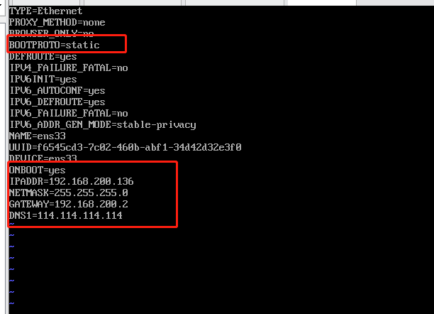
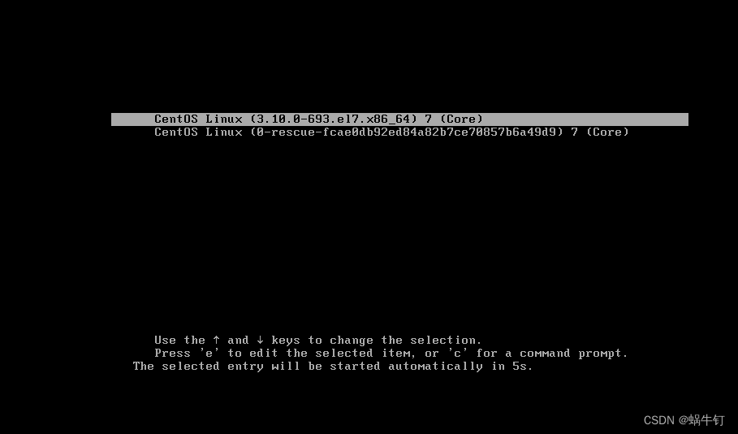
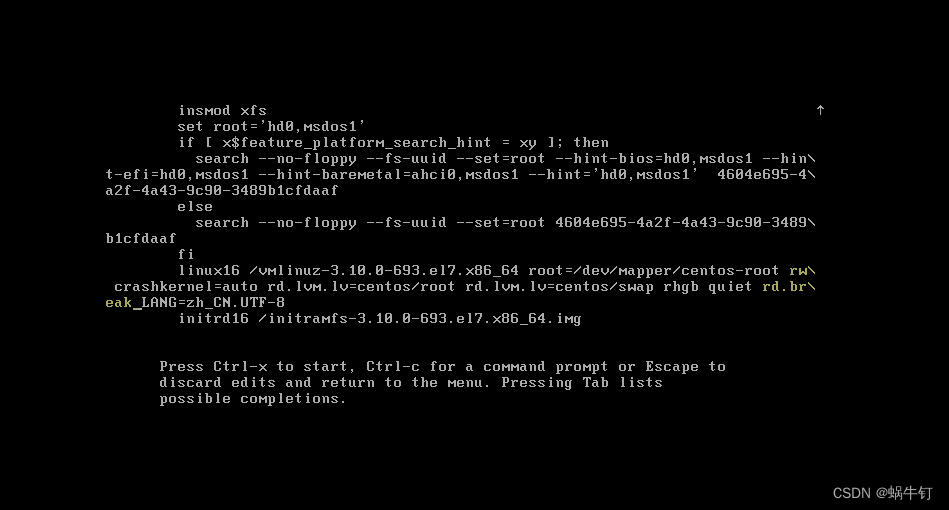
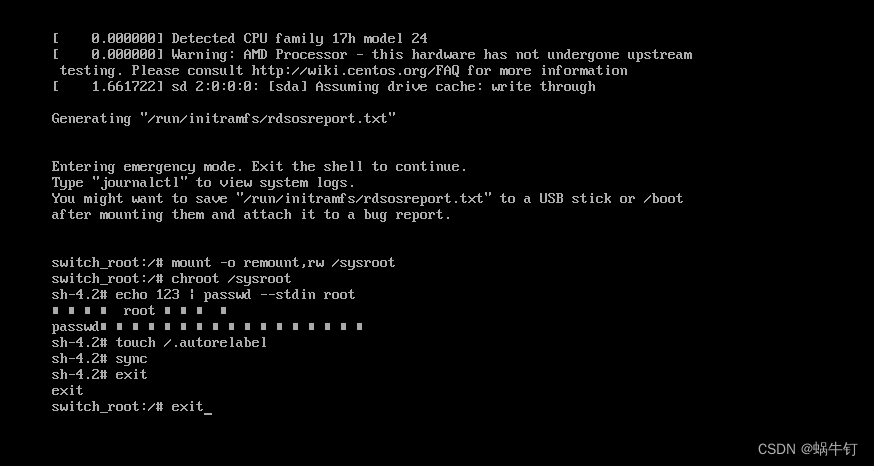

# VM配置静态ip

| 环境   | version                  |
| ------ | ------------------------ |
| centos | CentOS-7-x86_64-DVD-2009 |

~~~sh
#1.修改网络配置
vi /etc/sysconfig/network-scripts/ifcfg-ens33

#添加一下内容
IPADDR=192.168.200.136
NETMASK=255.255.255.0
GATEWAY=192.168.200.2
DNS1=114.114.114.114
~~~

~~~sh
#2.重启网络
systemctl restart network
~~~

3.修改VM配置

~~~sh
#4.验证
ip addr
~~~

# VM克隆

**注意：克隆之后注意要将mac重新生成，此时ip和源主机一样，所以先别登源主机，改完ip再登。**

~~~sh
#修改ip
vi /etc/sysconfig/network-scripts/ifcfg-ens33
~~~

# 防火墙、端口相关

~~~sh
#开启端口
firewall-cmd --zone=public --add-port=80/tcp --permanent
#已开启端口
firewall-cmd --list-port
#某个端口是否开启
firewall-cmd --query-port=80/tcp
#重启防火墙
firewall-cmd --reload
#关闭防火墙
systemctl stop firewalld.service

#查看端口
netstat -nlptu
~~~

# 文件

~~~sh
#查看某个目录下所有文件的大小
du -h
~~~

# vi

~~~sh
#删除某一行
dd
#删除全部
d+G
#复制当前行
yy复制当前行，在合适的位置，p粘贴
#复制n行
nyy复制n行（n=1,2,3...），在合适的位置，p粘贴
~~~

# grep

~~~sh
#查看xx文件xx内容后的20行
cat xx.conf | grep xx -A 20
~~~

# rpm

~~~sh
#安装
rpm -ivh xx.rpm
#查看某个rpm是否安装了
rpm -qa|grep xx
#卸载
rpm -e xx.rpm
#升级
rpm -Uvh xx.rpm
#查询软件描述信息的命令格式
rpm -qpi xxx.rpm
#列出软件文件信息的命令格式
rpm -qpl xxx.rpm
#查询文件属于哪个RPM的命令格式
rpm -qf xxx.rpm

#参数说明
-a 　查询所有套件。
-b<完成阶段><套件档>+或-t <完成阶段><套件档>+ 　设置包装套件的完成阶段，并指定套件档的文件名称。
-c 　只列出组态配置文件，本参数需配合"-l"参数使用。
-d 　只列出文本文件，本参数需配合"-l"参数使用。
-e<套件档>或--erase<套件档> 　删除指定的套件。
-f<文件>+ 　查询拥有指定文件的套件。
-h或--hash 　套件安装时列出标记。
-i 　显示套件的相关信息。
-i<套件档>或--install<套件档> 　安装指定的套件档。
-l 　显示套件的文件列表。
-p<套件档>+ 　查询指定的RPM套件档。
-q 　使用询问模式，当遇到任何问题时，rpm指令会先询问用户。
-R 　显示套件的关联性信息。
-s 　显示文件状态，本参数需配合"-l"参数使用。
-U<套件档>或--upgrade<套件档> 升级指定的套件档。
-v 　显示指令执行过程。
-vv 　详细显示指令执行过程，便于排错。
-addsign<套件档>+ 　在指定的套件里加上新的签名认证。
--allfiles 　安装所有文件。
--allmatches 　删除符合指定的套件所包含的文件。
--badreloc 　发生错误时，重新配置文件。
--buildroot<根目录> 　设置产生套件时，欲当作根目录的目录。
--changelog 　显示套件的更改记录。
--checksig<套件档>+ 　检验该套件的签名认证。
--clean 　完成套件的包装后，删除包装过程中所建立的目录。
--dbpath<数据库目录> 　设置欲存放RPM数据库的目录。
--dump 　显示每个文件的验证信息。本参数需配合"-l"参数使用。
--excludedocs 　安装套件时，不要安装文件。
--excludepath<排除目录> 　忽略在指定目录里的所有文件。
--force 　强行置换套件或文件。
--ftpproxy<主机名称或IP地址> 　指定FTP代理服务器。
--ftpport<通信端口> 　设置FTP服务器或代理服务器使用的通信端口。
--help 　在线帮助。
--httpproxy<主机名称或IP地址> 　指定HTTP代理服务器。
--httpport<通信端口> 　设置HTTP服务器或代理服务器使用的通信端口。
--ignorearch 　不验证套件档的结构正确性。
--ignoreos 　不验证套件档的结构正确性。
--ignoresize 　安装前不检查磁盘空间是否足够。
--includedocs 　安装套件时，一并安装文件。
--initdb 　确认有正确的数据库可以使用。
--justdb 　更新数据库，当不变动任何文件。
--nobulid 　不执行任何完成阶段。
--nodeps 　不验证套件档的相互关联性。
--nofiles 　不验证文件的属性。
--nogpg 　略过所有GPG的签名认证。
--nomd5 　不使用MD5编码演算确认文件的大小与正确性。
--nopgp 　略过所有PGP的签名认证。
--noorder 　不重新编排套件的安装顺序，以便满足其彼此间的关联性。
--noscripts 　不执行任何安装Script文件。
--notriggers 　不执行该套件包装内的任何Script文件。
--oldpackage 　升级成旧版本的套件。
--percent 　安装套件时显示完成度百分比。
--pipe<执行指令> 　建立管道，把输出结果转为该执行指令的输入数据。
--prefix<目的目录> 　若重新配置文件，就把文件放到指定的目录下。
--provides 　查询该套件所提供的兼容度。
--queryformat<档头格式> 　设置档头的表示方式。
--querytags 　列出可用于档头格式的标签。
--rcfile<配置文件> 　使用指定的配置文件。
--rebulid<套件档> 　安装原始代码套件，重新产生二进制文件的套件。
--rebuliddb 　以现有的数据库为主，重建一份数据库。
--recompile<套件档> 　此参数的效果和指定"--rebulid"参数类似，当不产生套件档。
--relocate<原目录>=<新目录> 　把本来会放到原目录下的文件改放到新目录。
--replacefiles 　强行置换文件。
--replacepkgs 　强行置换套件。
--requires 　查询该套件所需要的兼容度。
--resing<套件档>+ 　删除现有认证，重新产生签名认证。
--rmsource 　完成套件的包装后，删除原始代码。
--rmsource<文件> 　删除原始代码和指定的文件。
--root<根目录> 　设置欲当作根目录的目录。
--scripts 　列出安装套件的Script的变量。
--setperms 　设置文件的权限。
--setugids 　设置文件的拥有者和所属群组。
--short-circuit 　直接略过指定完成阶段的步骤。
--sign 　产生PGP或GPG的签名认证。
--target=<安装平台>+ 　设置产生的套件的安装平台。
--test 　仅作测试，并不真的安装套件。
--timecheck<检查秒数> 　设置检查时间的计时秒数。
--triggeredby<套件档> 　查询该套件的包装者。
--triggers 　展示套件档内的包装Script。
--verify 　此参数的效果和指定"-q"参数相同。
--version 　显示版本信息。
--whatprovides<功能特性> 　查询该套件对指定的功能特性所提供的兼容度。
--whatrequires<功能特性> 　查询该套件对指定的功能特性所需要的兼容度。
~~~

# zip

~~~sh
#把/home目录下面的data目录压缩为data.zip
zip -r data.zip data #压缩data目录
#把/home目录下面的data.zip解压到databak目录里面
unzip data.zip -d databak
#/home目录下面的a文件夹和3.txt压缩成为a123.zip
zip -r a123.zip a 3.txt
#/home目录下面的t.zip直接解压到/home目录里面
unzip t.zip
#/home目录下面的a1.zip、a2.zip、a3.zip同时解压到/home目录里面
unzip a*.zip
#/home目录下面w.zip里面的所有文件解压到第一级目录
unzip -j wt.zip
#指定密码
zip data.zip ./data/* -e 
~~~

选项	说明
-q	不显示指令执行过程
-r	递归处理，将指定目录下的所有文件和子目录一起处理
-z	给压缩文件加上注释
-v	显示指令的执行过程
-d	删除压缩包内的文件
-n   <后缀>	不压缩具有特定后缀的文件
-e	加密压缩文件
-u	更新或追加文件到压缩包内
-f	更新现有的文件
-m	将文件压缩并加入压缩文件后，删除原始文件，即把文件移到压缩文件中
-o	以压缩文件内拥有最新更改时间的文件为准，将压缩文件的更改时间设成和该文件相同

# 实用命令

清缓存

~~~sh
#清理前最好sync一下，防止正在运行的程序崩溃
sync
echo 3 > /proc/sys/vm/drop_caches
~~~

scp

~~~sh
#将本机/root/lk目录下所有的文件传输到服务器43.224.34.73的/home/lk/cpfile目录下
scp -r /root/lk root@43.224.34.73:/home/lk/cpfile
#将服务器43.224.34.73上/home/lk/目录下所有的文件全部复制到本地的/root目录下
scp -r root@43.224.34.73:/home/lk /root
~~~

目录/文件相关

~~~sh
#查看某个目录下文件数
ls | wc -l
~~~

# pg

~~~sh
#进去cmd
psql -U postgres -h localhost -p 5432 -d dbname
# 备份sql（结构+数据），数据加上 -a ,结构加上-s , 什么都不加就是结构+数据
1. cd到pg的bin
2. pg_dump -h localhost -U postgres databasename > databasename.bak
# 恢复sql
3. psql -h localhost -U postgres -d databasename < databasename.bak
~~~

# 查看日志

~~~sh
#查看某个service日志
journalctl -e -u 服务名
#查看系统日志
cat /var/log/message
~~~

# 查看磁盘

~~~sh
#查看磁盘使用
df -h
#查看某个目录磁盘
~~~

# 查看端口

~~~sh
查看端口是否使用
netstat -tlnp|grep xx
~~~

# lsof

> `lsof`（List Open Files）命令在Linux系统中用于查看当前系统上所有打开的文件和与之关联的进程。每个进程在系统中都有文件描述符，用于指向打开的文件，这些文件可以是磁盘文件、网络套接字、管道等。
>
> `lsof`命令可以帮助用户了解哪些文件被哪个进程打开，以及这些文件的状态信息。命令可以帮助系统管理员或者开发人员诊断和排查各种与文件访问相关的问题。

~~~sh
lsof [选项] [文件]

`-a` 或 `--all`：显示所有打开的文件，不仅仅是已经被映射到内存中的文件。
`-c <字符串>` 或 `--command <字符串>`：只显示指定命令的打开文件。
`-d <文件描述符>` 或 `--disk-only`：只显示指定文件描述符的文件。
`-h` 或 `--human-readable`：以易读的格式显示文件大小。
`-i` 或 `--network`：显示网络相关的文件（如套接字）。
`-n` 或 `--numeric`：不解析网络地址，显示数字形式的端口号和进程ID。
`-p <PID>` 或 `--pid <PID>`：只显示指定进程ID的打开文件。
`-u <用户>` 或 `--user <用户>`：只显示指定用户的所有打开文件。
`-v` 或 `--verbose`：详细显示信息，包括进程的环境和文件的状态。
`-t` 或 `--tables`：只更新打开文件的表，而不显示它们。
`-x` 或 `--extend`：显示额外的信息，如文件权限和文件系统类型。
~~~

## 常见用法

### 1. 查找占用特定端口的进程：

~~~sh
[root@ecs-52a1 121yunwei]# lsof -i:26088
COMMAND       PID   USER   FD   TYPE    DEVICE SIZE/OFF NODE NAME
nginx.out 4067399   root    8u  IPv4 762811375      0t0  TCP *:26088 (LISTEN)
nginx.out 4067405 nobody    8u  IPv4 762811375      0t0  TCP *:26088 (LISTEN)
~~~

> COMMAND：进程的命令名称。
>
> PID：             进程ID。
>
> USER：        进程所属的用户。
>
> FD：             文件描述符。在Unix系统中，每个打开的文件都有一个唯一的文件描述符。
>
> TYPE：        文件类型，可以是REG（普通文件）、DIR（目录）、CHR（字符设备）、BLK（块设备）、FIFO（管道）、LINK（符号链接）、SOCK（套接字）等。
>
> DEVICE：    文件的设备编号，对于普通文件，这通常是文件的inode号。
>
> SIZE/OFF：文件的大小或者偏移量，对于块设备和字符设备尤其重要。
>
> NODE：      文件的inode号。
>
> NAME：      打开文件的路径。
>

### 2. 查看某个文件被哪个进程打开：

~~~sh
lsof /path-to-file
~~~

### 3. 查找特定用户的打开文件：

~~~sh
lsof -u username
~~~

### 4. 查看详细信息，包括环境和文件状态：

~~~sh
lsof -v
~~~

# linux系统忘记密码

`以CentOS7为例`

**1.开机/或者重新启动CentOS系统，然后如图所示，迅速按下'e'**

**2.按下'e'之后，进入到了如图所示页面,键盘上下键找到 ro**

将图中的 ro 改为 rw 

再在 rhgb quiet 后面写上 rd.break  记得注意空格。

然后按Ctrl + X 确定

3. **然后进入如下界面，依次输入以下命令.....[注意命令之间的空格]**

~~~bash
mount -o remount,rw /sysroot   # 意思是重新挂载 remount 文件系统，并将其设置为可读写
chroot /sysroot   # 更改root目录
echo 123 | password --stdin root  # 给root设置密码为123 
touch /.autorelabel   # 重新给系统打一下selinux标签
sync # 同步到系统里
exit
exit
~~~

