# HTTP协议

## HTTP协议是怎么工作的

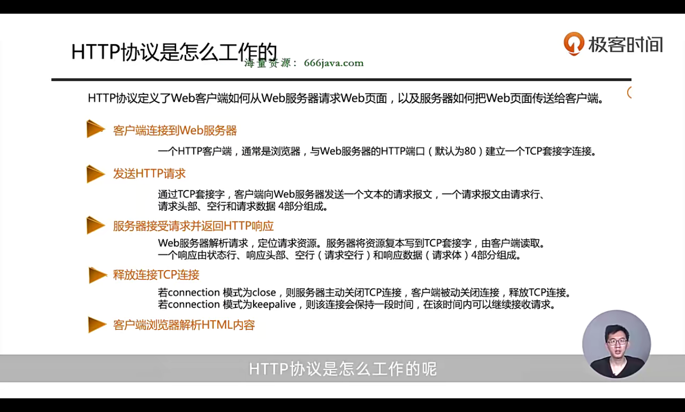

## HTTP协议组成

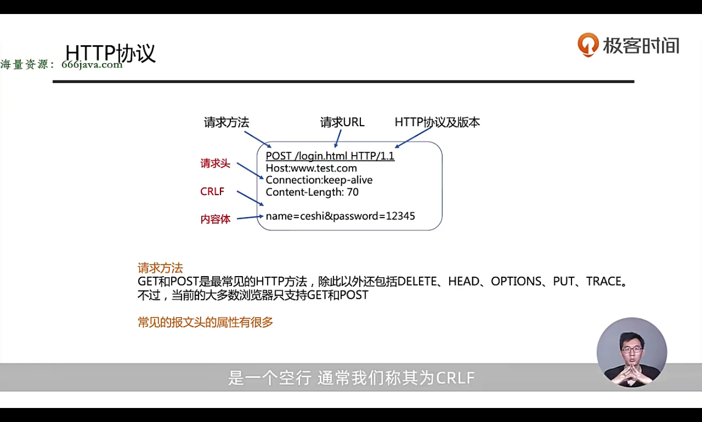

## GET VS POST

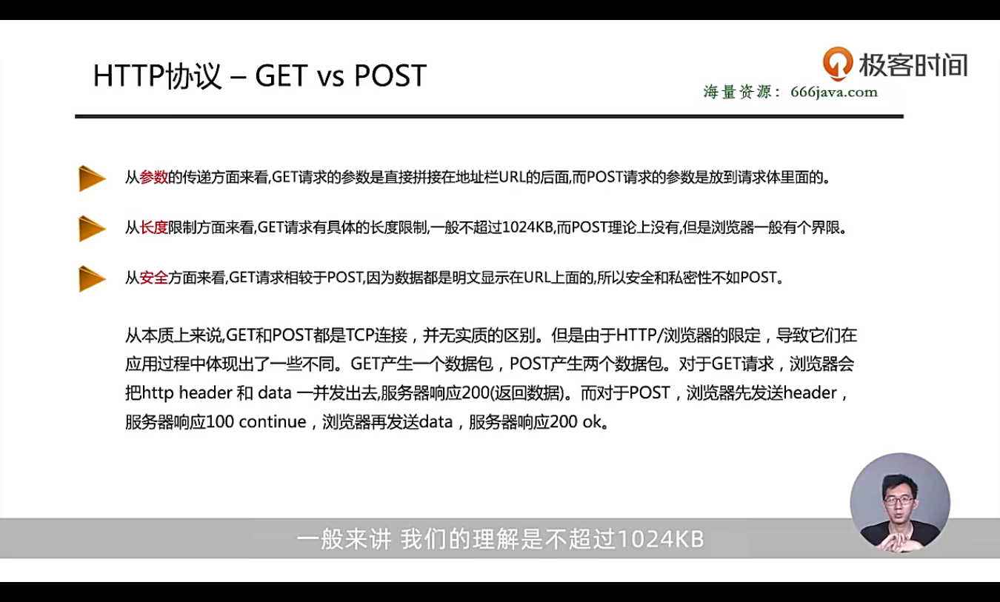

## HTTP请求方法和响应代码

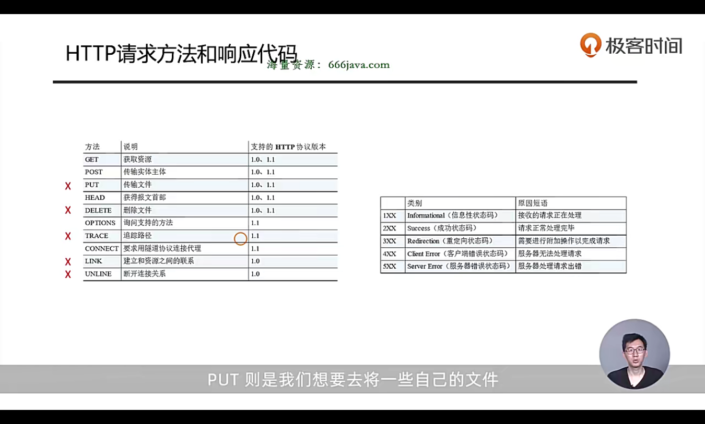

# Web安全起源

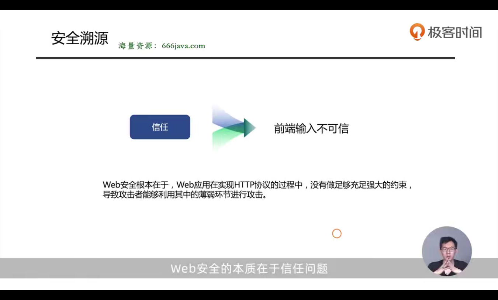

# XSS

## 存储型 XSS

> 存储型 XSS 是指应用程序通过 Web 请求获取不可信赖的数据，在未检验数据是否存在 XSS 代码的情况下，便将其存入数据库。当下一次从数据库中获取该数据时程序也未对其进行过滤，页面再次执行 XSS 代码，存储型 XSS 可以持续攻击用户。

### 出现位置

- 留言板
- 评论区
- 用户头像
- 个性签名
- 博客

### BeEF

> 全称 The Browser Exploitation Framework,是一款针对浏览器的渗透测试工具。 用 Ruby 语言开发的，Kali 中默认安装的一个模块，用于实现对 XSS 漏洞的攻击和利用。自带一个 JS 脚本和后台管理页面。

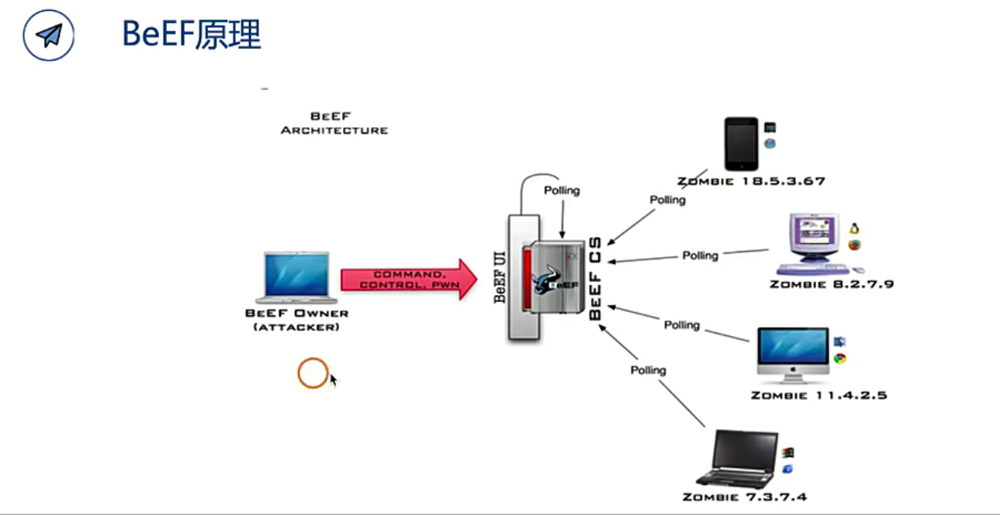

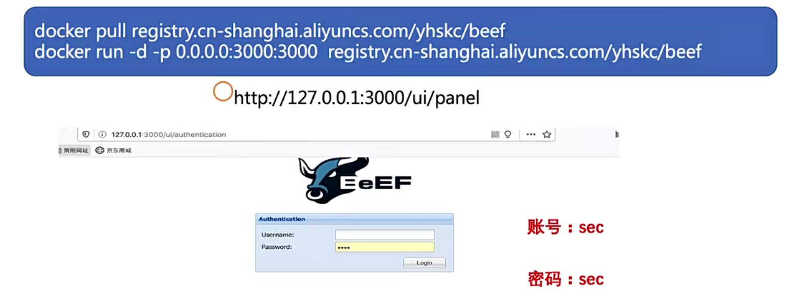

效果

页面会出现钓鱼按钮，用户点击后会进入钓鱼界面。

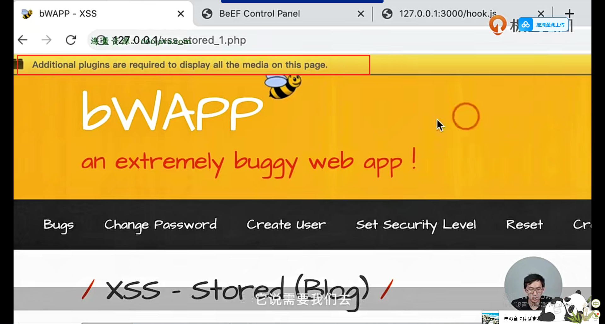

### 防御

字符替换标签

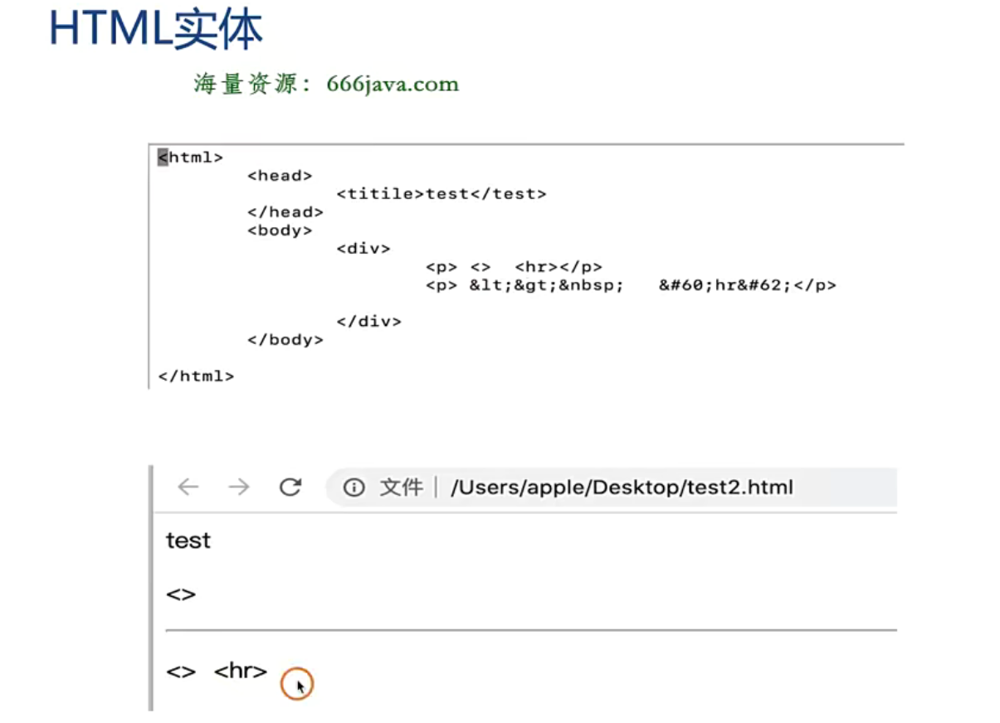

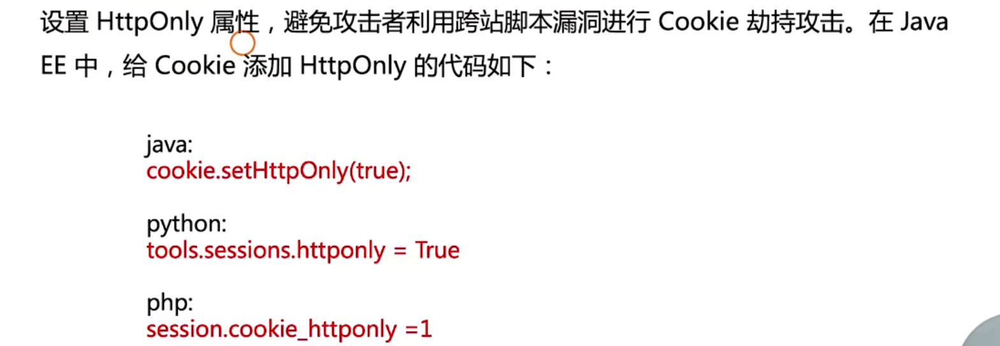

# CSRF

## 原理

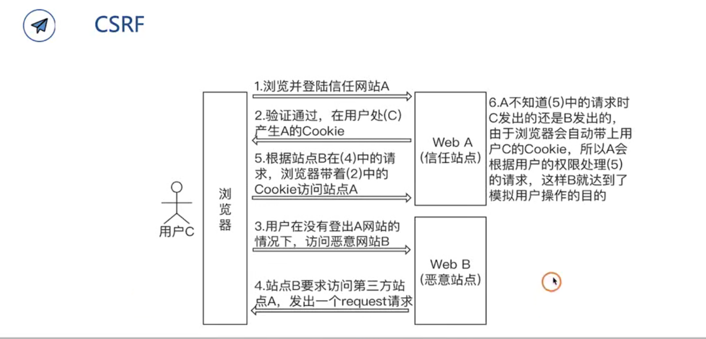

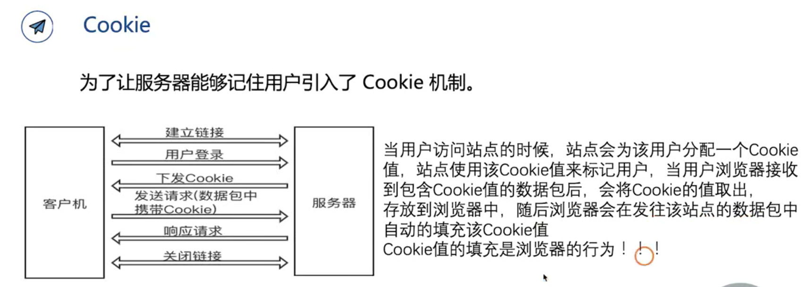

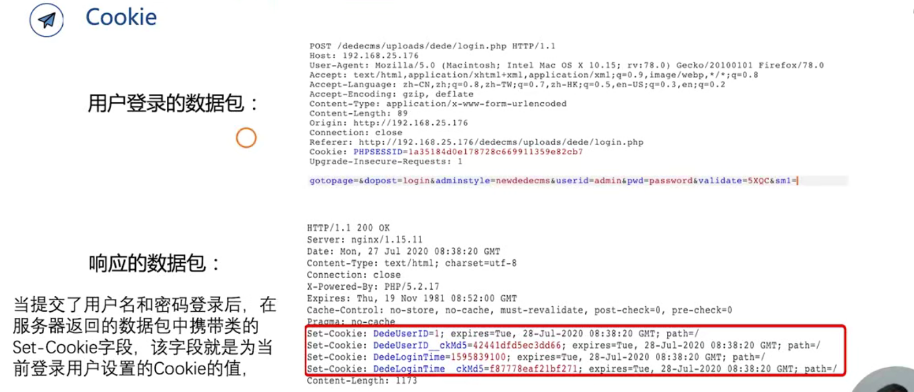

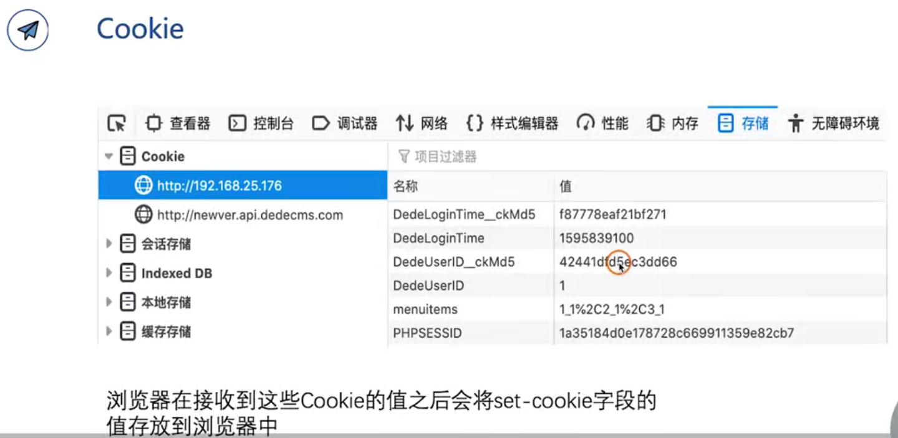

> 数据包的中 Cookie 的值是浏览器从本地存储中取出，并自动填充到数据包中。如果攻击者控制了用户浏览器并且窃取了cookie。浏览器会自动完成 Cookie 的填充，目标网站会误认为该数据包就是管理员发送的，会以
> 管理员的权限进行相关的操作。

## 防御

### HTTP Referer

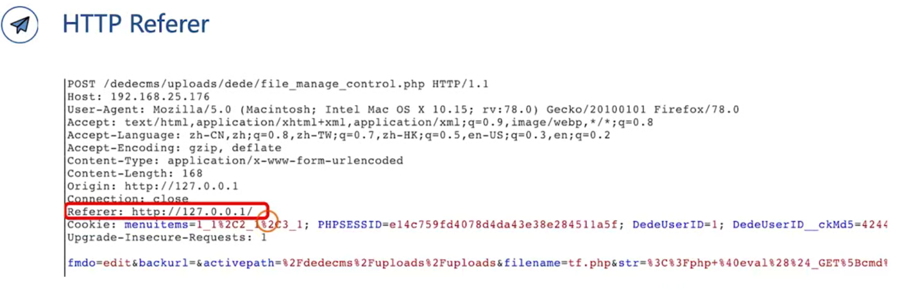

> 站点可以对一些敏感操作限制其 Referer 字段的值，比如某站点转账的时候使用:
> http://bank.example/withdraw?account=bob&amount=1000000&for=Mallory
> 转账的操作一定是用户登录之后在本站点的页面上操作的，因为可以将 Referer字段限制为只允许本站点。

### Token

CSRF 成功的原因在于站点对于用户身份的辨别依赖Cookie，因此攻击者可以在不知道用户口令的情况下直接使用用户的 Cookie 来通过安全验证。
在 HTTP 请求中以参数的形式形式加入一个随机产生的Token，服务器接收到用户请求后会验证Token，如果没有Token或Token不正确都会被认为是攻击而直接丢弃。
GET 请求:	http://url?csrftoken=tokenvalue
POST 请求: 	<input type=" hidden" name=" csrftoken" value=" tokenvalue” />

比如攻击者可以在网站发布自己服务器的地址，当普通用户点击了该地址后，由于该站点会在地址后面添加 Token，也就造成了 Token 的泄露。
站点对内链和外链进行区分，只在内链中添加 Token，对于外链就不添加 Token。

### 同源策略

> 同源（协议、主机、端口）：如果两个URL的协议、主机、端口都相同则认为是同源的。
>
> 同源策略是浏览器的一个安全功能，不同源的客户端脚本在没有明确授权的情况下，不能读写对方资源。
> 同源策略限制了从一个源加载的文档或脚本如何与来自另一个源的资源进行交互。这是一个用于隔离潜在恶意文件的重要安全机制。

从以下两个方面介绍同源策略：

1. Cookie

   在同源策略的限制下非同源的站点是不能够互相读取 Cookie 的。这个限制在父/子域名中同样存在。

   

   注意：`通过设置 domain 打破了浏览器对于 Cookie 的同源限制。`可以通过子站入手，通过主站获取子站的 Cookie 值。

   

   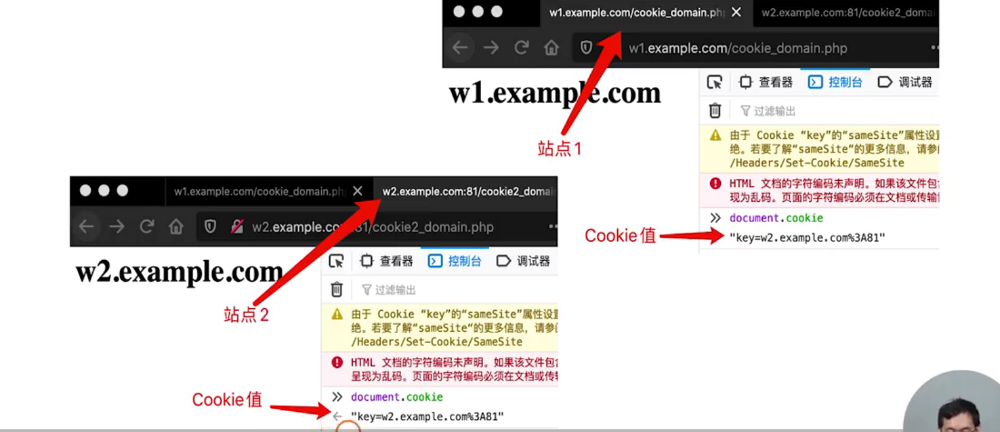

2. DOM

   在同源策略的限制下非同源的站点是无法相互获取 DOM，这里以子域名之间获取 DOM 为例子。

   

   注意：`通过设置 domain 打破了浏览器对于 DOM的同源限制。`可以通过子站入手，通过主站获取子站的 DOM值。

   

