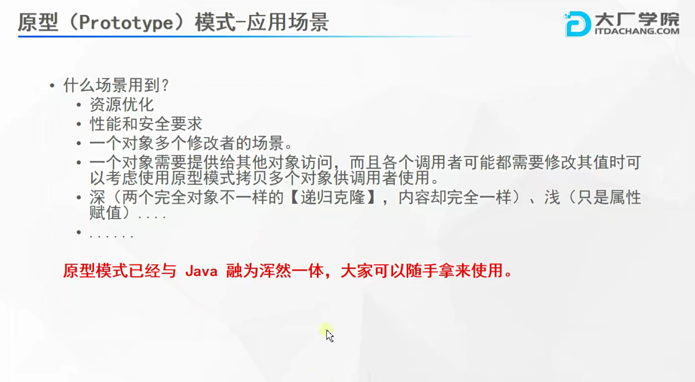
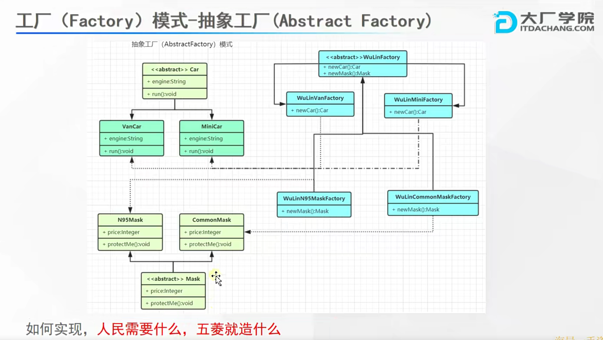
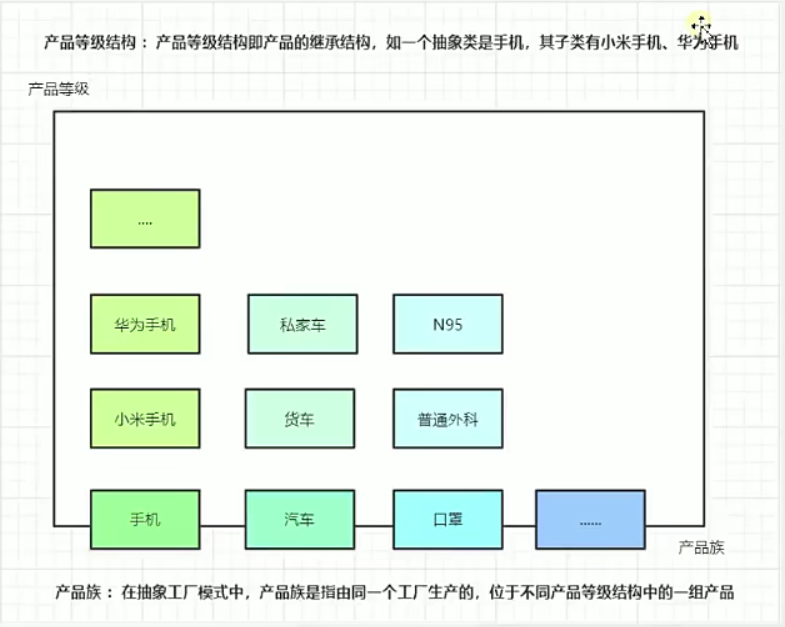
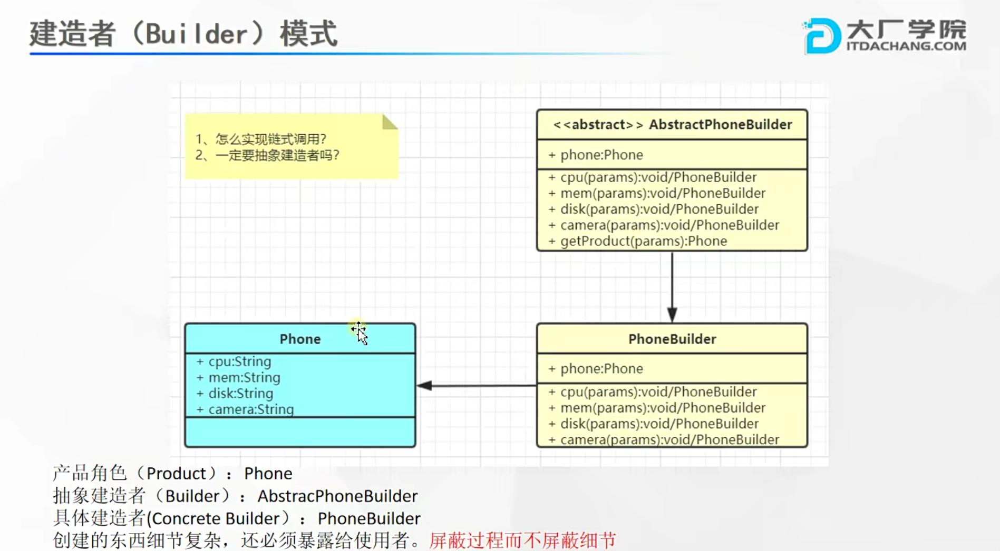

# 7大原则

## 开闭原则

> 定义：软件实体应当对扩展开放，对修改关闭
>
> 大白话：**扩展新类而非修改旧类**

## 里式替换原则

> 定义：继承必须确保超类所拥有的性质在子类中仍然成立
>
> 大白话：**继承父类而非改变父类**，《设计模式之禅》：有父类的地方子类就可以使用

以下是反例（不遵守里式替换原则）：

~~~java
public class Father {
    public Collection doSomething(Map map){
        System.out.println("父类被执行...");
        return map.values();
    }
}
~~~

~~~java
public class Son extends Father {
    //缩小输入参数范围
    //注意！！！！此处不是重写而是重载~！！
    public Collection doSomething(HashMap map){
        System.out.println("子类被执行...");
        return map.values();
    }
}
~~~

~~~java
public class Client {
    public static void invoker(){
        //有父类的地方就有子类
        Father f= new Father();
        HashMap map = new HashMap();
        f.doSomething(map);
    }
    public static void main(String[] args) {
    	invoker();
    }
}
//返回结果：父类被执行...
~~~

使用里式替换原则：

~~~java
public class Client {
    public static void invoker(){
        //有父类的地方就有子类
        Son f =new Son();
        HashMap map = new HashMap();
        f.doSomething(map);
    }
    public static void main(String[] args) {
    	invoker();
    }
}
//返回结果：子类被执行...
~~~

子类在没有覆写父类的方法的前提下，子类方法被执行了，这会引起业务逻辑混乱。所以子类中方法的前置条件必须与超类中被覆写的方法的前置条件相同或者更宽松。

重写或实现父类的方法时输出结果可以被缩小。

## 依赖倒置原则

> 定义：高层模块不应该依赖底层模块，两者都应该依赖其抽象；抽象不应该依赖细节，细节应该依赖抽象。
>
> 大白话：**面向接口编程而非面向实现类**

## 单一职责原则

> 定义：一个类应该有且仅有一个引起它变化的原因，否则类应该被拆分
>
> 大白话：**每个类只负责自己的事情，而非万能**

单一职责原则提出了一个编写程序的标准，用“职责”或“变化原因”来衡量接口或类设计得是否优良，但是“职责”和“变化原因”都是不可度量的，因项目而异，因环境而异。

## 接口隔离原则

> 定义：一个类对另一个类的依赖应该建立在最小的接口上
>
> 大白话：**各个类建立自己的专用接口，而非建立万能接口**

## 迪米特法则

> 定义：也称最少知识原则
>
> 大白话：**无需直接交互的两个类，如果需要交互，使用中间者**
>
> 注意：过度使用迪米特法则会使系统产生大量的中间类，增加系统复杂度，使模块间通信效率变低

## 合成复用原则

> 定义：软件复用时，要尽量使用组合或者聚合等关联关系来实现，其次才考虑继承
>
> 大白话：**优先组合，其次继承**


# 创建型模式（5个）

## 单例模式

### 41 | 单例模式（上）：为什么说支持懒加载的双重检测不比饿汉式更优？

#### 为什么要使用单例？

**单例设计模式**（Singleton Design Pattern）理解起来非常简单。一个类只允许创建一个对象（或者实例），那这个类就是一个单例类，这种设计模式就叫作单例设计模式，简称单例模式。

#### 实战案例一：处理资源访问冲突

在这个例子中，我们自定义实现了一个往文件中打印日志的Logger类。具体的代码实现如下所示：

```java
public class Logger {
  private FileWriter writer;

  public Logger() {
    File file = new File("/Users/wangzheng/log.txt");
    writer = new FileWriter(file, true); //true表示追加写入
  }

  public void log(String message) {
    writer.write(message);
  }
}

// Logger类的应用示例：
public class UserController {
  private Logger logger = new Logger();

  public void login(String username, String password) {
    // ...省略业务逻辑代码...
    logger.log(username + " logined!");
  }
}

public class OrderController {
  private Logger logger = new Logger();

  public void create(OrderVo order) {
    // ...省略业务逻辑代码...
    logger.log("Created an order: " + order.toString());
  }
}

```

看完代码之后，先别着急看我下面的讲解，你可以先思考一下，这段代码存在什么问题。

在上面的代码中，我们注意到，所有的日志都写入到同一个文件/Users/wangzheng/log.txt中。在UserController和OrderController中，我们分别创建两个Logger对象。在Web容器的Servlet多线程环境下，如果两个Servlet线程同时分别执行login()和create()两个函数，并且同时写日志到log.txt文件中，那就有可能存在日志信息互相覆盖的情况。

为什么会出现互相覆盖呢？我们可以这么类比着理解。在多线程环境下，如果两个线程同时给同一个共享变量加1，因为共享变量是竞争资源，所以，共享变量最后的结果有可能并不是加了2，而是只加了1。同理，这里的log.txt文件也是竞争资源，两个线程同时往里面写数据，就有可能存在互相覆盖的情况。


那如何来解决这个问题呢？我们最先想到的就是通过加锁的方式：给log()函数加互斥锁（Java中可以通过synchronized的关键字），同一时刻只允许一个线程调用执行log()函数。具体的代码实现如下所示：

```java
public class Logger {
  private FileWriter writer;

  public Logger() {
    File file = new File("/Users/wangzheng/log.txt");
    writer = new FileWriter(file, true); //true表示追加写入
  }

  public void log(String message) {
    synchronized(this) {
      writer.write(mesasge);
    }
  }
}

```

不过，你仔细想想，这真的能解决多线程写入日志时互相覆盖的问题吗？答案是否定的。这是因为，这种锁是一个对象级别的锁，一个对象在不同的线程下同时调用log()函数，会被强制要求顺序执行。但是，不同的对象之间并不共享同一把锁。在不同的线程下，通过不同的对象调用执行log()函数，锁并不会起作用，仍然有可能存在写入日志互相覆盖的问题。


我这里稍微补充一下，在刚刚的讲解和给出的代码中，我故意“隐瞒”了一个事实：我们给log()函数加不加对象级别的锁，其实都没有关系。因为FileWriter本身就是线程安全的，它的内部实现中本身就加了对象级别的锁，因此，在外层调用write()函数的时候，再加对象级别的锁实际上是多此一举。因为不同的Logger对象不共享FileWriter对象，所以，FileWriter对象级别的锁也解决不了数据写入互相覆盖的问题。

那我们该怎么解决这个问题呢？实际上，要想解决这个问题也不难，我们只需要把对象级别的锁，换成类级别的锁就可以了。让所有的对象都共享同一把锁。这样就避免了不同对象之间同时调用log()函数，而导致的日志覆盖问题。具体的代码实现如下所示：

```java
public class Logger {
  private FileWriter writer;

  public Logger() {
    File file = new File("/Users/wangzheng/log.txt");
    writer = new FileWriter(file, true); //true表示追加写入
  }

  public void log(String message) {
    synchronized(Logger.class) { // 类级别的锁
      writer.write(mesasge);
    }
  }
}

```

除了使用类级别锁之外，实际上，解决资源竞争问题的办法还有很多，分布式锁是最常听到的一种解决方案。不过，实现一个安全可靠、无bug、高性能的分布式锁，并不是件容易的事情。除此之外，并发队列（比如Java中的BlockingQueue）也可以解决这个问题：多个线程同时往并发队列里写日志，一个单独的线程负责将并发队列中的数据写入到日志文件。这种方式实现起来也稍微有点复杂。

相对于这两种解决方案，单例模式的解决思路就简单一些了。单例模式相对于之前类级别锁的好处是，不用创建那么多Logger对象，一方面节省内存空间，另一方面节省系统文件句柄（对于操作系统来说，文件句柄也是一种资源，不能随便浪费）。

我们将Logger设计成一个单例类，程序中只允许创建一个Logger对象，所有的线程共享使用的这一个Logger对象，共享一个FileWriter对象，而FileWriter本身是对象级别线程安全的，也就避免了多线程情况下写日志会互相覆盖的问题。

按照这个设计思路，我们实现了Logger单例类。具体代码如下所示：

```java
public class Logger {
  private FileWriter writer;
  private static final Logger instance = new Logger();

  private Logger() {
    File file = new File("/Users/wangzheng/log.txt");
    writer = new FileWriter(file, true); //true表示追加写入
  }

  public static Logger getInstance() {
    return instance;
  }

  public void log(String message) {
    writer.write(mesasge);
  }
}

// Logger类的应用示例：
public class UserController {
  public void login(String username, String password) {
    // ...省略业务逻辑代码...
    Logger.getInstance().log(username + " logined!");
  }
}

public class OrderController {
  public void create(OrderVo order) {
    // ...省略业务逻辑代码...
    Logger.getInstance().log("Created a order: " + order.toString());
  }
}

```

#### 实战案例二：表示全局唯一类

从业务概念上，如果有些数据在系统中只应保存一份，那就比较适合设计为单例类。

比如，配置信息类。在系统中，我们只有一个配置文件，当配置文件被加载到内存之后，以对象的形式存在，也理所应当只有一份。

再比如，唯一递增ID号码生成器（ [第34讲](https://time.geekbang.org/column/article/190979) 中我们讲的是唯一ID生成器，这里讲的是唯一递增ID生成器），如果程序中有两个对象，那就会存在生成重复ID的情况，所以，我们应该将ID生成器类设计为单例。

```java
import java.util.concurrent.atomic.AtomicLong;
public class IdGenerator {
  // AtomicLong是一个Java并发库中提供的一个原子变量类型,
  // 它将一些线程不安全需要加锁的复合操作封装为了线程安全的原子操作，
  // 比如下面会用到的incrementAndGet().
  private AtomicLong id = new AtomicLong(0);
  private static final IdGenerator instance = new IdGenerator();
  private IdGenerator() {}
  public static IdGenerator getInstance() {
    return instance;
  }
  public long getId() {
    return id.incrementAndGet();
  }
}

// IdGenerator使用举例
long id = IdGenerator.getInstance().getId();

```

实际上，今天讲到的两个代码实例（Logger、IdGenerator），设计的都并不优雅，还存在一些问题。至于有什么问题以及如何改造，今天我暂时卖个关子，下一节课我会详细讲解。

#### 如何实现一个单例？

概括起来，要实现一个单例，我们需要关注的点无外乎下面几个：

- 构造函数需要是private访问权限的，这样才能避免外部通过new创建实例；
- 考虑对象创建时的线程安全问题；
- 考虑是否支持延迟加载；
- 考虑getInstance()性能是否高（是否加锁）。

##### 1.饿汉式

饿汉式的实现方式比较简单。在类加载的时候，instance静态实例就已经创建并初始化好了，所以，instance实例的创建过程是线程安全的。不过，这样的实现方式不支持延迟加载（在真正用到IdGenerator的时候，再创建实例），从名字中我们也可以看出这一点。具体的代码实现如下所示：

```java
public class IdGenerator {
  private AtomicLong id = new AtomicLong(0);
  private static final IdGenerator instance = new IdGenerator();
  private IdGenerator() {}
  public static IdGenerator getInstance() {
    return instance;
  }
  public long getId() {
    return id.incrementAndGet();
  }
}

```

有人觉得这种实现方式不好，因为不支持延迟加载，如果实例占用资源多（比如占用内存多）或初始化耗时长（比如需要加载各种配置文件），提前初始化实例是一种浪费资源的行为。最好的方法应该在用到的时候再去初始化。不过，我个人并不认同这样的观点。

如果初始化耗时长，那我们最好不要等到真正要用它的时候，才去执行这个耗时长的初始化过程，这会影响到系统的性能（比如，在响应客户端接口请求的时候，做这个初始化操作，会导致此请求的响应时间变长，甚至超时）。采用饿汉式实现方式，将耗时的初始化操作，提前到程序启动的时候完成，这样就能避免在程序运行的时候，再去初始化导致的性能问题。

如果实例占用资源多，按照fail-fast的设计原则（有问题及早暴露），那我们也希望在程序启动时就将这个实例初始化好。如果资源不够，就会在程序启动的时候触发报错（比如Java中的 PermGen Space OOM），我们可以立即去修复。这样也能避免在程序运行一段时间后，突然因为初始化这个实例占用资源过多，导致系统崩溃，影响系统的可用性。

##### 2.懒汉式

懒汉式相对于饿汉式的优势是支持延迟加载。具体的代码实现如下所示：

```java
public class IdGenerator {
  private AtomicLong id = new AtomicLong(0);
  private static IdGenerator instance;
  private IdGenerator() {}
  public static synchronized IdGenerator getInstance() {
    if (instance == null) {
      instance = new IdGenerator();
    }
    return instance;
  }
  public long getId() {
    return id.incrementAndGet();
  }
}

```

不过懒汉式的缺点也很明显，我们给getInstance()这个方法加了一把大锁（synchronzed），导致这个函数的并发度很低。量化一下的话，并发度是1，也就相当于串行操作了。而这个函数是在单例使用期间，一直会被调用。如果这个单例类偶尔会被用到，那这种实现方式还可以接受。但是，如果频繁地用到，那频繁加锁、释放锁及并发度低等问题，会导致性能瓶颈，这种实现方式就不可取了。

##### 3.双重检测

饿汉式不支持延迟加载，懒汉式有性能问题，不支持高并发。那我们再来看一种既支持延迟加载、又支持高并发的单例实现方式，也就是双重检测实现方式。

在这种实现方式中，只要instance被创建之后，即便再调用getInstance()函数也不会再进入到加锁逻辑中了。所以，这种实现方式解决了懒汉式并发度低的问题。具体的代码实现如下所示：

```java
public class IdGenerator {
  private AtomicLong id = new AtomicLong(0);
  private static volatile IdGenerator instance;
  private IdGenerator() {}
  public static IdGenerator getInstance() {
    if (instance == null) {
      synchronized(IdGenerator.class) { // 此处为类级别的锁
        if (instance == null) {
          instance = new IdGenerator();
        }
      }
    }
    return instance;
  }
  public long getId() {
    return id.incrementAndGet();
  }
}

```

实际上，上述实现方式存在问题：CPU指令重排序可能导致在IdGenerator类的对象被关键字new创建并赋值给instance之后，还没来得及初始化（执行构造函数中的代码逻辑），就被另一个线程使用了。这样，另一个线程就使用了一个没有完整初始化的IdGenerator类的对象。要解决这个问题，我们只需要给instance成员变量添加volatile关键字来禁止指令重排序即可。

##### 4.静态内部类

我们再来看一种比双重检测更加简单的实现方法，那就是利用Java的静态内部类。它有点类似饿汉式，但又能做到了延迟加载。具体是怎么做到的呢？我们先来看它的代码实现。

```java
public class IdGenerator {
  private AtomicLong id = new AtomicLong(0);
  private IdGenerator() {}

  private static class SingletonHolder{
    private static final IdGenerator instance = new IdGenerator();
  }

  public static IdGenerator getInstance() {
    return SingletonHolder.instance;
  }

  public long getId() {
    return id.incrementAndGet();
  }
}

```

SingletonHolder 是一个静态内部类，当外部类IdGenerator被加载的时候，并不会创建SingletonHolder实例对象。只有当调用getInstance()方法时，SingletonHolder才会被加载，这个时候才会创建instance。instance的唯一性、创建过程的线程安全性，都由JVM来保证。所以，这种实现方法既保证了线程安全，又能做到延迟加载。

##### 5.枚举

最后，我们介绍一种最简单的实现方式，基于枚举类型的单例实现。这种实现方式通过Java枚举类型本身的特性，保证了实例创建的线程安全性和实例的唯一性。具体的代码如下所示：

```java
public enum IdGenerator {
  INSTANCE;
  private AtomicLong id = new AtomicLong(0);

  public long getId() {
    return id.incrementAndGet();
  }
}

```

#### 课堂讨论

1. 在你所熟悉的编程语言的类库中，有哪些类是单例类？又为什么要设计成单例类呢？
2. 在第一个实战案例中，除了我们讲到的类级别锁、分布式锁、并发队列、单例模式等解决方案之外，实际上还有一种非常简单的解决日志互相覆盖问题的方法，你想到了吗？

### 42 | 单例模式（中）：我为什么不推荐使用单例模式？又有何替代方案？

尽管单例是一个很常用的设计模式，在实际的开发中，我们也确实经常用到它，但是，有些人认为单例是一种反模式（anti-pattern），并不推荐使用。所以，今天，我就针对这个说法详细地讲讲这几个问题：单例这种设计模式存在哪些问题？为什么会被称为反模式？如果不用单例，该如何表示全局唯一类？有何替代的解决方案？

#### 单例存在哪些问题?

大部分情况下，我们在项目中使用单例，都是用它来表示一些全局唯一类，比如配置信息类、连接池类、ID生成器类。单例模式书写简洁、使用方便，在代码中，我们不需要创建对象，直接通过类似IdGenerator.getInstance().getId()这样的方法来调用就可以了。但是，这种使用方法有点类似硬编码（hard code），会带来诸多问题。接下来，我们就具体看看到底有哪些问题。

##### 1.单例对OOP特性的支持不友好

我们知道，OOP的四大特性是封装、抽象、继承、多态。单例这种设计模式对于其中的抽象、继承、多态都支持得不好。为什么这么说呢？我们还是通过IdGenerator这个例子来讲解。

```java
public class Order {
  public void create(...) {
    //...
    long id = IdGenerator.getInstance().getId();
    //...
  }
}

public class User {
  public void create(...) {
    // ...
    long id = IdGenerator.getInstance().getId();
    //...
  }
}

```

IdGenerator的使用方式违背了基于接口而非实现的设计原则，也就违背了广义上理解的OOP的抽象特性。如果未来某一天，我们希望针对不同的业务采用不同的ID生成算法。比如，订单ID和用户ID采用不同的ID生成器来生成。为了应对这个需求变化，我们需要修改所有用到IdGenerator类的地方，这样代码的改动就会比较大。

```java
public class Order {
  public void create(...) {
    //...
    long id = IdGenerator.getInstance().getId();
    // 需要将上面一行代码，替换为下面一行代码
    long id = OrderIdGenerator.getIntance().getId();
    //...
  }
}

public class User {
  public void create(...) {
    // ...
    long id = IdGenerator.getInstance().getId();
    // 需要将上面一行代码，替换为下面一行代码
    long id = UserIdGenerator.getIntance().getId();
  }
}

```

除此之外，单例对继承、多态特性的支持也不友好。这里我之所以会用“不友好”这个词，而非“完全不支持”，是因为从理论上来讲，单例类也可以被继承、也可以实现多态，只是实现起来会非常奇怪，会导致代码的可读性变差。不明白设计意图的人，看到这样的设计，会觉得莫名其妙。所以，一旦你选择将某个类设计成到单例类，也就意味着放弃了继承和多态这两个强有力的面向对象特性，也就相当于损失了可以应对未来需求变化的扩展性。

##### 2.单例会隐藏类之间的依赖关系

我们知道，代码的可读性非常重要。在阅读代码的时候，我们希望一眼就能看出类与类之间的依赖关系，搞清楚这个类依赖了哪些外部类。

通过构造函数、参数传递等方式声明的类之间的依赖关系，我们通过查看函数的定义，就能很容易识别出来。但是，单例类不需要显示创建、不需要依赖参数传递，在函数中直接调用就可以了。如果代码比较复杂，这种调用关系就会非常隐蔽。在阅读代码的时候，我们就需要仔细查看每个函数的代码实现，才能知道这个类到底依赖了哪些单例类。

##### 3.单例对代码的扩展性不友好

我们知道，单例类只能有一个对象实例。如果未来某一天，我们需要在代码中创建两个实例或多个实例，那就要对代码有比较大的改动。你可能会说，会有这样的需求吗？既然单例类大部分情况下都用来表示全局类，怎么会需要两个或者多个实例呢？

实际上，这样的需求并不少见。我们拿数据库连接池来举例解释一下。

在系统设计初期，我们觉得系统中只应该有一个数据库连接池，这样能方便我们控制对数据库连接资源的消耗。所以，我们把数据库连接池类设计成了单例类。但之后我们发现，系统中有些SQL语句运行得非常慢。这些SQL语句在执行的时候，长时间占用数据库连接资源，导致其他SQL请求无法响应。为了解决这个问题，我们希望将慢SQL与其他SQL隔离开来执行。为了实现这样的目的，我们可以在系统中创建两个数据库连接池，慢SQL独享一个数据库连接池，其他SQL独享另外一个数据库连接池，这样就能避免慢SQL影响到其他SQL的执行。

如果我们将数据库连接池设计成单例类，显然就无法适应这样的需求变更，也就是说，单例类在某些情况下会影响代码的扩展性、灵活性。所以，数据库连接池、线程池这类的资源池，最好还是不要设计成单例类。实际上，一些开源的数据库连接池、线程池也确实没有设计成单例类。

##### 4.单例对代码的可测试性不友好

单例模式的使用会影响到代码的可测试性。如果单例类依赖比较重的外部资源，比如DB，我们在写单元测试的时候，希望能通过mock的方式将它替换掉。而单例类这种硬编码式的使用方式，导致无法实现mock替换。

除此之外，如果单例类持有成员变量（比如IdGenerator中的id成员变量），那它实际上相当于一种全局变量，被所有的代码共享。如果这个全局变量是一个可变全局变量，也就是说，它的成员变量是可以被修改的，那我们在编写单元测试的时候，还需要注意不同测试用例之间，修改了单例类中的同一个成员变量的值，从而导致测试结果互相影响的问题。关于这一点，你可以回过头去看下 [第29讲](https://time.geekbang.org/column/article/186691) 中的“其他常见的Anti-Patterns：全局变量”那部分的代码示例和讲解。

##### 5.单例不支持有参数的构造函数

单例不支持有参数的构造函数，比如我们创建一个连接池的单例对象，我们没法通过参数来指定连接池的大小。针对这个问题，我们来看下都有哪些解决方案。

第一种解决思路是：创建完实例之后，再调用init()函数传递参数。需要注意的是，我们在使用这个单例类的时候，要先调用init()方法，然后才能调用getInstance()方法，否则代码会抛出异常。具体的代码实现如下所示：

```
public class Singleton {
  private static Singleton instance = null;
  private final int paramA;
  private final int paramB;

  private Singleton(int paramA, int paramB) {
    this.paramA = paramA;
    this.paramB = paramB;
  }

  public static Singleton getInstance() {
    if (instance == null) {
       throw new RuntimeException("Run init() first.");
    }
    return instance;
  }

  public synchronized static Singleton init(int paramA, int paramB) {
    if (instance != null){
       throw new RuntimeException("Singleton has been created!");
    }
    instance = new Singleton(paramA, paramB);
    return instance;
  }
}

Singleton.init(10, 50); // 先init，再使用
Singleton singleton = Singleton.getInstance();

```

第二种解决思路是：将参数放到getIntance()方法中。具体的代码实现如下所示：

```
public class Singleton {
  private static Singleton instance = null;
  private final int paramA;
  private final int paramB;

  private Singleton(int paramA, int paramB) {
    this.paramA = paramA;
    this.paramB = paramB;
  }

  public synchronized static Singleton getInstance(int paramA, int paramB) {
    if (instance == null) {
      instance = new Singleton(paramA, paramB);
    }
    return instance;
  }
}

Singleton singleton = Singleton.getInstance(10, 50);

```

不知道你有没有发现，上面的代码实现稍微有点问题。如果我们如下两次执行getInstance()方法，那获取到的singleton1和signleton2的paramA和paramB都是10和50。也就是说，第二次的参数（20，30）没有起作用，而构建的过程也没有给与提示，这样就会误导用户。这个问题如何解决呢？留给你自己思考，你可以在留言区说说你的解决思路。

```
Singleton singleton1 = Singleton.getInstance(10, 50);
Singleton singleton2 = Singleton.getInstance(20, 30);

```

第三种解决思路是：将参数放到另外一个全局变量中。具体的代码实现如下。Config是一个存储了paramA和paramB值的全局变量。里面的值既可以像下面的代码那样通过静态常量来定义，也可以从配置文件中加载得到。实际上，这种方式是最值得推荐的。

```
public class Config {
  public static final int PARAM_A = 123;
  public static final int PARAM_B = 245;
}

public class Singleton {
  private static Singleton instance = null;
  private final int paramA;
  private final int paramB;

  private Singleton() {
    this.paramA = Config.PARAM_A;
    this.paramB = Config.PARAM_B;
  }

  public synchronized static Singleton getInstance() {
    if (instance == null) {
      instance = new Singleton();
    }
    return instance;
  }
}

```

#### 有何替代解决方案？

刚刚我们提到了单例的很多问题，你可能会说，即便单例有这么多问题，但我不用不行啊。我业务上有表示全局唯一类的需求，如果不用单例，我怎么才能保证这个类的对象全局唯一呢？

为了保证全局唯一，除了使用单例，我们还可以用静态方法来实现。这也是项目开发中经常用到的一种实现思路。比如，上一节课中讲的ID唯一递增生成器的例子，用静态方法实现一下，就是下面这个样子：

```
// 静态方法实现方式
public class IdGenerator {
  private static AtomicLong id = new AtomicLong(0);

  public static long getId() {
    return id.incrementAndGet();
  }
}
// 使用举例
long id = IdGenerator.getId();

```

不过，静态方法这种实现思路，并不能解决我们之前提到的问题。实际上，它比单例更加不灵活，比如，它无法支持延迟加载。我们再来看看有没有其他办法。实际上，单例除了我们之前讲到的使用方法之外，还有另外一种使用方法。具体的代码如下所示：

```
// 1. 老的使用方式
public demofunction() {
  //...
  long id = IdGenerator.getInstance().getId();
  //...
}

// 2. 新的使用方式：依赖注入
public demofunction(IdGenerator idGenerator) {
  long id = idGenerator.getId();
}
// 外部调用demofunction()的时候，传入idGenerator
IdGenerator idGenerator = IdGenerator.getInsance();
demofunction(idGenerator);

```

基于新的使用方式，我们将单例生成的对象，作为参数传递给函数（也可以通过构造函数传递给类的成员变量），可以解决单例隐藏类之间依赖关系的问题。不过，对于单例存在的其他问题，比如对OOP特性、扩展性、可测性不友好等问题，还是无法解决。

所以，如果要完全解决这些问题，我们可能要从根上，寻找其他方式来实现全局唯一类。实际上，类对象的全局唯一性可以通过多种不同的方式来保证。我们既可以通过单例模式来强制保证，也可以通过工厂模式、IOC容器（比如Spring IOC容器）来保证，还可以通过程序员自己来保证（自己在编写代码的时候自己保证不要创建两个类对象）。这就类似Java中内存对象的释放由JVM来负责，而C++中由程序员自己负责，道理是一样的。

对于替代方案工厂模式、IOC容器的详细讲解，我们放到后面的章节中讲解。

#### 重点回顾

好了，今天的内容到此就讲完了。我们来一块总结回顾一下，你需要掌握的重点内容。

**1.单例存在哪些问题？**

- 单例对OOP特性的支持不友好
- 单例会隐藏类之间的依赖关系
- 单例对代码的扩展性不友好
- 单例对代码的可测试性不友好
- 单例不支持有参数的构造函数

**2.单例有什么替代解决方案？**

为了保证全局唯一，除了使用单例，我们还可以用静态方法来实现。不过，静态方法这种实现思路，并不能解决我们之前提到的问题。如果要完全解决这些问题，我们可能要从根上，寻找其他方式来实现全局唯一类了。比如，通过工厂模式、IOC容器（比如Spring IOC容器）来保证，由程序员自己来保证（自己在编写代码的时候自己保证不要创建两个类对象）。

有人把单例当作反模式，主张杜绝在项目中使用。我个人觉得这有点极端。模式没有对错，关键看你怎么用。如果单例类并没有后续扩展的需求，并且不依赖外部系统，那设计成单例类就没有太大问题。对于一些全局的类，我们在其他地方new的话，还要在类之间传来传去，不如直接做成单例类，使用起来简洁方便。

#### 课堂讨论

1.如果项目中已经用了很多单例模式，比如下面这段代码，我们该如何在尽量减少代码改动的情况下，通过重构代码来提高代码的可测试性呢？

```
public class Demo {
  private UserRepo userRepo; // 通过构造哈函数或IOC容器依赖注入

  public boolean validateCachedUser(long userId) {
    User cachedUser = CacheManager.getInstance().getUser(userId);
    User actualUser = userRepo.getUser(userId);
    // 省略核心逻辑：对比cachedUser和actualUser...
  }
}

```

2.在单例支持参数传递的第二种解决方案中，如果我们两次执行getInstance(paramA, paramB)方法，第二次传递进去的参数是不生效的，而构建的过程也没有给与提示，这样就会误导用户。这个问题如何解决呢？

```
Singleton singleton1 = Singleton.getInstance(10, 50);
Singleton singleton2 = Singleton.getInstance(20, 30);

```

欢迎留言和我分享你的思考和见解。如果有收获，也欢迎你把文章分享给你的朋友。

### 43 | 单例模式（下）：如何设计实现一个集群环境下的分布式单例模式？

上两节课中，我们针对单例模式，讲解了单例的应用场景、几种常见的代码实现和存在的问题，并粗略给出了替换单例模式的方法，比如工厂模式、IOC容器。今天，我们再进一步扩展延伸一下，一块讨论一下下面这几个问题：

- 如何理解单例模式中的唯一性？
- 如何实现线程唯一的单例？
- 如何实现集群环境下的单例？
- 如何实现一个多例模式？

今天的内容稍微有点“烧脑”，希望你在看的过程中多思考一下。话不多说，让我们正式开始今天的学习吧！

#### 如何理解单例模式中的唯一性？

首先，我们重新看一下单例的定义：“一个类只允许创建唯一一个对象（或者实例），那这个类就是一个单例类，这种设计模式就叫作单例设计模式，简称单例模式。”

定义中提到，“一个类只允许创建唯一一个对象”。那对象的唯一性的作用范围是什么呢？是指线程内只允许创建一个对象，还是指进程内只允许创建一个对象？答案是后者，也就是说，单例模式创建的对象是进程唯一的。这里有点不好理解，我来详细地解释一下。

我们编写的代码，通过编译、链接，组织在一起，就构成了一个操作系统可以执行的文件，也就是我们平时所说的“可执行文件”（比如Windows下的exe文件）。可执行文件实际上就是代码被翻译成操作系统可理解的一组指令，你完全可以简单地理解为就是代码本身。

当我们使用命令行或者双击运行这个可执行文件的时候，操作系统会启动一个进程，将这个执行文件从磁盘加载到自己的进程地址空间（可以理解操作系统为进程分配的内存存储区，用来存储代码和数据）。接着，进程就一条一条地执行可执行文件中包含的代码。比如，当进程读到代码中的User user = new User();这条语句的时候，它就在自己的地址空间中创建一个user临时变量和一个User对象。

进程之间是不共享地址空间的，如果我们在一个进程中创建另外一个进程（比如，代码中有一个fork()语句，进程执行到这条语句的时候会创建一个新的进程），操作系统会给新进程分配新的地址空间，并且将老进程地址空间的所有内容，重新拷贝一份到新进程的地址空间中，这些内容包括代码、数据（比如user临时变量、User对象）。

所以，单例类在老进程中存在且只能存在一个对象，在新进程中也会存在且只能存在一个对象。而且，这两个对象并不是同一个对象，这也就说，单例类中对象的唯一性的作用范围是进程内的，在进程间是不唯一的。

#### 如何实现线程唯一的单例？

刚刚我们讲了单例类对象是进程唯一的，一个进程只能有一个单例对象。那如何实现一个线程唯一的单例呢？

我们先来看一下，什么是线程唯一的单例，以及“线程唯一”和“进程唯一”的区别。

“进程唯一”指的是进程内唯一，进程间不唯一。类比一下，“线程唯一”指的是线程内唯一，线程间可以不唯一。实际上，“进程唯一”还代表了线程内、线程间都唯一，这也是“进程唯一”和“线程唯一”的区别之处。这段话听起来有点像绕口令，我举个例子来解释一下。

假设IdGenerator是一个线程唯一的单例类。在线程A内，我们可以创建一个单例对象a。因为线程内唯一，在线程A内就不能再创建新的IdGenerator对象了，而线程间可以不唯一，所以，在另外一个线程B内，我们还可以重新创建一个新的单例对象b。

尽管概念理解起来比较复杂，但线程唯一单例的代码实现很简单，如下所示。在代码中，我们通过一个HashMap来存储对象，其中key是线程ID，value是对象。这样我们就可以做到，不同的线程对应不同的对象，同一个线程只能对应一个对象。实际上，Java语言本身提供了ThreadLocal工具类，可以更加轻松地实现线程唯一单例。不过，ThreadLocal底层实现原理也是基于下面代码中所示的HashMap。

```
public class IdGenerator {
  private AtomicLong id = new AtomicLong(0);

  private static final ConcurrentHashMap<Long, IdGenerator> instances
          = new ConcurrentHashMap<>();

  private IdGenerator() {}

  public static IdGenerator getInstance() {
    Long currentThreadId = Thread.currentThread().getId();
    instances.putIfAbsent(currentThreadId, new IdGenerator());
    return instances.get(currentThreadId);
  }

  public long getId() {
    return id.incrementAndGet();
  }
}

```

#### 如何实现集群环境下的单例？

刚刚我们讲了“进程唯一”的单例和“线程唯一”的单例，现在，我们再来看下，“集群唯一”的单例。

首先，我们还是先来解释一下，什么是“集群唯一”的单例。

我们还是将它跟“进程唯一”“线程唯一”做个对比。“进程唯一”指的是进程内唯一、进程间不唯一。“线程唯一”指的是线程内唯一、线程间不唯一。集群相当于多个进程构成的一个集合，“集群唯一”就相当于是进程内唯一、进程间也唯一。也就是说，不同的进程间共享同一个对象，不能创建同一个类的多个对象。

我们知道，经典的单例模式是进程内唯一的，那如何实现一个进程间也唯一的单例呢？如果严格按照不同的进程间共享同一个对象来实现，那集群唯一的单例实现起来就有点难度了。

具体来说，我们需要把这个单例对象序列化并存储到外部共享存储区（比如文件）。进程在使用这个单例对象的时候，需要先从外部共享存储区中将它读取到内存，并反序列化成对象，然后再使用，使用完成之后还需要再存储回外部共享存储区。

为了保证任何时刻，在进程间都只有一份对象存在，一个进程在获取到对象之后，需要对对象加锁，避免其他进程再将其获取。在进程使用完这个对象之后，还需要显式地将对象从内存中删除，并且释放对对象的加锁。

按照这个思路，我用伪代码实现了一下这个过程，具体如下所示：

```
public class IdGenerator {
  private AtomicLong id = new AtomicLong(0);
  private static IdGenerator instance;
  private static SharedObjectStorage storage = FileSharedObjectStorage(/*入参省略，比如文件地址*/);
  private static DistributedLock lock = new DistributedLock();

  private IdGenerator() {}

  public synchronized static IdGenerator getInstance()
    if (instance == null) {
      lock.lock();
      instance = storage.load(IdGenerator.class);
    }
    return instance;
  }

  public synchroinzed void freeInstance() {
    storage.save(this, IdGeneator.class);
    instance = null; //释放对象
    lock.unlock();
  }

  public long getId() {
    return id.incrementAndGet();
  }
}

// IdGenerator使用举例
IdGenerator idGeneator = IdGenerator.getInstance();
long id = idGenerator.getId();
idGenerator.freeInstance();

```

#### 如何实现一个多例模式？

跟单例模式概念相对应的还有一个多例模式。那如何实现一个多例模式呢？

“单例”指的是，一个类只能创建一个对象。对应地，“多例”指的就是，一个类可以创建多个对象，但是个数是有限制的，比如只能创建3个对象。如果用代码来简单示例一下的话，就是下面这个样子：

```
public class BackendServer {
  private long serverNo;
  private String serverAddress;

  private static final int SERVER_COUNT = 3;
  private static final Map<Long, BackendServer> serverInstances = new HashMap<>();

  static {
    serverInstances.put(1L, new BackendServer(1L, "192.134.22.138:8080"));
    serverInstances.put(2L, new BackendServer(2L, "192.134.22.139:8080"));
    serverInstances.put(3L, new BackendServer(3L, "192.134.22.140:8080"));
  }

  private BackendServer(long serverNo, String serverAddress) {
    this.serverNo = serverNo;
    this.serverAddress = serverAddress;
  }

  public BackendServer getInstance(long serverNo) {
    return serverInstances.get(serverNo);
  }

  public BackendServer getRandomInstance() {
    Random r = new Random();
    int no = r.nextInt(SERVER_COUNT)+1;
    return serverInstances.get(no);
  }
}

```

实际上，对于多例模式，还有一种理解方式：同一类型的只能创建一个对象，不同类型的可以创建多个对象。这里的“类型”如何理解呢？

我们还是通过一个例子来解释一下，具体代码如下所示。在代码中，logger name就是刚刚说的“类型”，同一个logger name获取到的对象实例是相同的，不同的logger name获取到的对象实例是不同的。

```
public class Logger {
  private static final ConcurrentHashMap<String, Logger> instances
          = new ConcurrentHashMap<>();

  private Logger() {}

  public static Logger getInstance(String loggerName) {
    instances.putIfAbsent(loggerName, new Logger());
    return instances.get(loggerName);
  }

  public void log() {
    //...
  }
}

//l1==l2, l1!=l3
Logger l1 = Logger.getInstance("User.class");
Logger l2 = Logger.getInstance("User.class");
Logger l3 = Logger.getInstance("Order.class");

```

这种多例模式的理解方式有点类似工厂模式。它跟工厂模式的不同之处是，多例模式创建的对象都是同一个类的对象，而工厂模式创建的是不同子类的对象，关于这一点，下一节课中就会讲到。实际上，它还有点类似享元模式，两者的区别等到我们讲到享元模式的时候再来分析。除此之外，实际上，枚举类型也相当于多例模式，一个类型只能对应一个对象，一个类可以创建多个对象。

#### 重点回顾

好了，今天的内容到此就讲完了。我们来一块总结回顾一下，你需要掌握的重点内容。

今天的内容比较偏理论，在实际的项目开发中，没有太多的应用。讲解的目的，主要还是拓展你的思路，锻炼你的逻辑思维能力，加深你对单例的认识。

**1.如何理解单例模式的唯一性？**

单例类中对象的唯一性的作用范围是“进程唯一”的。“进程唯一”指的是进程内唯一，进程间不唯一；“线程唯一”指的是线程内唯一，线程间可以不唯一。实际上，“进程唯一”就意味着线程内、线程间都唯一，这也是“进程唯一”和“线程唯一”的区别之处。“集群唯一”指的是进程内唯一、进程间也唯一。

**2.如何实现线程唯一的单例？**

我们通过一个HashMap来存储对象，其中key是线程ID，value是对象。这样我们就可以做到，不同的线程对应不同的对象，同一个线程只能对应一个对象。实际上，Java语言本身提供了ThreadLocal并发工具类，可以更加轻松地实现线程唯一单例。

**3.如何实现集群环境下的单例？**

我们需要把这个单例对象序列化并存储到外部共享存储区（比如文件）。进程在使用这个单例对象的时候，需要先从外部共享存储区中将它读取到内存，并反序列化成对象，然后再使用，使用完成之后还需要再存储回外部共享存储区。为了保证任何时刻在进程间都只有一份对象存在，一个进程在获取到对象之后，需要对对象加锁，避免其他进程再将其获取。在进程使用完这个对象之后，需要显式地将对象从内存中删除，并且释放对对象的加锁。

**4.如何实现一个多例模式？**

“单例”指的是一个类只能创建一个对象。对应地，“多例”指的就是一个类可以创建多个对象，但是个数是有限制的，比如只能创建3个对象。多例的实现也比较简单，通过一个Map来存储对象类型和对象之间的对应关系，来控制对象的个数。

#### 课堂讨论

在文章中，我们讲到单例唯一性的作用范围是进程，实际上，对于Java语言来说，单例类对象的唯一性的作用范围并非进程，而是类加载器（Class Loader），你能自己研究并解释一下为什么吗？

欢迎在留言区写下你的答案，和同学一起交流和分享。如果有收获，也欢迎你把这篇文章分享给你的朋友。

## 原型模式

> 依赖已有的对象（克隆），每次创建新的对象



## 工厂模式（3个）

#### 简单工厂模式

> new对象交给一个factory，factory通过type来new对象
>
> 缺点：新增一个产品需要修改factory代码，**不符合开闭原则**

#### 工厂方法模式

> 将简单工厂中的factory抽象成多个子factory，每个子factory负责自己type的对象创建
>
> 缺点：需要不断扩充factory，而且无法满足多种产品族


#### 抽象工厂模式





> 将所有产品族放在一个抽象factory中，每种产品族拥有自己的子factory，实现自己产品族的method即可

工厂模式应用场景：

- NumberFormat、SimpleDateFormat
- LoggerFactory
- SqlSessionFactory
- BeanFactory

### 44 | 工厂模式（上）：我为什么说没事不要随便用工厂模式创建对象？

上几节课我们讲了单例模式，今天我们再来讲另外一个比较常用的创建型模式：工厂模式（Factory Design Pattern）。

一般情况下，工厂模式分为三种更加细分的类型：简单工厂、工厂方法和抽象工厂。不过，在GoF的《设计模式》一书中，它将简单工厂模式看作是工厂方法模式的一种特例，所以工厂模式只被分成了工厂方法和抽象工厂两类。实际上，前面一种分类方法更加常见，所以，在今天的讲解中，我们沿用第一种分类方法。

在这三种细分的工厂模式中，简单工厂、工厂方法原理比较简单，在实际的项目中也比较常用。而抽象工厂的原理稍微复杂点，在实际的项目中相对也不常用。所以，我们今天讲解的重点是前两种工厂模式。对于抽象工厂，你稍微了解一下即可。

除此之外，我们讲解的重点也不是原理和实现，因为这些都很简单，重点还是带你搞清楚应用场景：什么时候该用工厂模式？相对于直接new来创建对象，用工厂模式来创建究竟有什么好处呢？

话不多说，让我们正式开始今天的学习吧！

#### 简单工厂（Simple Factory）

首先，我们来看，什么是简单工厂模式。我们通过一个例子来解释一下。

在下面这段代码中，我们根据配置文件的后缀（json、xml、yaml、properties），选择不同的解析器（JsonRuleConfigParser、XmlRuleConfigParser……），将存储在文件中的配置解析成内存对象RuleConfig。

```
public class RuleConfigSource {
  public RuleConfig load(String ruleConfigFilePath) {
    String ruleConfigFileExtension = getFileExtension(ruleConfigFilePath);
    IRuleConfigParser parser = null;
    if ("json".equalsIgnoreCase(ruleConfigFileExtension)) {
      parser = new JsonRuleConfigParser();
    } else if ("xml".equalsIgnoreCase(ruleConfigFileExtension)) {
      parser = new XmlRuleConfigParser();
    } else if ("yaml".equalsIgnoreCase(ruleConfigFileExtension)) {
      parser = new YamlRuleConfigParser();
    } else if ("properties".equalsIgnoreCase(ruleConfigFileExtension)) {
      parser = new PropertiesRuleConfigParser();
    } else {
      throw new InvalidRuleConfigException(
             "Rule config file format is not supported: " + ruleConfigFilePath);
    }

    String configText = "";
    //从ruleConfigFilePath文件中读取配置文本到configText中
    RuleConfig ruleConfig = parser.parse(configText);
    return ruleConfig;
  }

  private String getFileExtension(String filePath) {
    //...解析文件名获取扩展名，比如rule.json，返回json
    return "json";
  }
}

```

在“规范和重构”那一部分中，我们有讲到，为了让代码逻辑更加清晰，可读性更好，我们要善于将功能独立的代码块封装成函数。按照这个设计思路，我们可以将代码中涉及parser创建的部分逻辑剥离出来，抽象成createParser()函数。重构之后的代码如下所示：

```
  public RuleConfig load(String ruleConfigFilePath) {
    String ruleConfigFileExtension = getFileExtension(ruleConfigFilePath);
    IRuleConfigParser parser = createParser(ruleConfigFileExtension);
    if (parser == null) {
      throw new InvalidRuleConfigException(
              "Rule config file format is not supported: " + ruleConfigFilePath);
    }

    String configText = "";
    //从ruleConfigFilePath文件中读取配置文本到configText中
    RuleConfig ruleConfig = parser.parse(configText);
    return ruleConfig;
  }

  private String getFileExtension(String filePath) {
    //...解析文件名获取扩展名，比如rule.json，返回json
    return "json";
  }

  private IRuleConfigParser createParser(String configFormat) {
    IRuleConfigParser parser = null;
    if ("json".equalsIgnoreCase(configFormat)) {
      parser = new JsonRuleConfigParser();
    } else if ("xml".equalsIgnoreCase(configFormat)) {
      parser = new XmlRuleConfigParser();
    } else if ("yaml".equalsIgnoreCase(configFormat)) {
      parser = new YamlRuleConfigParser();
    } else if ("properties".equalsIgnoreCase(configFormat)) {
      parser = new PropertiesRuleConfigParser();
    }
    return parser;
  }
}

```

为了让类的职责更加单一、代码更加清晰，我们还可以进一步将createParser()函数剥离到一个独立的类中，让这个类只负责对象的创建。而这个类就是我们现在要讲的简单工厂模式类。具体的代码如下所示：

```
public class RuleConfigSource {
  public RuleConfig load(String ruleConfigFilePath) {
    String ruleConfigFileExtension = getFileExtension(ruleConfigFilePath);
    IRuleConfigParser parser = RuleConfigParserFactory.createParser(ruleConfigFileExtension);
    if (parser == null) {
      throw new InvalidRuleConfigException(
              "Rule config file format is not supported: " + ruleConfigFilePath);
    }

    String configText = "";
    //从ruleConfigFilePath文件中读取配置文本到configText中
    RuleConfig ruleConfig = parser.parse(configText);
    return ruleConfig;
  }

  private String getFileExtension(String filePath) {
    //...解析文件名获取扩展名，比如rule.json，返回json
    return "json";
  }
}

public class RuleConfigParserFactory {
  public static IRuleConfigParser createParser(String configFormat) {
    IRuleConfigParser parser = null;
    if ("json".equalsIgnoreCase(configFormat)) {
      parser = new JsonRuleConfigParser();
    } else if ("xml".equalsIgnoreCase(configFormat)) {
      parser = new XmlRuleConfigParser();
    } else if ("yaml".equalsIgnoreCase(configFormat)) {
      parser = new YamlRuleConfigParser();
    } else if ("properties".equalsIgnoreCase(configFormat)) {
      parser = new PropertiesRuleConfigParser();
    }
    return parser;
  }
}

```

大部分工厂类都是以“Factory”这个单词结尾的，但也不是必须的，比如Java中的DateFormat、Calender。除此之外，工厂类中创建对象的方法一般都是create开头，比如代码中的createParser()，但有的也命名为getInstance()、createInstance()、newInstance()，有的甚至命名为valueOf()（比如Java String类的valueOf()函数）等等，这个我们根据具体的场景和习惯来命名就好。

在上面的代码实现中，我们每次调用RuleConfigParserFactory的createParser()的时候，都要创建一个新的parser。实际上，如果parser可以复用，为了节省内存和对象创建的时间，我们可以将parser事先创建好缓存起来。当调用createParser()函数的时候，我们从缓存中取出parser对象直接使用。

这有点类似单例模式和简单工厂模式的结合，具体的代码实现如下所示。在接下来的讲解中，我们把上一种实现方法叫作简单工厂模式的第一种实现方法，把下面这种实现方法叫作简单工厂模式的第二种实现方法。

```
public class RuleConfigParserFactory {
  private static final Map<String, RuleConfigParser> cachedParsers = new HashMap<>();

  static {
    cachedParsers.put("json", new JsonRuleConfigParser());
    cachedParsers.put("xml", new XmlRuleConfigParser());
    cachedParsers.put("yaml", new YamlRuleConfigParser());
    cachedParsers.put("properties", new PropertiesRuleConfigParser());
  }

  public static IRuleConfigParser createParser(String configFormat) {
    if (configFormat == null || configFormat.isEmpty()) {
      return null;//返回null还是IllegalArgumentException全凭你自己说了算
    }
    IRuleConfigParser parser = cachedParsers.get(configFormat.toLowerCase());
    return parser;
  }
}

```

对于上面两种简单工厂模式的实现方法，如果我们要添加新的parser，那势必要改动到RuleConfigParserFactory的代码，那这是不是违反开闭原则呢？实际上，如果不是需要频繁地添加新的parser，只是偶尔修改一下RuleConfigParserFactory代码，稍微不符合开闭原则，也是完全可以接受的。

除此之外，在RuleConfigParserFactory的第一种代码实现中，有一组if分支判断逻辑，是不是应该用多态或其他设计模式来替代呢？实际上，如果if分支并不是很多，代码中有if分支也是完全可以接受的。应用多态或设计模式来替代if分支判断逻辑，也并不是没有任何缺点的，它虽然提高了代码的扩展性，更加符合开闭原则，但也增加了类的个数，牺牲了代码的可读性。关于这一点，我们在后面章节中会详细讲到。

总结一下，尽管简单工厂模式的代码实现中，有多处if分支判断逻辑，违背开闭原则，但权衡扩展性和可读性，这样的代码实现在大多数情况下（比如，不需要频繁地添加parser，也没有太多的parser）是没有问题的。

#### 工厂方法（Factory Method）

如果我们非得要将if分支逻辑去掉，那该怎么办呢？比较经典处理方法就是利用多态。按照多态的实现思路，对上面的代码进行重构。重构之后的代码如下所示：

```
public interface IRuleConfigParserFactory {
  IRuleConfigParser createParser();
}

public class JsonRuleConfigParserFactory implements IRuleConfigParserFactory {
  @Override
  public IRuleConfigParser createParser() {
    return new JsonRuleConfigParser();
  }
}

public class XmlRuleConfigParserFactory implements IRuleConfigParserFactory {
  @Override
  public IRuleConfigParser createParser() {
    return new XmlRuleConfigParser();
  }
}

public class YamlRuleConfigParserFactory implements IRuleConfigParserFactory {
  @Override
  public IRuleConfigParser createParser() {
    return new YamlRuleConfigParser();
  }
}

public class PropertiesRuleConfigParserFactory implements IRuleConfigParserFactory {
  @Override
  public IRuleConfigParser createParser() {
    return new PropertiesRuleConfigParser();
  }
}

```

实际上，这就是工厂方法模式的典型代码实现。这样当我们新增一种parser的时候，只需要新增一个实现了IRuleConfigParserFactory接口的Factory类即可。所以， **工厂方法模式比起简单工厂模式更加符合开闭原则。**

从上面的工厂方法的实现来看，一切都很完美，但是实际上存在挺大的问题。问题存在于这些工厂类的使用上。接下来，我们看一下，如何用这些工厂类来实现RuleConfigSource的load()函数。具体的代码如下所示：

```
public class RuleConfigSource {
  public RuleConfig load(String ruleConfigFilePath) {
    String ruleConfigFileExtension = getFileExtension(ruleConfigFilePath);

    IRuleConfigParserFactory parserFactory = null;
    if ("json".equalsIgnoreCase(ruleConfigFileExtension)) {
      parserFactory = new JsonRuleConfigParserFactory();
    } else if ("xml".equalsIgnoreCase(ruleConfigFileExtension)) {
      parserFactory = new XmlRuleConfigParserFactory();
    } else if ("yaml".equalsIgnoreCase(ruleConfigFileExtension)) {
      parserFactory = new YamlRuleConfigParserFactory();
    } else if ("properties".equalsIgnoreCase(ruleConfigFileExtension)) {
      parserFactory = new PropertiesRuleConfigParserFactory();
    } else {
      throw new InvalidRuleConfigException("Rule config file format is not supported: " + ruleConfigFilePath);
    }
    IRuleConfigParser parser = parserFactory.createParser();

    String configText = "";
    //从ruleConfigFilePath文件中读取配置文本到configText中
    RuleConfig ruleConfig = parser.parse(configText);
    return ruleConfig;
  }

  private String getFileExtension(String filePath) {
    //...解析文件名获取扩展名，比如rule.json，返回json
    return "json";
  }
}

```

从上面的代码实现来看，工厂类对象的创建逻辑又耦合进了load()函数中，跟我们最初的代码版本非常相似，引入工厂方法非但没有解决问题，反倒让设计变得更加复杂了。那怎么来解决这个问题呢？

**我们可以为工厂类再创建一个简单工厂，也就是工厂的工厂，用来创建工厂类对象。** 这段话听起来有点绕，我把代码实现出来了，你一看就能明白了。其中，RuleConfigParserFactoryMap类是创建工厂对象的工厂类，getParserFactory()返回的是缓存好的单例工厂对象。

```
public class RuleConfigSource {
  public RuleConfig load(String ruleConfigFilePath) {
    String ruleConfigFileExtension = getFileExtension(ruleConfigFilePath);

    IRuleConfigParserFactory parserFactory = RuleConfigParserFactoryMap.getParserFactory(ruleConfigFileExtension);
    if (parserFactory == null) {
      throw new InvalidRuleConfigException("Rule config file format is not supported: " + ruleConfigFilePath);
    }
    IRuleConfigParser parser = parserFactory.createParser();

    String configText = "";
    //从ruleConfigFilePath文件中读取配置文本到configText中
    RuleConfig ruleConfig = parser.parse(configText);
    return ruleConfig;
  }

  private String getFileExtension(String filePath) {
    //...解析文件名获取扩展名，比如rule.json，返回json
    return "json";
  }
}

//因为工厂类只包含方法，不包含成员变量，完全可以复用，
//不需要每次都创建新的工厂类对象，所以，简单工厂模式的第二种实现思路更加合适。
public class RuleConfigParserFactoryMap { //工厂的工厂
  private static final Map<String, IRuleConfigParserFactory> cachedFactories = new HashMap<>();

  static {
    cachedFactories.put("json", new JsonRuleConfigParserFactory());
    cachedFactories.put("xml", new XmlRuleConfigParserFactory());
    cachedFactories.put("yaml", new YamlRuleConfigParserFactory());
    cachedFactories.put("properties", new PropertiesRuleConfigParserFactory());
  }

  public static IRuleConfigParserFactory getParserFactory(String type) {
    if (type == null || type.isEmpty()) {
      return null;
    }
    IRuleConfigParserFactory parserFactory = cachedFactories.get(type.toLowerCase());
    return parserFactory;
  }
}

```

当我们需要添加新的规则配置解析器的时候，我们只需要创建新的parser类和parser factory类，并且在RuleConfigParserFactoryMap类中，将新的parser factory对象添加到cachedFactories中即可。代码的改动非常少，基本上符合开闭原则。

实际上，对于规则配置文件解析这个应用场景来说，工厂模式需要额外创建诸多Factory类，也会增加代码的复杂性，而且，每个Factory类只是做简单的new操作，功能非常单薄（只有一行代码），也没必要设计成独立的类，所以，在这个应用场景下，简单工厂模式简单好用，比工厂方法模式更加合适。

**那什么时候该用工厂方法模式，而非简单工厂模式呢？**

我们前面提到，之所以将某个代码块剥离出来，独立为函数或者类，原因是这个代码块的逻辑过于复杂，剥离之后能让代码更加清晰，更加可读、可维护。但是，如果代码块本身并不复杂，就几行代码而已，我们完全没必要将它拆分成单独的函数或者类。

基于这个设计思想，当对象的创建逻辑比较复杂，不只是简单的new一下就可以，而是要组合其他类对象，做各种初始化操作的时候，我们推荐使用工厂方法模式，将复杂的创建逻辑拆分到多个工厂类中，让每个工厂类都不至于过于复杂。而使用简单工厂模式，将所有的创建逻辑都放到一个工厂类中，会导致这个工厂类变得很复杂。

除此之外，在某些场景下，如果对象不可复用，那工厂类每次都要返回不同的对象。如果我们使用简单工厂模式来实现，就只能选择第一种包含if分支逻辑的实现方式。如果我们还想避免烦人的if-else分支逻辑，这个时候，我们就推荐使用工厂方法模式。

#### 抽象工厂（Abstract Factory）

讲完了简单工厂、工厂方法，我们再来看抽象工厂模式。抽象工厂模式的应用场景比较特殊，没有前两种常用，所以不是我们本节课学习的重点，你简单了解一下就可以了。

在简单工厂和工厂方法中，类只有一种分类方式。比如，在规则配置解析那个例子中，解析器类只会根据配置文件格式（Json、Xml、Yaml……）来分类。但是，如果类有两种分类方式，比如，我们既可以按照配置文件格式来分类，也可以按照解析的对象（Rule规则配置还是System系统配置）来分类，那就会对应下面这8个parser类。

```
针对规则配置的解析器：基于接口IRuleConfigParser
JsonRuleConfigParser
XmlRuleConfigParser
YamlRuleConfigParser
PropertiesRuleConfigParser

针对系统配置的解析器：基于接口ISystemConfigParser
JsonSystemConfigParser
XmlSystemConfigParser
YamlSystemConfigParser
PropertiesSystemConfigParser

```

针对这种特殊的场景，如果还是继续用工厂方法来实现的话，我们要针对每个parser都编写一个工厂类，也就是要编写8个工厂类。如果我们未来还需要增加针对业务配置的解析器（比如IBizConfigParser），那就要再对应地增加4个工厂类。而我们知道，过多的类也会让系统难维护。这个问题该怎么解决呢？

抽象工厂就是针对这种非常特殊的场景而诞生的。我们可以让一个工厂负责创建多个不同类型的对象（IRuleConfigParser、ISystemConfigParser等），而不是只创建一种parser对象。这样就可以有效地减少工厂类的个数。具体的代码实现如下所示：

```
public interface IConfigParserFactory {
  IRuleConfigParser createRuleParser();
  ISystemConfigParser createSystemParser();
  //此处可以扩展新的parser类型，比如IBizConfigParser
}

public class JsonConfigParserFactory implements IConfigParserFactory {
  @Override
  public IRuleConfigParser createRuleParser() {
    return new JsonRuleConfigParser();
  }

  @Override
  public ISystemConfigParser createSystemParser() {
    return new JsonSystemConfigParser();
  }
}

public class XmlConfigParserFactory implements IConfigParserFactory {
  @Override
  public IRuleConfigParser createRuleParser() {
    return new XmlRuleConfigParser();
  }

  @Override
  public ISystemConfigParser createSystemParser() {
    return new XmlSystemConfigParser();
  }
}

// 省略YamlConfigParserFactory和PropertiesConfigParserFactory代码

```

#### 重点回顾

好了，今天的内容到此就讲完了。我们来一块总结回顾一下，你需要重点掌握的内容。

在今天讲的三种工厂模式中，简单工厂和工厂方法比较常用，抽象工厂的应用场景比较特殊，所以很少用到，不是我们学习的重点。所以，下面我重点对前两种工厂模式的应用场景进行总结。

当创建逻辑比较复杂，是一个“大工程”的时候，我们就考虑使用工厂模式，封装对象的创建过程，将对象的创建和使用相分离。何为创建逻辑比较复杂呢？我总结了下面两种情况。

- 第一种情况：类似规则配置解析的例子，代码中存在if-else分支判断，动态地根据不同的类型创建不同的对象。针对这种情况，我们就考虑使用工厂模式，将这一大坨if-else创建对象的代码抽离出来，放到工厂类中。
- 还有一种情况，尽管我们不需要根据不同的类型创建不同的对象，但是，单个对象本身的创建过程比较复杂，比如前面提到的要组合其他类对象，做各种初始化操作。在这种情况下，我们也可以考虑使用工厂模式，将对象的创建过程封装到工厂类中。

对于第一种情况，当每个对象的创建逻辑都比较简单的时候，我推荐使用简单工厂模式，将多个对象的创建逻辑放到一个工厂类中。当每个对象的创建逻辑都比较复杂的时候，为了避免设计一个过于庞大的简单工厂类，我推荐使用工厂方法模式，将创建逻辑拆分得更细，每个对象的创建逻辑独立到各自的工厂类中。同理，对于第二种情况，因为单个对象本身的创建逻辑就比较复杂，所以，我建议使用工厂方法模式。

除了刚刚提到的这几种情况之外，如果创建对象的逻辑并不复杂，那我们就直接通过new来创建对象就可以了，不需要使用工厂模式。

现在，我们上升一个思维层面来看工厂模式，它的作用无外乎下面这四个。这也是判断要不要使用工厂模式的最本质的参考标准。

- 封装变化：创建逻辑有可能变化，封装成工厂类之后，创建逻辑的变更对调用者透明。
- 代码复用：创建代码抽离到独立的工厂类之后可以复用。
- 隔离复杂性：封装复杂的创建逻辑，调用者无需了解如何创建对象。
- 控制复杂度：将创建代码抽离出来，让原本的函数或类职责更单一，代码更简洁。

#### 课堂讨论

1. 工厂模式是一种非常常用的设计模式，在很多开源项目、工具类中到处可见，比如Java中的Calendar、DateFormat类。除此之外，你还知道哪些用工厂模式实现类？可以留言说一说它们为什么要设计成工厂模式类？
2. 实际上，简单工厂模式还叫作静态工厂方法模式（Static Factory Method Pattern）。之所以叫静态工厂方法模式，是因为其中创建对象的方法是静态的。那为什么要设置成静态的呢？设置成静态的，在使用的时候，是否会影响到代码的可测试性呢？

欢迎在留言区写下你的答案，和同学一起交流和分享。如果有收获，也欢迎你把这篇文章分享给你的朋友。

### 45 | 工厂模式（下）：如何设计实现一个Dependency Injection框架？

在上一节课我们讲到，当创建对象是一个“大工程”的时候，我们一般会选择使用工厂模式，来封装对象复杂的创建过程，将对象的创建和使用分离，让代码更加清晰。那何为“大工程”呢？上一节课中我们讲了两种情况，一种是创建过程涉及复杂的if-else分支判断，另一种是对象创建需要组装多个其他类对象或者需要复杂的初始化过程。

今天，我们再来讲一个创建对象的“大工程”，依赖注入框架，或者叫依赖注入容器（Dependency Injection Container），简称DI容器。在今天的讲解中，我会带你一块搞清楚这样几个问题：DI容器跟我们讲的工厂模式又有何区别和联系？DI容器的核心功能有哪些，以及如何实现一个简单的DI容器？

话不多说，让我们正式开始今天的学习吧！

#### 工厂模式和DI容器有何区别？

实际上，DI容器底层最基本的设计思路就是基于工厂模式的。DI容器相当于一个大的工厂类，负责在程序启动的时候，根据配置（要创建哪些类对象，每个类对象的创建需要依赖哪些其他类对象）事先创建好对象。当应用程序需要使用某个类对象的时候，直接从容器中获取即可。正是因为它持有一堆对象，所以这个框架才被称为“容器”。

DI容器相对于我们上节课讲的工厂模式的例子来说，它处理的是更大的对象创建工程。上节课讲的工厂模式中，一个工厂类只负责某个类对象或者某一组相关类对象（继承自同一抽象类或者接口的子类）的创建，而DI容器负责的是整个应用中所有类对象的创建。

除此之外，DI容器负责的事情要比单纯的工厂模式要多。比如，它还包括配置的解析、对象生命周期的管理。接下来，我们就详细讲讲，一个简单的DI容器应该包含哪些核心功能。

#### DI容器的核心功能有哪些？

总结一下，一个简单的DI容器的核心功能一般有三个：配置解析、对象创建和对象生命周期管理。

**首先，我们来看配置解析。**

在上节课讲的工厂模式中，工厂类要创建哪个类对象是事先确定好的，并且是写死在工厂类代码中的。作为一个通用的框架来说，框架代码跟应用代码应该是高度解耦的，DI容器事先并不知道应用会创建哪些对象，不可能把某个应用要创建的对象写死在框架代码中。所以，我们需要通过一种形式，让应用告知DI容器要创建哪些对象。这种形式就是我们要讲的配置。

我们将需要由DI容器来创建的类对象和创建类对象的必要信息（使用哪个构造函数以及对应的构造函数参数都是什么等等），放到配置文件中。容器读取配置文件，根据配置文件提供的信息来创建对象。

下面是一个典型的Spring容器的配置文件。Spring容器读取这个配置文件，解析出要创建的两个对象：rateLimiter和redisCounter，并且得到两者的依赖关系：rateLimiter依赖redisCounter。

```
public class RateLimiter {
  private RedisCounter redisCounter;
  public RateLimiter(RedisCounter redisCounter) {
    this.redisCounter = redisCounter;
  }
  public void test() {
    System.out.println("Hello World!");
  }
  //...
}

public class RedisCounter {
  private String ipAddress;
  private int port;
  public RedisCounter(String ipAddress, int port) {
    this.ipAddress = ipAddress;
    this.port = port;
  }
  //...
}

配置文件beans.xml：
<beans>
   <bean id="rateLimiter" class="com.xzg.RateLimiter">
      <constructor-arg ref="redisCounter"/>
   </bean>

   <bean id="redisCounter" class="com.xzg.redisCounter">
     <constructor-arg type="String" value="127.0.0.1">
     <constructor-arg type="int" value=1234>
   </bean>
</beans>

```

**其次，我们再来看对象创建。**

在DI容器中，如果我们给每个类都对应创建一个工厂类，那项目中类的个数会成倍增加，这会增加代码的维护成本。要解决这个问题并不难。我们只需要将所有类对象的创建都放到一个工厂类中完成就可以了，比如BeansFactory。

你可能会说，如果要创建的类对象非常多，BeansFactory中的代码会不会线性膨胀（代码量跟创建对象的个数成正比）呢？实际上并不会。待会讲到DI容器的具体实现的时候，我们会讲“反射”这种机制，它能在程序运行的过程中，动态地加载类、创建对象，不需要事先在代码中写死要创建哪些对象。所以，不管是创建一个对象还是十个对象，BeansFactory工厂类代码都是一样的。

**最后，我们来看对象的生命周期管理。**

上一节课我们讲到，简单工厂模式有两种实现方式，一种是每次都返回新创建的对象，另一种是每次都返回同一个事先创建好的对象，也就是所谓的单例对象。在Spring框架中，我们可以通过配置scope属性，来区分这两种不同类型的对象。scope=prototype表示返回新创建的对象，scope=singleton表示返回单例对象。

除此之外，我们还可以配置对象是否支持懒加载。如果lazy-init=true，对象在真正被使用到的时候（比如：BeansFactory.getBean(“userService”)）才被被创建；如果lazy-init=false，对象在应用启动的时候就事先创建好。

不仅如此，我们还可以配置对象的init-method和destroy-method方法，比如init-method=loadProperties()，destroy-method=updateConfigFile()。DI容器在创建好对象之后，会主动调用init-method属性指定的方法来初始化对象。在对象被最终销毁之前，DI容器会主动调用destroy-method属性指定的方法来做一些清理工作，比如释放数据库连接池、关闭文件。

#### 如何实现一个简单的DI容器？

实际上，用Java语言来实现一个简单的DI容器，核心逻辑只需要包括这样两个部分：配置文件解析、根据配置文件通过“反射”语法来创建对象。

##### 1.最小原型设计

因为我们主要是讲解设计模式，所以，在今天的讲解中，我们只实现一个DI容器的最小原型。像Spring框架这样的DI容器，它支持的配置格式非常灵活和复杂。为了简化代码实现，重点讲解原理，在最小原型中，我们只支持下面配置文件中涉及的配置语法。

```
配置文件beans.xml
<beans>
   <bean id="rateLimiter" class="com.xzg.RateLimiter">
      <constructor-arg ref="redisCounter"/>
   </bean>

   <bean id="redisCounter" class="com.xzg.redisCounter" scope="singleton" lazy-init="true">
     <constructor-arg type="String" value="127.0.0.1">
     <constructor-arg type="int" value=1234>
   </bean>
</bean

```

最小原型的使用方式跟Spring框架非常类似，示例代码如下所示：

```
public class Demo {
  public static void main(String[] args) {
    ApplicationContext applicationContext = new ClassPathXmlApplicationContext(
            "beans.xml");
    RateLimiter rateLimiter = (RateLimiter) applicationContext.getBean("rateLimiter");
    rateLimiter.test();
    //...
  }
}

```

##### 2.提供执行入口

前面我们讲到，面向对象设计的最后一步是：组装类并提供执行入口。在这里，执行入口就是一组暴露给外部使用的接口和类。

通过刚刚的最小原型使用示例代码，我们可以看出，执行入口主要包含两部分：ApplicationContext和ClassPathXmlApplicationContext。其中，ApplicationContext是接口，ClassPathXmlApplicationContext是接口的实现类。两个类具体实现如下所示：

```
public interface ApplicationContext {
  Object getBean(String beanId);
}

public class ClassPathXmlApplicationContext implements ApplicationContext {
  private BeansFactory beansFactory;
  private BeanConfigParser beanConfigParser;

  public ClassPathXmlApplicationContext(String configLocation) {
    this.beansFactory = new BeansFactory();
    this.beanConfigParser = new XmlBeanConfigParser();
    loadBeanDefinitions(configLocation);
  }

  private void loadBeanDefinitions(String configLocation) {
    InputStream in = null;
    try {
      in = this.getClass().getResourceAsStream("/" + configLocation);
      if (in == null) {
        throw new RuntimeException("Can not find config file: " + configLocation);
      }
      List<BeanDefinition> beanDefinitions = beanConfigParser.parse(in);
      beansFactory.addBeanDefinitions(beanDefinitions);
    } finally {
      if (in != null) {
        try {
          in.close();
        } catch (IOException e) {
          // TODO: log error
        }
      }
    }
  }

  @Override
  public Object getBean(String beanId) {
    return beansFactory.getBean(beanId);
  }
}

```

从上面的代码中，我们可以看出，ClassPathXmlApplicationContext负责组装BeansFactory和BeanConfigParser两个类，串联执行流程：从classpath中加载XML格式的配置文件，通过BeanConfigParser解析为统一的BeanDefinition格式，然后，BeansFactory根据BeanDefinition来创建对象。

##### 3.配置文件解析

配置文件解析主要包含BeanConfigParser接口和XmlBeanConfigParser实现类，负责将配置文件解析为BeanDefinition结构，以便BeansFactory根据这个结构来创建对象。

配置文件的解析比较繁琐，不涉及我们专栏要讲的理论知识，不是我们讲解的重点，所以这里我只给出两个类的大致设计思路，并未给出具体的实现代码。如果感兴趣的话，你可以自行补充完整。具体的代码框架如下所示：

```
public interface BeanConfigParser {
  List<BeanDefinition> parse(InputStream inputStream);
  List<BeanDefinition> parse(String configContent);
}

public class XmlBeanConfigParser implements BeanConfigParser {

  @Override
  public List<BeanDefinition> parse(InputStream inputStream) {
    String content = null;
    // TODO:...
    return parse(content);
  }

  @Override
  public List<BeanDefinition> parse(String configContent) {
    List<BeanDefinition> beanDefinitions = new ArrayList<>();
    // TODO:...
    return beanDefinitions;
  }

}

public class BeanDefinition {
  private String id;
  private String className;
  private List<ConstructorArg> constructorArgs = new ArrayList<>();
  private Scope scope = Scope.SINGLETON;
  private boolean lazyInit = false;
  // 省略必要的getter/setter/constructors

  public boolean isSingleton() {
    return scope.equals(Scope.SINGLETON);
  }

  public static enum Scope {
    SINGLETON,
    PROTOTYPE
  }

  public static class ConstructorArg {
    private boolean isRef;
    private Class type;
    private Object arg;
    // 省略必要的getter/setter/constructors
  }
}

```

##### 4.核心工厂类设计

最后，我们来看，BeansFactory是如何设计和实现的。这也是我们这个DI容器最核心的一个类了。它负责根据从配置文件解析得到的BeanDefinition来创建对象。

如果对象的scope属性是singleton，那对象创建之后会缓存在singletonObjects这样一个map中，下次再请求此对象的时候，直接从map中取出返回，不需要重新创建。如果对象的scope属性是prototype，那每次请求对象，BeansFactory都会创建一个新的对象返回。

实际上，BeansFactory创建对象用到的主要技术点就是Java中的反射语法：一种动态加载类和创建对象的机制。我们知道，JVM在启动的时候会根据代码自动地加载类、创建对象。至于都要加载哪些类、创建哪些对象，这些都是在代码中写死的，或者说提前写好的。但是，如果某个对象的创建并不是写死在代码中，而是放到配置文件中，我们需要在程序运行期间，动态地根据配置文件来加载类、创建对象，那这部分工作就没法让JVM帮我们自动完成了，我们需要利用Java提供的反射语法自己去编写代码。

搞清楚了反射的原理，BeansFactory的代码就不难看懂了。具体代码实现如下所示：

```
public class BeansFactory {
  private ConcurrentHashMap<String, Object> singletonObjects = new ConcurrentHashMap<>();
  private ConcurrentHashMap<String, BeanDefinition> beanDefinitions = new ConcurrentHashMap<>();

  public void addBeanDefinitions(List<BeanDefinition> beanDefinitionList) {
    for (BeanDefinition beanDefinition : beanDefinitionList) {
      this.beanDefinitions.putIfAbsent(beanDefinition.getId(), beanDefinition);
    }

    for (BeanDefinition beanDefinition : beanDefinitionList) {
      if (beanDefinition.isLazyInit() == false && beanDefinition.isSingleton()) {
        createBean(beanDefinition);
      }
    }
  }

  public Object getBean(String beanId) {
    BeanDefinition beanDefinition = beanDefinitions.get(beanId);
    if (beanDefinition == null) {
      throw new NoSuchBeanDefinitionException("Bean is not defined: " + beanId);
    }
    return createBean(beanDefinition);
  }

  @VisibleForTesting
  protected Object createBean(BeanDefinition beanDefinition) {
    if (beanDefinition.isSingleton() && singletonObjects.contains(beanDefinition.getId())) {
      return singletonObjects.get(beanDefinition.getId());
    }

    Object bean = null;
    try {
      Class beanClass = Class.forName(beanDefinition.getClassName());
      List<BeanDefinition.ConstructorArg> args = beanDefinition.getConstructorArgs();
      if (args.isEmpty()) {
        bean = beanClass.newInstance();
      } else {
        Class[] argClasses = new Class[args.size()];
        Object[] argObjects = new Object[args.size()];
        for (int i = 0; i < args.size(); ++i) {
          BeanDefinition.ConstructorArg arg = args.get(i);
          if (!arg.getIsRef()) {
            argClasses[i] = arg.getType();
            argObjects[i] = arg.getArg();
          } else {
            BeanDefinition refBeanDefinition = beanDefinitions.get(arg.getArg());
            if (refBeanDefinition == null) {
              throw new NoSuchBeanDefinitionException("Bean is not defined: " + arg.getArg());
            }
            argClasses[i] = Class.forName(refBeanDefinition.getClassName());
            argObjects[i] = createBean(refBeanDefinition);
          }
        }
        bean = beanClass.getConstructor(argClasses).newInstance(argObjects);
      }
    } catch (ClassNotFoundException | IllegalAccessException
            | InstantiationException | NoSuchMethodException | InvocationTargetException e) {
      throw new BeanCreationFailureException("", e);
    }

    if (bean != null && beanDefinition.isSingleton()) {
      singletonObjects.putIfAbsent(beanDefinition.getId(), bean);
      return singletonObjects.get(beanDefinition.getId());
    }
    return bean;
  }
}

```

#### 重点回顾

好了，今天的内容到此就讲完了。我们来一块总结回顾一下，你需要重点掌握的内容。

DI容器在一些软件开发中已经成为了标配，比如Spring IOC、Google Guice。但是，大部分人可能只是把它当作一个黑盒子来使用，并未真正去了解它的底层是如何实现的。当然，如果只是做一些简单的小项目，简单会用就足够了，但是，如果我们面对的是非常复杂的系统，当系统出现问题的时候，对底层原理的掌握程度，决定了我们排查问题的能力，直接影响到我们排查问题的效率。

今天，我们讲解了一个简单的DI容器的实现原理，其核心逻辑主要包括：配置文件解析，以及根据配置文件通过“反射”语法来创建对象。其中，创建对象的过程就应用到了我们在学的工厂模式。对象创建、组装、管理完全有DI容器来负责，跟具体业务代码解耦，让程序员聚焦在业务代码的开发上。

#### 课堂讨论

BeansFactory类中的createBean()函数是一个递归函数。当构造函数的参数是ref类型时，会递归地创建ref属性指向的对象。如果我们在配置文件中错误地配置了对象之间的依赖关系，导致存在循环依赖，那BeansFactory的createBean()函数是否会出现堆栈溢出？又该如何解决这个问题呢？

你可以可以在留言区说一说，和同学一起交流和分享。如果有收获，也欢迎你把这篇文章分享给你的朋友。

## 建造者模式




### 46 | 建造者模式：详解构造函数、set方法、建造者模式三种对象创建方式

上两节课中，我们学习了工厂模式，讲了工厂模式的应用场景，并带你实现了一个简单的DI容器。今天，我们再来学习另外一个比较常用的创建型设计模式， **Builder模式**，中文翻译为 **建造者模式** 或者 **构建者模式**，也有人叫它 **生成器模式**。

实际上，建造者模式的原理和代码实现非常简单，掌握起来并不难，难点在于应用场景。比如，你有没有考虑过这样几个问题：直接使用构造函数或者配合set方法就能创建对象，为什么还需要建造者模式来创建呢？建造者模式和工厂模式都可以创建对象，那它们两个的区别在哪里呢？

话不多说，带着上面两个问题，让我们开始今天的学习吧！

#### 为什么需要建造者模式？

在平时的开发中，创建一个对象最常用的方式是，使用new关键字调用类的构造函数来完成。我的问题是，什么情况下这种方式就不适用了，就需要采用建造者模式来创建对象呢？你可以先思考一下，下面我通过一个例子来带你看一下。

假设有这样一道设计面试题：我们需要定义一个资源池配置类ResourcePoolConfig。这里的资源池，你可以简单理解为线程池、连接池、对象池等。在这个资源池配置类中，有以下几个成员变量，也就是可配置项。现在，请你编写代码实现这个ResourcePoolConfig类。


只要你稍微有点开发经验，那实现这样一个类对你来说并不是件难事。最常见、最容易想到的实现思路如下代码所示。因为maxTotal、maxIdle、minIdle不是必填变量，所以在创建ResourcePoolConfig对象的时候，我们通过往构造函数中，给这几个参数传递null值，来表示使用默认值。

```
public class ResourcePoolConfig {
  private static final int DEFAULT_MAX_TOTAL = 8;
  private static final int DEFAULT_MAX_IDLE = 8;
  private static final int DEFAULT_MIN_IDLE = 0;

  private String name;
  private int maxTotal = DEFAULT_MAX_TOTAL;
  private int maxIdle = DEFAULT_MAX_IDLE;
  private int minIdle = DEFAULT_MIN_IDLE;

  public ResourcePoolConfig(String name, Integer maxTotal, Integer maxIdle, Integer minIdle) {
    if (StringUtils.isBlank(name)) {
      throw new IllegalArgumentException("name should not be empty.");
    }
    this.name = name;

    if (maxTotal != null) {
      if (maxTotal <= 0) {
        throw new IllegalArgumentException("maxTotal should be positive.");
      }
      this.maxTotal = maxTotal;
    }

    if (maxIdle != null) {
      if (maxIdle < 0) {
        throw new IllegalArgumentException("maxIdle should not be negative.");
      }
      this.maxIdle = maxIdle;
    }

    if (minIdle != null) {
      if (minIdle < 0) {
        throw new IllegalArgumentException("minIdle should not be negative.");
      }
      this.minIdle = minIdle;
    }
  }
  //...省略getter方法...
}

```

现在，ResourcePoolConfig只有4个可配置项，对应到构造函数中，也只有4个参数，参数的个数不多。但是，如果可配置项逐渐增多，变成了8个、10个，甚至更多，那继续沿用现在的设计思路，构造函数的参数列表会变得很长，代码在可读性和易用性上都会变差。在使用构造函数的时候，我们就容易搞错各参数的顺序，传递进错误的参数值，导致非常隐蔽的bug。

```
// 参数太多，导致可读性差、参数可能传递错误
ResourcePoolConfig config = new ResourcePoolConfig("dbconnectionpool", 16, null, 8, null, false , true, 10, 20，false， true);

```

解决这个问题的办法你应该也已经想到了，那就是用set()函数来给成员变量赋值，以替代冗长的构造函数。我们直接看代码，具体如下所示。其中，配置项name是必填的，所以我们把它放到构造函数中设置，强制创建类对象的时候就要填写。其他配置项maxTotal、maxIdle、minIdle都不是必填的，所以我们通过set()函数来设置，让使用者自主选择填写或者不填写。

```
public class ResourcePoolConfig {
  private static final int DEFAULT_MAX_TOTAL = 8;
  private static final int DEFAULT_MAX_IDLE = 8;
  private static final int DEFAULT_MIN_IDLE = 0;

  private String name;
  private int maxTotal = DEFAULT_MAX_TOTAL;
  private int maxIdle = DEFAULT_MAX_IDLE;
  private int minIdle = DEFAULT_MIN_IDLE;

  public ResourcePoolConfig(String name) {
    if (StringUtils.isBlank(name)) {
      throw new IllegalArgumentException("name should not be empty.");
    }
    this.name = name;
  }

  public void setMaxTotal(int maxTotal) {
    if (maxTotal <= 0) {
      throw new IllegalArgumentException("maxTotal should be positive.");
    }
    this.maxTotal = maxTotal;
  }

  public void setMaxIdle(int maxIdle) {
    if (maxIdle < 0) {
      throw new IllegalArgumentException("maxIdle should not be negative.");
    }
    this.maxIdle = maxIdle;
  }

  public void setMinIdle(int minIdle) {
    if (minIdle < 0) {
      throw new IllegalArgumentException("minIdle should not be negative.");
    }
    this.minIdle = minIdle;
  }
  //...省略getter方法...
}

```

接下来，我们来看新的ResourcePoolConfig类该如何使用。我写了一个示例代码，如下所示。没有了冗长的函数调用和参数列表，代码在可读性和易用性上提高了很多。

```
// ResourcePoolConfig使用举例
ResourcePoolConfig config = new ResourcePoolConfig("dbconnectionpool");
config.setMaxTotal(16);
config.setMaxIdle(8);

```

至此，我们仍然没有用到建造者模式，通过构造函数设置必填项，通过set()方法设置可选配置项，就能实现我们的设计需求。如果我们把问题的难度再加大点，比如，还需要解决下面这三个问题，那现在的设计思路就不能满足了。

- 我们刚刚讲到，name是必填的，所以，我们把它放到构造函数中，强制创建对象的时候就设置。如果必填的配置项有很多，把这些必填配置项都放到构造函数中设置，那构造函数就又会出现参数列表很长的问题。如果我们把必填项也通过set()方法设置，那校验这些必填项是否已经填写的逻辑就无处安放了。
- 除此之外，假设配置项之间有一定的依赖关系，比如，如果用户设置了maxTotal、maxIdle、minIdle其中一个，就必须显式地设置另外两个；或者配置项之间有一定的约束条件，比如，maxIdle和minIdle要小于等于maxTotal。如果我们继续使用现在的设计思路，那这些配置项之间的依赖关系或者约束条件的校验逻辑就无处安放了。
- 如果我们希望ResourcePoolConfig类对象是不可变对象，也就是说，对象在创建好之后，就不能再修改内部的属性值。要实现这个功能，我们就不能在ResourcePoolConfig类中暴露set()方法。

为了解决这些问题，建造者模式就派上用场了。

我们可以把校验逻辑放置到Builder类中，先创建建造者，并且通过set()方法设置建造者的变量值，然后在使用build()方法真正创建对象之前，做集中的校验，校验通过之后才会创建对象。除此之外，我们把ResourcePoolConfig的构造函数改为private私有权限。这样我们就只能通过建造者来创建ResourcePoolConfig类对象。并且，ResourcePoolConfig没有提供任何set()方法，这样我们创建出来的对象就是不可变对象了。

我们用建造者模式重新实现了上面的需求，具体的代码如下所示：

```
public class ResourcePoolConfig {
  private String name;
  private int maxTotal;
  private int maxIdle;
  private int minIdle;

  private ResourcePoolConfig(Builder builder) {
    this.name = builder.name;
    this.maxTotal = builder.maxTotal;
    this.maxIdle = builder.maxIdle;
    this.minIdle = builder.minIdle;
  }
  //...省略getter方法...

  //我们将Builder类设计成了ResourcePoolConfig的内部类。
  //我们也可以将Builder类设计成独立的非内部类ResourcePoolConfigBuilder。
  public static class Builder {
    private static final int DEFAULT_MAX_TOTAL = 8;
    private static final int DEFAULT_MAX_IDLE = 8;
    private static final int DEFAULT_MIN_IDLE = 0;

    private String name;
    private int maxTotal = DEFAULT_MAX_TOTAL;
    private int maxIdle = DEFAULT_MAX_IDLE;
    private int minIdle = DEFAULT_MIN_IDLE;

    public ResourcePoolConfig build() {
      // 校验逻辑放到这里来做，包括必填项校验、依赖关系校验、约束条件校验等
      if (StringUtils.isBlank(name)) {
        throw new IllegalArgumentException("...");
      }
      if (maxIdle > maxTotal) {
        throw new IllegalArgumentException("...");
      }
      if (minIdle > maxTotal || minIdle > maxIdle) {
        throw new IllegalArgumentException("...");
      }

      return new ResourcePoolConfig(this);
    }

    public Builder setName(String name) {
      if (StringUtils.isBlank(name)) {
        throw new IllegalArgumentException("...");
      }
      this.name = name;
      return this;
    }

    public Builder setMaxTotal(int maxTotal) {
      if (maxTotal <= 0) {
        throw new IllegalArgumentException("...");
      }
      this.maxTotal = maxTotal;
      return this;
    }

    public Builder setMaxIdle(int maxIdle) {
      if (maxIdle < 0) {
        throw new IllegalArgumentException("...");
      }
      this.maxIdle = maxIdle;
      return this;
    }

    public Builder setMinIdle(int minIdle) {
      if (minIdle < 0) {
        throw new IllegalArgumentException("...");
      }
      this.minIdle = minIdle;
      return this;
    }
  }
}

// 这段代码会抛出IllegalArgumentException，因为minIdle>maxIdle
ResourcePoolConfig config = new ResourcePoolConfig.Builder()
        .setName("dbconnectionpool")
        .setMaxTotal(16)
        .setMaxIdle(10)
        .setMinIdle(12)
        .build();

```



实际上，使用建造者模式创建对象，还能避免对象存在无效状态。我再举个例子解释一下。比如我们定义了一个长方形类，如果不使用建造者模式，采用先创建后set的方式，那就会导致在第一个set之后，对象处于无效状态。具体代码如下所示：

```
Rectangle r = new Rectange(); // r is invalid
r.setWidth(2); // r is invalid
r.setHeight(3); // r is valid

```

为了避免这种无效状态的存在，我们就需要使用构造函数一次性初始化好所有的成员变量。如果构造函数参数过多，我们就需要考虑使用建造者模式，先设置建造者的变量，然后再一次性地创建对象，让对象一直处于有效状态。

实际上，如果我们并不是很关心对象是否有短暂的无效状态，也不是太在意对象是否是可变的。比如，对象只是用来映射数据库读出来的数据，那我们直接暴露set()方法来设置类的成员变量值是完全没问题的。而且，使用建造者模式来构建对象，代码实际上是有点重复的，ResourcePoolConfig类中的成员变量，要在Builder类中重新再定义一遍。

#### 与工厂模式有何区别？

从上面的讲解中，我们可以看出，建造者模式是让建造者类来负责对象的创建工作。上一节课中讲到的工厂模式，是由工厂类来负责对象创建的工作。那它们之间有什么区别呢？

实际上，工厂模式是用来创建不同但是相关类型的对象（继承同一父类或者接口的一组子类），由给定的参数来决定创建哪种类型的对象。建造者模式是用来创建一种类型的复杂对象，通过设置不同的可选参数，“定制化”地创建不同的对象。

网上有一个经典的例子很好地解释了两者的区别。

顾客走进一家餐馆点餐，我们利用工厂模式，根据用户不同的选择，来制作不同的食物，比如披萨、汉堡、沙拉。对于披萨来说，用户又有各种配料可以定制，比如奶酪、西红柿、起司，我们通过建造者模式根据用户选择的不同配料来制作披萨。

实际上，我们也不要太学院派，非得把工厂模式、建造者模式分得那么清楚，我们需要知道的是，每个模式为什么这么设计，能解决什么问题。 **只有了解了这些最本质的东西，我们才能不生搬硬套，才能灵活应用，甚至可以混用各种模式创造出新的模式，来解决特定场景的问题。**

#### 重点回顾

好了，今天的内容到此就讲完了。我们一块来总结回顾一下，你需要重点掌握的内容。

建造者模式的原理和实现比较简单，重点是掌握应用场景，避免过度使用。

如果一个类中有很多属性，为了避免构造函数的参数列表过长，影响代码的可读性和易用性，我们可以通过构造函数配合set()方法来解决。但是，如果存在下面情况中的任意一种，我们就要考虑使用建造者模式了。

- 我们把类的必填属性放到构造函数中，强制创建对象的时候就设置。如果必填的属性有很多，把这些必填属性都放到构造函数中设置，那构造函数就又会出现参数列表很长的问题。如果我们把必填属性通过set()方法设置，那校验这些必填属性是否已经填写的逻辑就无处安放了。
- 如果类的属性之间有一定的依赖关系或者约束条件，我们继续使用构造函数配合set()方法的设计思路，那这些依赖关系或约束条件的校验逻辑就无处安放了。
- 如果我们希望创建不可变对象，也就是说，对象在创建好之后，就不能再修改内部的属性值，要实现这个功能，我们就不能在类中暴露set()方法。构造函数配合set()方法来设置属性值的方式就不适用了。

除此之外，在今天的讲解中，我们还对比了工厂模式和建造者模式的区别。工厂模式是用来创建不同但是相关类型的对象（继承同一父类或者接口的一组子类），由给定的参数来决定创建哪种类型的对象。建造者模式是用来创建一种类型的复杂对象，可以通过设置不同的可选参数，“定制化”地创建不同的对象。

#### 课堂讨论

在下面的ConstructorArg类中，当isRef为true的时候，arg表示String类型的refBeanId，type不需要设置；当isRef为false的时候，arg、type都需要设置。请根据这个需求，完善ConstructorArg类。

```
 public class ConstructorArg {
    private boolean isRef;
    private Class type;
    private Object arg;
    // TODO: 待完善...
  }

```

# 结构型模式

### 适配器模式

> 两个不兼容的接口之间适配的桥梁（增强一个类）

将一个接口转换成用户希望的另一个接口，适配器模式使接口不兼容的那些类可以一起工作（继承或组合）

适配器模式包含以下主要角色：

- 目标接口：可以是抽象类或接口，用户希望用到的接口
- 适配者类：隐藏的转换接口
- 适配器类：是个转换器，通过继承或引用适配者的对象，把适配者接口转换成目标接口

应用场景


### 桥接模式

> 相同功能抽象化与实现化解耦，抽象与实现可以独立升级


### 过滤器模式

> 使用不同标准来过滤一组对象

### 组合模式

> 相似对象进行组合，形成树形结构（类属性引用）

### 装饰器模式（注意与适配器区别）

> 向一个现有的对象添加新功能，同时不改变结构。（增强一个类的功能）

**与适配器区别**：

装饰器增强的方法在装饰类中定义，而适配器增加的方法需要外部类引用。


### 外观模式（门面模式）

> 向现有系统添加一个接口，客户端访问此接口来隐藏系统的复杂性（类似网关）


### 享元模式（池化思想）

> 尝试重用现有的同类对象，如果未找到匹配对象，则创建新的（池化思想）
>
> 与原型模式区别：原型模式返回的是克隆体，而享元模式返回的是本体。

### 代理模式

> 一个类代表另一个类的功能

#### 静态代理（等同于装饰器）

> 不同的代理对象可能要创建多个Proxy

#### 动态代理

> 一个Proxy就能代理不同的对象

jdk动态代理只能代理实现接口的类，可以利用多态代理所有接口中的方法。**Proxy只能转成接口**。


cglib不需要类实现接口，底层通过extends类，自然得到父类中所有的方法。


# 行为型模式

### 模板模式

> 父类定义算法骨架，某些实现放在子类


### 策略模式

> 每种算法独立封装，根据不同情况使用不同算法


### 状态模式

> 每种状态独立封装，不同状态内部封装了不同行为。**必须有状态切换**。

### 命令模式

> 将一个请求封装为一个对象，使发出请求的责任和执行请求的责任分隔开

### 责任链模式

>所有处理者封装为链式结构，依次调用（递归调用）

### 备忘录模式

> 把核心信息抽取出来，可以进行保存（快照）

### 解释器模式（不必掌握）

> 定义语法解析规则


### 观察者模式

> 维护多个观察者依赖，状态变化通知所有观察者。（发布订阅）


### 中介者模式

> 取消类/对象的直接调用关系，使用中介者维护

### 迭代器模式

> 定义集合数据的遍历规则

### 访问者模式

> 分离对象结构，与元素的执行算法